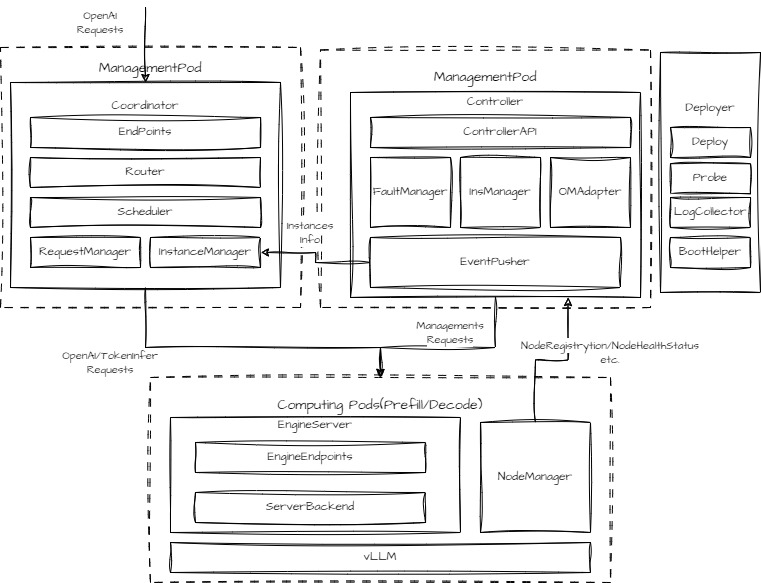

# MindIE PyMotor Architecture

<!-- md-trans-meta sourceCommit=unknown translatedAt=2026-06-27T02:03:48.949Z pushedAt=2026-06-27T08:09:17.313Z -->

## Introduction to MindIE PyMotor

**MindIE PyMotor** is a request scheduling framework oriented to distributed inference of large language models (LLMs), such as **PD disaggregation inference** (separation of the Prefill and Decode phases). Through an open and scalable inference service platform architecture, it connects downward to [vLLM-Ascend](https://github.com/vllm-project/vllm-ascend), aiming to meet the high-performance inference requirements of LLMs.

### Core Capabilities

MindIE PyMotor primarily provides capabilities in the following two aspects:

1. **PD disaggregation request scheduling**: distributes external customer requests to the Prefill/Decode instance with the lowest load, achieving **load balancing**.

2. **Reliability, Availability, and Serviceability (RAS)**: enhances the **reliability, availability, and serviceability** of the PD disaggregation service.

## System Architecture

The interaction architecture of MindIE PyMotor and its peripheral components is shown in the following figure:

**Figure 1 MindIE PyMotor architecture**

## Key Components and Modules

The core components of MindIE PyMotor are defined as follows:

### 1. Coordinator

As the **unified entry point** for user inference requests, it is responsible for receiving high-concurrency requests, performing request scheduling, management, and forwarding, serving as the data flow hub of the entire cluster.

- **Endpoint**: Provides RESTful APIs externally, including the data-plane OpenAI APIs and management-plane APIs such as health probes and metrics.

- **Router**: Provides request routing and forwarding capabilities.

- **Scheduler**: Load balancing scheduler.

- **RequestManager**: Request manager, responsible for global request information statistics and management.

- **InstanceManager**: Synchronizes instance health status, assists load balancing scheduling, and isolates faulty instances.

### 2. Controller

As the **status manager and decision-making brain** of the cluster, it is responsible for global service status management and RAS capability decision-making.

- **FaultManager**: fault management module, which receives and handles reported faults, such as isolation, restart, and self-healing.

- **InsManager**: instance manager, which allocates and dynamically adjusts PD instance identities (Prefill or Decode).

- **CCAEReporter**: O&M management information reporter, which synchronizes instance status and metrics to O&M management platforms such as [CCAE](https://www.hiascend.com/software/ccae).

- **EventPusher**: event pusher, which synchronizes instance status information to the Coordinator.

### 3. Deployer

Based on the reference scripts for Kubernetes inference **service deployment**, it provides capabilities such as service startup, shutdown, and elastic scaling.

- **Deploy**: one-click service startup and shutdown script tool.

- **Probe**: [health probe](https://kubernetes.io/docs/tasks/configure-pod-container/configure-liveness-readiness-startup-probes/) configuration script.

- **LogCollector**: Kubernetes log collection script.

- **BootHelper**: container startup script that automatically configures environment variables.

### 4. EngineServer

As the entry point for node inference services, it provides unified RESTful endpoints, including the OpenAI APIs, metrics, and others. It interfaces northbound with the Coordinator and Controller, and southbound with the vLLM, SGLang, and MindIE frameworks. (Only vLLM is supported in the current version.)

### 5. NodeManager

As the node-level service manager, it provides the following capabilities:

- **Node-level service process startup**: registers with the Controller, obtains an instance identity, and starts the inference service processes (EngineServer, vLLM, etc.) on the local node.

- **Node-level health status management**: monitors the status of inference service subprocesses and reports health status and heartbeats to the Controller.

### 4. Peripheral Components

- **[vLLM-Ascend](https://github.com/vllm-project/vllm-ascend)**: vLLM acceleration engine, which provides model instance acceleration capabilities.

- **[MindCluster](https://gitcode.com/Ascend/mind-cluster)**: Ascend cluster enablement component, which provides underlying Kubernetes support capabilities, CRD definitions in PD disaggregation, and supporting operators.

- **[CCAE](https://www.hiascend.com/software/ccae)** (optional): visualized O&M platform, which integrates computing, storage, and network resources.
