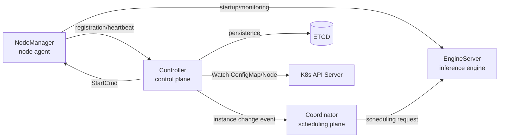
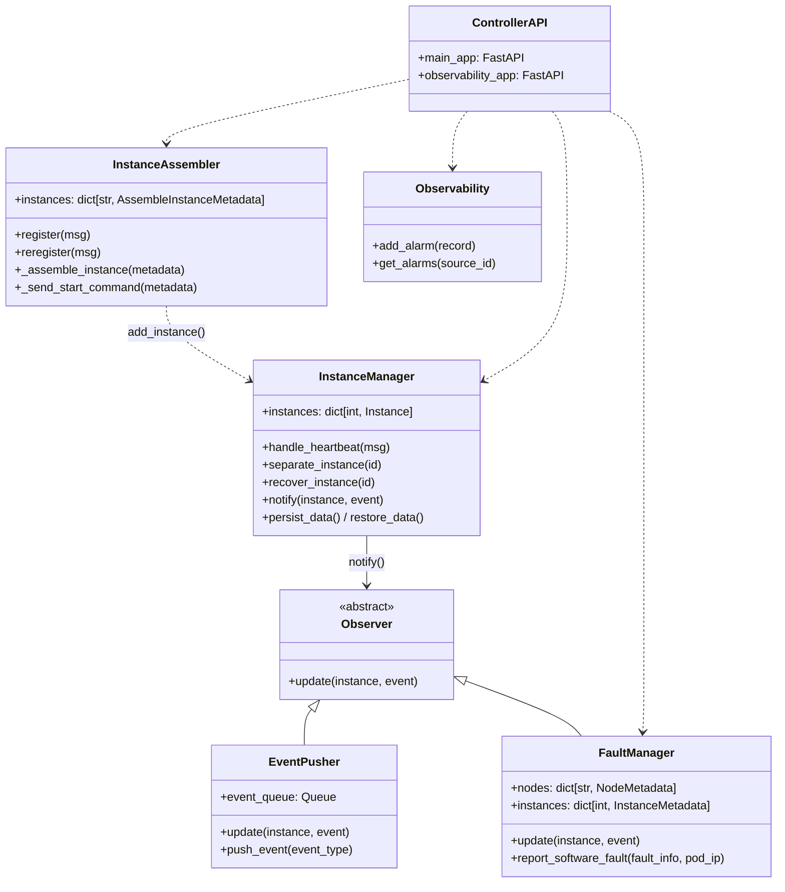
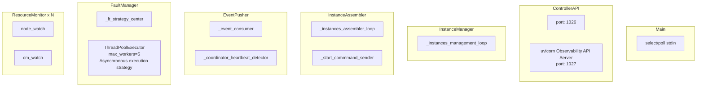
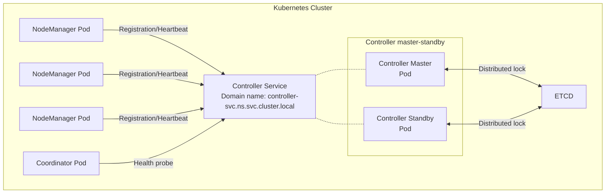
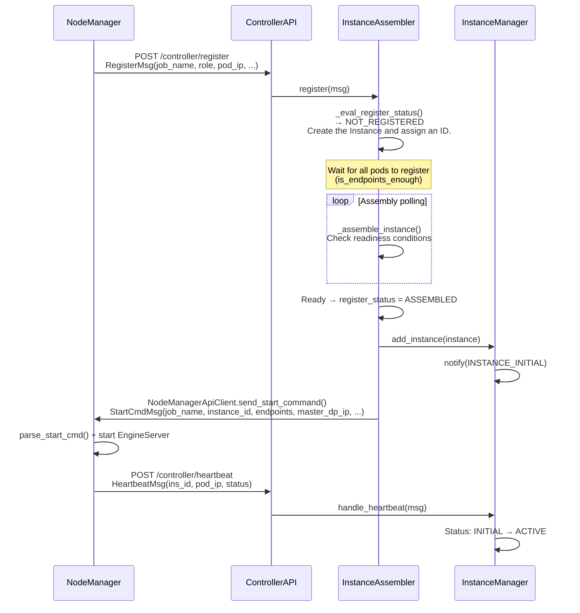
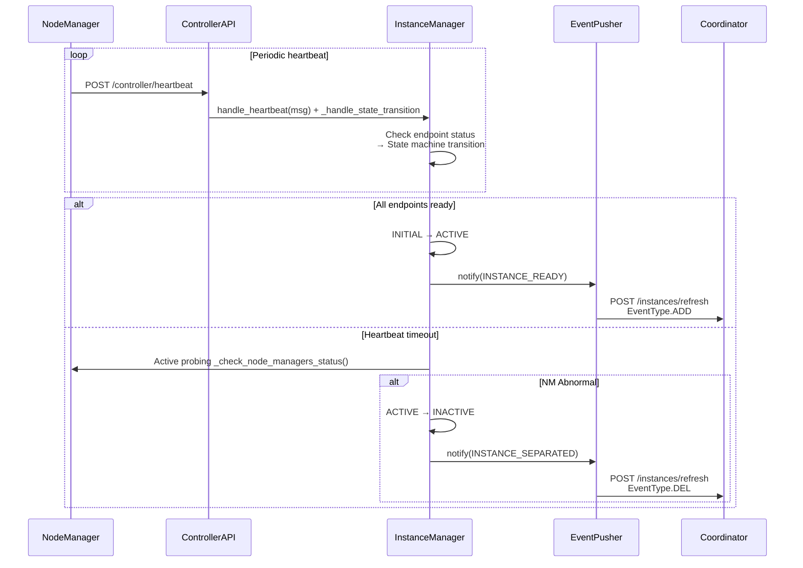
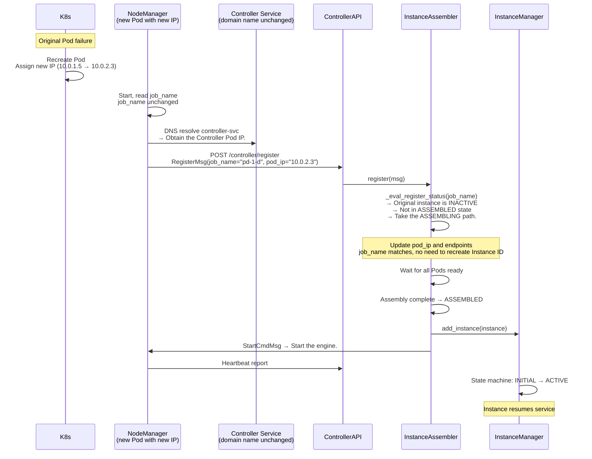
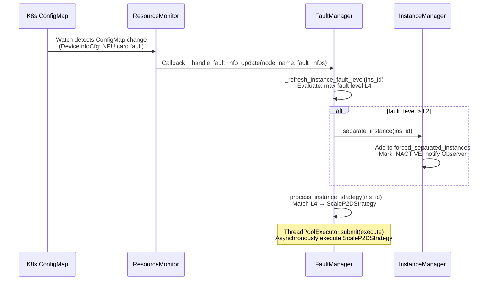
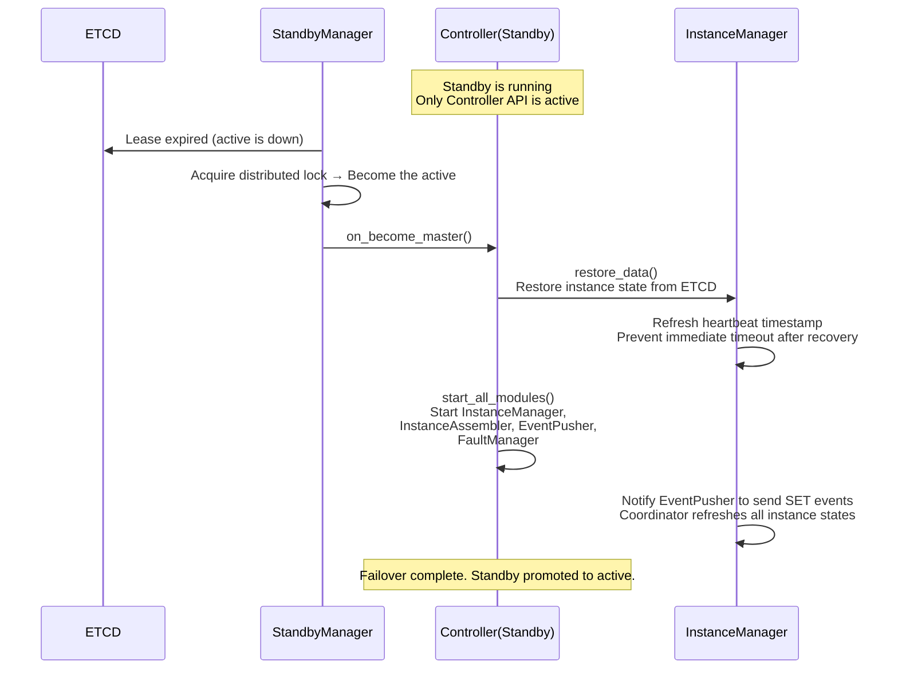

# Controller

## Overview

The Controller is the **control plane core** of the Motor inference cluster. It manages the full lifecycle of all inference instances, from the Node Manager registration, instance assembly, and engine startup to runtime heartbeat monitoring, fault isolation, and automatic recovery.

In the Motor architecture, the Controller occupies a central position:



The relationships among the components are briefly described as follows:

- **Node Manager**: the node agent of each inference Pod. It registers itself with the Controller, receives startup instructions, and reports heartbeats and faults.

- **Coordinator**: the scheduling entry point for inference requests. The Consumer receives instance status changes pushed by the Controller and determines the routing policy accordingly.

- **Engine Server**: the engine process (vLLM / SGLang) that actually executes inference, launched by the Node Manager based on the StartCmd delivered by the Controller.

- **ETCD**: the persistence storage of the Controller, which supports state recovery during active/standby switchover.

- **K8s API Server**: the Controller perceives hardware faults (ConfigMap) and node status changes through the Watch mechanism.

## Architecture View

### 2.1 Logical View: Module Responsibilities and Collaboration

The Controller is internally organized using a **modular + Observer pattern**. The core modules and their responsibilities are as follows:



| Module | Source Code | Core Responsibility |
|------|------|----------|
| `InstanceManager` | `motor/controller/core/instance_manager.py` | Instance dictionary maintenance, heartbeat processing, **state machine driving**, instance isolation/recovery, and ETCD persistence |
| `InstanceAssembler` | `motor/controller/core/instance_assembler.py` | **Registration and assembly** of new instances (waiting for all Pods to be ready), delivery of startup commands, and re-registration recovery |
| `EventPusher` | `motor/controller/core/event_pusher.py` | **Observer** that pushes instance lifecycle events (READY/SEPARATED/PAUSED/REMOVED) to the Coordinator |
| `FaultManager` | `motor/controller/fault_tolerance/fault_manager.py` | **Observer** that perceives hardware faults (ConfigMap Watch) and software fault reports, evaluates the instance fault level, and **schedules recovery policies** |
| `Observability` | `motor/controller/observability/observability.py` | Alarm management and inventory check (for consumption by the northbound management platform) |
| `ControllerAPI` | `motor/controller/api_server/controller_api.py` | External HTTP API (FastAPI/uvicorn), including the main API port (default 1026) and the observability API port (default 1027) |

The **Observer pattern** is the core design pattern of the Controller. `InstanceManager` acts as the observed subject and calls `notify()` when a key instance state change occurs, iterating over all observers. The current system has two Observers:

- `EventPusher`: pushes state changes to the Coordinator in real time for scheduling-plane routing updates.

- `FaultManager`: synchronizes the node mapping when an instance is first registered, and updates the fault data structure when an instance is isolated or deleted.

To add a new Observer, you only need to inherit the `Observer` abstract class and register it with `InstanceManager` (see [Development Extension Guide](#development-extension-guide)).

### 2.2 Process View: Concurrency Model

The Controller uses a **Python multithreading** concurrency model, where each module has an independent background thread that executes polling or daemon tasks:



**Inter-thread communication methods**:

| Mechanism | Usage scenario |
|------|----------|
| `queue.Queue` | The event queue of EventPusher (producer-consumer) |
| `threading.Condition` | On-demand wakeup of InstanceAssembler/EventPusher/FaultManager, replacing busy-wait |
| `threading.Lock` | Protects shared data such as the `instances` dictionary |
| `threading.RLock` | Protects configuration fields (`config_lock`) and supports nested access |

All core modules (`InstanceManager`, `InstanceAssembler`, `FaultManager`, `Observability`) inherit `ThreadSafeSingleton`, ensuring a globally unique instance and thread safety.

### 2.3 Development View: Code Organization

```text
motor/controller/
├── main.py                          # Entry: parse the configuration, initialize modules, and run the main loop
├── core/                            # Core logic
│   ├── instance_manager.py          # Instance lifecycle + state machine
│   ├── instance_assembler.py        # Registration/assembly/delivery of startup commands
│   ├── event_pusher.py              # Observer: event -> Coordinator push
│   ├── observer.py                  # Observer abstract base class + event enumeration
│   └── recovery_service.py          # Unified termination recovery helper function
├── fault_tolerance/                 # Fault tolerance subsystem
│   ├── fault_manager.py             # RAS core: fault evaluation + policy scheduling
│   ├── fault_types.py               # Fault type definitions (level/classification/metadata model)
│   ├── strategy/                    # Recovery policy
│   │   ├── strategy.py              # StrategyBase + level-to-policy factory
│   │   ├── scale_p2d.py             # Scale down P to preserve D
│   │   └── token_reinference.py     # Token-level reinference
│   ├── k8s/                         # K8s interaction
│   │   ├── resource_monitor.py      # Dual watch of ConfigMap + Node
│   │   ├── configmap_parser.py      # Parse the fault ConfigMap
│   │   └── k8s_client.py            # K8s API client
│   └── mixin/                       # Mixin separation of concerns
│       ├── persistence.py           # ETCD persistence
│       └── resource_manager.py      # Node synchronization and ownership exchange
├── observability/                   # Observability subsystem
│   ├── observability.py             # Alarm/inventory facade
│   ├── alarm/alarm_store.py         # In-memory alarm store
│   └── inventory/inventory_collector.py  # Inventory collection
├── api_server/controller_api.py     # HTTP API (FastAPI)
└── api_client/                      # Outbound HTTP client
    ├── coordinator_api_client.py    # Call the Coordinator API
    └── node_manager_api_client.py   # Call the the Node Manager API
```

### 2.4 Physical View: Deployment Topology

The Controller is deployed within a K8s cluster and supports two deployment modes:



**Key design**:

- **K8s Service domain name masks IP drift**: The Node Manager accesses the Controller through the K8s Service domain name (for example, `controller-svc.namespace.svc.cluster.local`) instead of a hardcoded Pod IP. When the Controller Pod restarts or an active/standby switchover occurs, the Service automatically directs traffic to the new Pod, so the Node Manager does not need to perceive the IP change.

- **Single-instance mode** (`standby_config.enable_master_standby = false`): Only one Controller Pod exists, which is suitable for development/test environments.

- **Active/standby mode** (`standby_config.enable_master_standby = true`): Two Controller Pods elect a leader through the ETCD distributed lock. The standby Pod runs only `ControllerAPI` (responding to health checks and registration requests), while the active Pod handles all business logic.

- **External dependencies**: ETCD (persistence + leader election), K8s API Server (Watch ConfigMap/Node), and Coordinator (event push target).

### 2.5 Scenario View: Core Use Cases

#### Scenario 1: First Registration and Assembly of an Instance



#### Scenario 2: Heartbeat and State Transition



#### Scenario 3: Automatic Pod Fault Recovery (Domain Name Masking IP Drift)

This is the most critical dynamic recovery capability of the Controller. The entire process **does not perceive IP changes and only cares about job_name consistency**.



> [!NOTE]NOTE
> **Key value of domain name abstraction**: pod_ip changes as the Pod is rebuilt, but the Controller identifies instance identity through job_name. the Node Manager accesses the Controller through the K8s Service domain name (rather than a hardcoded Pod IP), ensuring that registration requests always reach the Controller regardless of how the Pod is rebuilt or how the IP changes. On the Controller side, only job_name consistency matters to represent the same logical instance, without the need to perceive the underlying IP drift.

#### Scenario 4: Hardware Fault Perception → Isolation → Policy Recovery



#### Scenario 5: Active/Standby Switchover



## Key Features

### 3.1 Instance Management: Registration, Assembly, and Lifecycle

#### 3.1.1 Registration Mechanism

After the Node Manager starts, it registers with the Controller through `POST /controller/register`, carrying the following information:

- `job_name`: the **logical unique identifier** of the instance, generated by the deployer and kept unchanged after Pod recreation

- `role`: the inference role (`prefill` / `decode` / `union`)

- `pod_ip`: the current Pod IP (which may change)

- `parallel_config`: the parallel configuration (`local_world_size`, `dp_size`, etc.)

- `nnodes`: the expected number of nodes in the cross-node PCP scenario

- `enable_multi_endpoints`: whether to enable the multi-endpoint mode

The Controller has two registration forms:

| Registration Type | Trigger Scenario | Message Type | Behavioral Difference |
|----------|----------|----------|----------|
| **First registration** | Node Manager initial start | `RegisterMsg` | Creates a new Instance, assigns a new ID, and delivers StartCmd after assembly. |
| **Re-registration** | Controller restart | `ReregisterMsg` (carrying the existing instance_id + endpoints) | Restores the instance identity, **skips StartCmd** (the engine is already running), and directly returns it to InstanceManager. |

#### 3.1.2 Assembly Process

The assembly process of `InstanceAssembler` is completed through the collaboration of two background threads:

1. **Assembly polling thread** (`_instances_assembler_loop`):

   - Checks whether all node managers of the instance have been registered (`is_endpoints_enough()` or, for cross-node PCP, determined by `nnodes`).

   - Filters abnormal node managers (`_filter_abnormal_endpoints()`).

   - Marks the instance as `ASSEMBLED` after all are ready.

2. **Start command sending thread** (`_start_commmand_sender`):

   - Sends `StartCmdMsg` to instances in the `ASSEMBLED` state.

   - `StartCmdMsg` contains: `job_name`, `role`, `instance_id`, `endpoints`, `master_dp_ip`, `ranktable`, `d2d_peer_ips` (if required).

   - Supports a retry mechanism (`send_cmd_retry_times`), and gives up after timeout.

Assembly timeout protection: `instance_assemble_timeout` (default 600 seconds), after which incomplete assemblies are automatically cleaned up.

#### 3.1.3 Instance Isolation and Recovery

The Controller distinguishes two types of INACTIVE scenarios through the `forced_separated_instances` set:

| Scenario | Trigger Method | Automatic Recovery | Mechanism |
|------|----------|----------|------|
| **Heartbeat timeout** (network jitter) | `_instances_management_loop` heartbeat detect timed out | ✅ Automatically returns to ACTIVE when the next heartbeat is normal. | Not in `forced_separated_instances` |
| **Active isolation** (fault/API) | Explicitly invoked by `separate_instance()` | ❌ Cannot be recovered by heartbeat; `recover_instance()` must be called. | Added to `forced_separated_instances` |

The invocation paths of `separate_instance()`:

- **Fault tolerance**: FaultManager evaluates that the instance fault level is greater than L2 (`_refresh_instance_fault_level()`).

- **API trigger**: `POST /controller/terminate_instance`.

- **Recovery service**: the `terminate_instance_for_recovery()` function.

#### 3.1.4 State Machine Design

`InstanceManager` maintains a state machine for each instance, and state transitions are driven by heartbeats and the instance management loop:

```text
INITIAL → ACTIVE ⇄ PAUSED
  ▲         ▲        ▲
  │         │        │
  │         │        ▼
  │         │  (RESUMED/NORMAL)
  └────┬────┘
       ▼
    INACTIVE  →  DELETED
              (Reachable upon timeout)
```

Events that trigger state transitions (`InsConditionEvent`):

| Transition | Trigger Event |
|------|----------|
| INITIAL → ACTIVE | `INSTANCE_NORMAL` |
| INITIAL → INACTIVE | `INSTANCE_ABNORMAL` |
| INITIAL → DELETED | `INSTANCE_HEARTBEAT_TIMEOUT` |
| ACTIVE → INACTIVE | `INSTANCE_HEARTBEAT_TIMEOUT` / `INSTANCE_ABNORMAL` |
| ACTIVE → PAUSED | `INSTANCE_PAUSED` |
| INACTIVE → ACTIVE | `INSTANCE_NORMAL` |
| INACTIVE → INITIAL | `INSTANCE_INIT` |
| INACTIVE → DELETED | `INSTANCE_HEARTBEAT_TIMEOUT` |
| PAUSED → ACTIVE | `INSTANCE_RESUMED` / `INSTANCE_NORMAL` |
| PAUSED → INACTIVE | `INSTANCE_ABNORMAL` |
| PAUSED → DELETED | `INSTANCE_HEARTBEAT_TIMEOUT` |

**Side effects of state transitions**:

- A state change triggers ETCD persistence (`persist_data()`) to ensure state consistency after an active/standby switchover.

- A state change triggers Observer notification (`notify()`), where EventPusher synchronizes with the Coordinator and FaultManager synchronizes the node mapping.

### 3.2 Active/Standby Mode: Persistence Supports Seamless Switchover

#### 3.2.1 Why Persistence Is Needed

The Controller maintains a large amount of runtime state. Losing this state means:

- All registered instances must be re-registered (assembly starts from scratch, which can take several minutes in a large-scale cluster)

- Fault history is lost (making it impossible to determine whether a node is experiencing a persistent fault or a transient fluctuation)

- Assembly progress is lost (instances that are partially ready must go through the assembly process again)

> [!IMPORTANT]
> Persistence enables the standby node to take over the active node's state within seconds, keeping service interruption to a minimum.

#### 3.2.2 ETCD Persistence Design

The three core modules persist independently to different paths in ETCD:

| Module | ETCD Path | Persistent Content | Version Control |
|------|----------|------------|----------|
| `InstanceManager` | `/controller/instance_manager` | Complete state of all instances, heartbeat timestamps | Monotonically increasing `_data_version` |
| `InstanceAssembler` | `/controller/instance_assembler` | Assembly progress, `ins_id_cnt` (ID allocation counter) | Monotonically increasing `_data_version` |
| `FaultManager` | `/controller/fault_manager` | Node fault history, instance fault levels | Monotonically increasing `_data_version` |

**Persistence features**:

- **Version number + checksum**: Each persistence increments the version number and computes the checksum of `PersistentState`, which is used to verify data integrity during recovery.

- **Non-synchronous write**: Persistence is triggered only when the state changes (rather than on every heartbeat), reducing the pressure on ETCD.

- **Refresh heartbeat after recovery**: After recovering ACTIVE instances from ETCD, the heartbeat timestamps of all endpoints are refreshed to the current time, preventing the instances from being incorrectly judged as INACTIVE immediately after recovery due to "heartbeat timeout".

- **Re-registration recovery**: After recovery, EventPusher proactively pushes a `SET` event to the Coordinator to refresh the state of all instances.

#### 3.2.3 Active/Standby Switchover Process

```text
Standby running state (Controller API only)  
      │  
      ▼  StandbyManager detects ETCD lease expiry of the master  
      │  
      ▼  on_become_master() callback  
      │  
      ├─► InstanceAssembler.restore_data()    Restore assembly progress and ins_id_cnt  
      ├─► InstanceManager.restore_data()      Restore instance status and refresh heartbeat  
      ├─► FaultManager.restore_data()         Restore fault history  
      │  
      ▼  start_all_modules() starts: InstanceManager, InstanceAssembler,  
      │   EventPusher, FaultManager  
      │  
      ▼  After InstanceManager restoration → EventPusher.push_event(SET)  
      │  Coordinator receives SET → Refresh the status of all instances.  
      │  
      ▼  Takeover complete
```

**Why the standby node runs only the API**:

The standby node does not run business modules (InstanceManager, FaultManager, and so on) but only runs Controller API, for the following reasons:

1. Avoid "dual-master" simultaneously managing the same batch of instances, which causes state conflicts.

2. The API of the standby node is responsible for responding to registration requests from the Node Manager. When the master node fails, the Node Manager accesses the Controller through the K8s Service domain name, and traffic is automatically switched to the standby node, so registration requests are not lost.

3. The health check interface of the standby node responds normally, ensuring that the K8s readiness probe passes.

> [!WARNING]
> Persistence is not synchronized in real time (it is triggered only on state changes), so a master/standby switchover may lose the last few state changes that have not been persisted. This is acceptable for instance management, because unpresisted states can usually be repaired by the re-registration mechanism of the Node Manager.

### 3.3 Fault Perception and Recovery: Multi-source Fusion + Policy-based Leveling

#### 3.3.1 Three Fault Perception Paths

The Controller perceives faults from three independent sources, fuses them, and performs unified evaluation:

```mermaid
flowchart LR
    subgraph HW[Hardware fault awareness]
        CM["K8s ConfigMap<br/>mindx-dl-deviceinfo-&#123;node&#125;"] -->|Watch| RM_HW[ResourceMonitor]
    end
    subgraph Node[Node status awareness]
        K8sNode[K8s Node status] -->|Watch| RM_Node[ResourceMonitor]
    end
    subgraph SW[Software fault awareness]
        Engine[vLLM Engine] -->|ZMQ PUB/SUB| FR[FaultReporter<br/>NodeManager]
        FR -->|HTTP| API[ControllerAPI<br/>/report_software_fault]
    end
    RM_HW --> FM[FaultManager]
    RM_Node --> FM
    API --> FM
    FM --> Eval[Fault level evaluation<br/>_refresh_instance_fault_level]
```



| Path | Fault Type | Perception Method | Data Structure |
|------|----------|----------|----------|
| ConfigMap Watch | NPU card fault (`CardUnhealthy`)<br/>Inter-card network fault (`CardNetworkUnhealthy`)<br/>Switch fault | K8s Watch API, one ResourceMonitor per Node | `FaultInfo` → `NodeMetadata.hardware_fault_infos` |
| Node Watch | Node restart / NotReady | K8s Watch API | `NODE_REBOOT` (fault_code: `0x0000001`) → L6 |
| Software fault report | Engine DEAD/UNHEALTHY | NodeManager FaultReporter → HTTP | `FaultInfo` → `NodeMetadata.software_fault_infos` |

#### 3.3.2 Fault Level System

Faults are classified into 7 levels (L0 to L6) by severity, mapped from `OriginFaultLevel`:

| Level | Original Fault Type | Meaning | Recovery Policy | Policy Trigger Condition |
|------|-------------|------|----------|-------------|
| **L0 HEALTHY** | — | No fault | — | — |
| **L1** | `NotHandleFault` / `SubHealthFault` | Notification/sub-health | No action | — |
| **L2** | `RestartRequest` | Self-healable (network jitter, engine exception) | Token re-inference | `enable_token_reinference` + whitelist fault code |
| **L3** | `RestartBusiness` | Cannot be automatically recovered | Manual intervention | — |
| **L4** | `FreeRestartNPU` | NPU isolation required | Scale down P to preserve D | `enable_scale_p2d` + Decode role |
| **L5** | `RestartNPU` | NPU restart required | Delegate to L4 policy | Same as L4 |
| **L6** | `SeparateNPU` / `PreSeparateNPU` / `ManuallySeparateNPU` | NPU separation/node restart required | Delegate to L4 policy | Same as L4 |

**Instance fault level calculation logic** (`_refresh_instance_fault_level()`):

1. Find the hardware faults and software faults of all physical nodes where the instance resides.

2. Take the highest `fault_level` among all faults.

3. Special handling for `PreSeparateNPU`: If active instances still exist on the node → downgrade to L2 (business is still running, no isolation for now); if no instance exists on the node → keep L6 (safe isolation).

4. Decide isolation/recovery based on the result:

   - `fault_level > L2` → `separate_instance()` (forced isolation)

   - `fault_level ≤ L2` and already isolated → `recover_instance()`

   - `HEALTHY` → reset and recover

#### 3.3.3 Policy Scheduling

The `_ft_strategy_center` background thread periodically scans the fault levels of all instances and schedules recovery policies:

```text
For each instance:
  │
  ├─► Get current fault level + fault code
  │
  ├─► Look up strategy mapping table (level → policy factory function)
  │
  ├─► Decide on strategy switch:
  │   ├─ New level > current level → UPGRADE: stop the old policy and start the new policy
  │   ├─ New level == current level → keep (avoid repeated switching at the same level)
  │   └─ New level < current level → ignore (protect high-level recovery from interruption)
  │
  └─► When strategy completes (is_finished):
      ├─ Clear all software faults for that instance
      └─ Re-evaluate the fault level
```

Policies are executed asynchronously (`ThreadPoolExecutor(max_workers=5)`) without blocking the main loop of the policy center.

#### 3.3.4 Two Recovery Policies

**TokenReinferenceStrategy (token-level reinference)**:

- Trigger condition: L2 fault + fault code in the `{0x00F1FEF5, 0x08520003}` whitelist + `enable_token_reinference = true`

- Behavior: waits for network self-healing or fault escalation, and **cannot be interrupted** (`stop()` is an empty implementation)

- Applicable scenario: transient jitter of the Lingqu high-speed network

**ScaleP2DStrategy (scaling down P to preserve D)**:

- Trigger condition: L4/L5/L6 fault + `enable_scale_p2d = true` + Decode role

- Behavior: releases one Prefill node → uses the released node to start a new Decode instance → Coordinator automatically degrades to SINGLE_NODE mode → restores PD disaggregation after the new Decode becomes ready

- Applicable scenario: Decode instance hardware fault with no redundant nodes in the cluster

### 3.4 Observability: Inventory and Alarms

#### 3.4.1 Inventory Collection

`InventoryCollector` collects information about all instances from `InstanceManager` and generates structured inventory data for consumption by the northbound management platform (CCAE):

- **Instance list**: classified by role (P/D/U) and status (RUNNING/ERROR/INIT).

- **DP grouping**: displays the P-D pairing relationship, including NPU information and Server information.

- **Model status**: HEALTHY (all required role instances are running) / SUB_HEALTHY (some instances are abnormal) / UNHEALTHY (all instances of a role are missing).

Inventory data is obtained through `GET /observability/inventory` (requires `observability_enable` to be enabled).

#### 3.4.2 Alarm Management

Alarms flow through the `AlarmStore` in-memory storage and are grouped by `source_id` (northbound platform identifier):

| Alarm Type | Trigger Timing | Recoverable |
|----------|----------|--------|
| `InstanceExceptionAlarm` | When an instance is abnormal/recovers | ✅ Has a clear alarm (`is_cleared`) |
| `CoordinatorExceptionAlarm` | When all instances of a role are missing | ✅ Has a clear alarm |
| `PrecisionIssueAlarm` | Precision anomaly | Triggers automatic recovery (`precision_auto_recovery_enabled` must be enabled) |

Alarms can be reported externally through `POST /observability/add_alarm` and queried through `GET /observability/alarms?source_id=xxx`.

> [!WARNING] Deprecated
> `GET /observability/metrics` is deprecated and will be removed in a later version. Instead, directly access the Coordinator's `GET /metrics?type={type}&role={role}` endpoint. For the Coordinator's address and port, see [Metrics Interfaces](../../user_guide/api/metrics_interfaces.md#interface-format).

## Development Extension Guide

### 4.1 Adding an Observer

Inherit the `Observer` abstract class to listen for instance lifecycle events:

```python
from motor.controller.core import Observer, ObserverEvent
from motor.common.resources import ReadOnlyInstance

class MyObserver(Observer):
    def update(self, instance: ReadOnlyInstance, event: ObserverEvent) -> None:
        if event == ObserverEvent.INSTANCE_READY:
            # Instance ready. Custom logic can be executed here
            self._on_instance_ready(instance)
        elif event == ObserverEvent.INSTANCE_SEPARATED:
            # Instance is isolated
            self._on_instance_separated(instance)
        elif event == ObserverEvent.INSTANCE_REMOVED:
            # Instance is removed
            self._on_instance_removed(instance)

    def _on_instance_ready(self, instance: ReadOnlyInstance) -> None:
        # Implement custom logic
        pass
```

**Registration steps**:

1. Add the module name to the `observers_list` collection in `motor/controller/main.py`.

2. Create the module instance in `init_all_modules()` and `attach` it to `InstanceManager`.

3. If an independent thread and lifecycle management are required, implement the `start()`, `stop()`, `is_alive()`, and `update_config()` methods.

**Available events** (`ObserverEvent` enum):

| Event | Meaning | Trigger timing |
|------|------|----------|
| `INSTANCE_INITIAL` | The instance joins InstanceManager for the first time. | Assembly completed, `add_instance()` |
| `INSTANCE_READY` | The instance is ready. | INITIAL/INACTIVE → ACTIVE |
| `INSTANCE_SEPARATED` | The instance is isolated. | ACTIVE → INACTIVE (exception/isolation) |
| `INSTANCE_REMOVED` | The instance is deleted. | Heartbeat keeps timing out, entering DELETED |
| `INSTANCE_PAUSED` | The instance is paused. | PreStop / mixed PAUSED detection |
| `INSTANCE_RESUMED` | The instance recovers. | PAUSED → ACTIVE |

### 4.2 Adding a Fault Recovery Policy

Inherit `StrategyBase` and implement the core logic of the policy:

```python
from motor.controller.fault_tolerance.strategy import StrategyBase
from motor.config.controller import ControllerConfig

class MyRecoveryStrategy(StrategyBase):
    def __init__(self) -> None:
        super().__init__()

    def execute(self, instance_id: int) -> None:
        """Execute the policy. FaultManager invokes it asynchronously through ThreadPoolExecutor."""
        # 1. Execute the recovery logic
        # 2. Wait for recovery to complete or time out
        # 3. Set _is_finished = True to notify that the policy is complete
        with self._lock:
            self._is_finished = True

    def stop(self) -> None:
        """Called when the policy is switched. Set the event to notify execute to exit."""
        self.event.set()
```

**Registration steps**:

1. Implement the policy factory function in `motor/controller/fault_tolerance/strategy/strategy.py`.

2. Return your policy class in the factory function for the corresponding fault level.

```python
# Example: Register a new policy in level2_strategy
def level2_strategy(fault_code: int, instance_id: int, config: ControllerConfig) -> type[StrategyBase] | None:
    # Whitelist check
    if fault_code in YOUR_FAULT_CODES:
        from motor.controller.fault_tolerance.strategy import MyRecoveryStrategy
        return MyRecoveryStrategy

    # Check existing policies...
    if fault_code in [0x00F1FEF5, 0x08520003]:
        from motor.controller.fault_tolerance.strategy import TokenReinferenceStrategy
        return TokenReinferenceStrategy
    return None
```

**Policy lifecycle**:

- **Creation**: FaultManager instantiates the policy in `_process_instance_strategy()` based on the fault level and fault code.

- **Execution**: Executed asynchronously through `ThreadPoolExecutor.submit()`.

- **Switchover**: When the fault level escalates and the new level is higher than the current policy level, `stop()` is called to interrupt the old policy.

- **Completion**: `is_finished()` returns True → clear the software fault → re-evaluate the fault level.

### 4.3 Implementing Module Hot Update

If a newly added module needs to respond to configuration changes, implement the `update_config()` method:

```python
def update_config(self, config: ControllerConfig) -> None:
    """Configuration hot update callback"""
    with self.config_lock:
        # Update the configuration fields that the module cares about
        self.my_interval = config.my_config.my_interval
        logger.info("MyModule configuration updated")
```

**Hot update link**:

```text
ConfigWatcher detects configuration file changes.
      │
      ▼
      main.on_config_updated()
      │
      ├─► Check if the enable/disable state of FaultManager has changed
      │   (enable_fault_tolerance toggle)
      │
      └─► Iterate over modules.items():
            └─ module.update_config(config)
```

> [!NOTE]NOTE
> The runtime configuration (port, TLS) of `ControllerAPI` does not support hot update and requires a Pod restart to take effect. All other modules support hot update.

### 4.4 Adding API Routes

**Main API routes** (added in `ControllerAPI._create_app()`):

```python
app.add_api_route("/controller/my_endpoint", self._my_handler, methods=["POST"])

async def _my_handler(self, request: Request) -> dict:
    body = await request.json()
    # Implement the handler logic
    return {"result": "success"}
```

**Observability API routes** (added in `ControllerAPI._create_observability_app()`):

```python
app.add_api_route("/observability/my_metrics", self._my_metrics, methods=["GET"])

@observability_enabled_required  # Automatically check the observability_enable switch
async def _my_metrics(self, request: Request):
    ...
```

**Probe endpoint conventions**:

- `GET /startup`: startup probe, returns `{"message": "Controller startup"}`

- `GET /readiness`: readiness probe, checks `is_alive()` of all modules + active/standby role

- `GET /liveness`: liveness probe, checks overall health status

## Code Navigation

### Key Files

| File | Description |
|------|------|
| `motor/controller/main.py` | Entry point: module initialization, main loop, active/standby callbacks |
| `motor/controller/core/instance_manager.py` | Instance manager: state machine, heartbeat, isolation/recovery, persistence |
| `motor/controller/core/instance_assembler.py` | Instance assembler: registration, assembly, delivery of StartCmd |
| `motor/controller/core/event_pusher.py` | Event pusher: instance changes → Coordinator |
| `motor/controller/core/observer.py` | Observer abstract base class + ObserverEvent enumeration |
| `motor/controller/core/recovery_service.py` | Unified termination recovery helper functions |
| `motor/controller/fault_tolerance/fault_manager.py` | Fault manager: fault evaluation, policy scheduling |
| `motor/controller/fault_tolerance/fault_types.py` | Fault type definitions: level, classification, metadata model |
| `motor/controller/fault_tolerance/strategy/strategy.py` | StrategyBase + level-to-policy mapping |
| `motor/controller/fault_tolerance/strategy/scale_p2d.py` | Scale down P to preserve D policy |
| `motor/controller/fault_tolerance/strategy/token_reinference.py` | Token-level reinference policy |
| `motor/controller/fault_tolerance/k8s/resource_monitor.py` | K8s ConfigMap + Node dual Watch |
| `motor/controller/observability/observability.py` | Observability facade |
| `motor/controller/observability/inventory/inventory_collector.py` | Inventory collection |
| `motor/controller/observability/alarm/alarm_store.py` | Alarm storage |
| `motor/controller/api_server/controller_api.py` | HTTP API service |
| `motor/common/standby/standby_manager.py` | Active/standby management (common module) |
| `motor/config/controller.py` | ControllerConfig definition |

### Related Documents

- [Motor System Architecture](../../architecture.md)

- [Configuration Reference: motor_controller_config](../../user_guide/configuration/config_reference.md)
