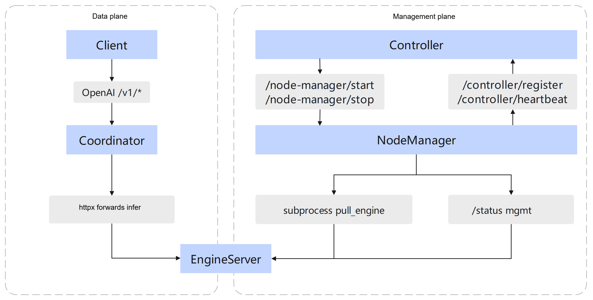

# Motor Engine Server (Inference Engine Side Process)

## Feature Description

In this repository, **Engine Server** refers to the executable entry point **`engine_server`** (entry point in `setup.py`: `engine_server = motor.engine_server.cli.main:main`), and the script path that implements this feature is `motor/engine_server/cli/main.py`.

The main features are as follows:

- **Parse endpoint configuration**: `EndpointConfig.init_endpoint_config()` obtains the specific engine configuration through `ConfigFactory` (the configuration class is selected by type such as `vllm` / `sglang` in `motor/engine_server/factory/config_factory.py`).

- **Management plane HTTP (MgmtEndpoint)**: In `motor/engine_server/core/mgmt_endpoint.py`, uvicorn is started on `mgmt_port`, mounting Prometheus-related routes and **`GET /status`** (the path constant `STATUS_INTERFACE`, with the value `/status`). The status field key is the constant corresponding to `STATUS_KEY` (used together with `NORMAL_STATUS` / `ABNORMAL_STATUS` / `INIT_STATUS` in the same file). **TLS** is optional (`mgmt_tls_config.enable_tls`).

- **Inference plane (InferEndpoint)**: Constructed by `EndpointFactory.get_infer_endpoint(config)` according to the engine type (such as `VLLMEndpoint` and `SGLangEndpoint`, see `motor/engine_server/factory/endpoint_factory.py`), and runs in parallel with `MgmtEndpoint` via `run()`. The main thread blocks at `infer_endpoint.wait()` until exit, and then `shutdown` both endpoints.

On the Node Manager side, this process is started through the subprocess command **`engine_server`**. The parameters are in `pull_engine` of `motor/node_manager/core/daemon.py`, including `--dp-rank`, `--instance-id`, `--role`, `--host`, `--port`, `--mgmt-port`, `--master-dp-ip`, and `--config-path` (with the value `Env.user_config_path`). In single-container mode, `--kv-port` and `--dp-rpc-port` are also appended.

## Relationship with Peripheral Components

Engine Server participates in both the **data plane** inference forwarding path and the **control plane** lifecycle path: it externally accepts OpenAI requests forwarded by the Coordinator; on the control plane, Node Manager starts Engine Server through a subprocess and periodically probes its health status, then reports the results to the Controller via heartbeat. **There is no direct HTTP or process invocation between the Controller and Engine Server**; startup and shutdown are both completed indirectly through Node Manager.



In PD disaggregation mode, the Coordinator may dispatch Prefill and Decode to Engine Server instances with different roles; in single-node or Hybrid mode, the entire inference process is completed by the same instance.

| Phase | Direction | Interface/Mechanism | Description |
| -------- | ----------------------------- | -------------------------------- | ------------------------------------------ |
| Inference request | Coordinator → Engine Server | infer port `/v1/*` | The Coordinator forwards the OpenAI request after routing and selecting the instance. |
| Node registration | Node Manager → Controller | `POST /controller/register` | The Node Manager registers the node with Controller after startup. |
| Instance startup | Controller → Node Manager | `POST /node-manager/start` | The Controller issues the startup command after completing instance assembly. |
| Engine launch | Node Manager → Engine Server | `subprocess` `engine_server` | The Node Manager launches engine_server through a subprocess. |
| Health probe | Node Manager → Engine Server | mgmt port `GET /status` | The Node Manager periodically polls the engine mgmt health status. |
| Status reporting | Node Manager → Controller | `POST /controller/heartbeat` | Reports the health status of each endpoint to the Controller. |
| Instance stop | Controller → Node Manager | `POST /node-manager/stop` | The Controller issues the stop command (including fault recovery scenarios). |
| Engine stop | Node Manager → Engine Server | `Daemon.stop` SIGKILL | The Node Manager sends SIGKILL to the engine subprocess. |

The Node Manager initiates **`GET /status`** to `{ip}:{mgmt_port}` through `engine_server_api_client` (TLS is obtained from `motor_nodemanger_config.mgmt_tls_config`). The mgmt `/status` combines the inference plane `/health` and the optional virtual inference result; virtual inference is controlled by `health_check_config.enable_virtual_inference`, which is disabled by default. For the mechanism, see [Virtual Inference Health Probe](../../user_guide/features/sim_inference.md), and for fields, see [Configuration Reference health_check_config](../../user_guide/configuration/config_reference.md#health_check_config).

## Environment Preparation

- `--config-path` points to the `user_config.json` containing `motor_engine_prefill_config` / `motor_engine_decode_config` (consistent with the Node Manager mount path; see [Configuration File Description](../../user_guide/configuration/config_reference.md)).

- For the runtime environment requirements such as the Ascend NPU driver/HDK and model weight paths, see [Environment Preparation](../../user_guide/environment_preparation.md).

## Configuration Description

- **Engine configuration block**: `motor_engine_prefill_config` / `motor_engine_decode_config` (including the optional `health_check_config`).

- **Node-side cross items**: `motor_nodemanger_config` (such as mgmt TLS, used by the Node Manager to probe the Engine Server mgmt port).

- **Authoritative field description**: See `motor_engine_prefill_config` / `motor_engine_decode_config` in [Configuration Reference](../../user_guide/configuration/config_reference.md).

- **CLI-side definition**: The `EndpointConfig` fields and validation logic in `motor/config/endpoint.py`.

## Usage Examples (Local Debugging)

Consistent with the commands delivered by the Node Manager, the following items are required for local debugging:

- **CLI options**: `--host`, `--role`, `--port`, `--mgmt-port`, `--instance-id`, `--dp-rank`, `--master-dp-ip`, and `--config-path`; in single-container mode, `--kv-port` and `--dp-rpc-port` may also be required.

- **Configuration file**: `user_config.json` pointed to by `--config-path` must contain the engine configuration block corresponding to `--role`.

- **Runtime environment**: The NPU/Ascend runtime and model weight path are specified by `engine_config` in `user_config`. For details, see [Environment Preparation](../../user_guide/environment_preparation.md).

```bash
engine_server --dp-rank 0 --instance-id 1 --role prefill \
  --host 127.0.0.1 --port 8000 --mgmt-port 8001 \
  --master-dp-ip 127.0.0.1 --config-path /path/to/user_config.json
```

The following table describes the CLI options in the example commands. For the complete definitions and validation, see `EndpointConfig.parse_cli_args` in `motor/config/endpoint.py`; for the Node Manager assembly logic, see `pull_engine` in `motor/node_manager/core/daemon.py`.

| Parameter | Type | Description |
|------|------|------|
| `--dp-rank` | int | Endpoint sequence number within the data parallel group. The default value is `0`. When the Node Manager starts the endpoint, it takes `endpoint.id` and maps it to the vLLM `data-parallel-rank` (see [examples/deployer/README.md](https://gitcode.com/Ascend/MindIE-Motor/blob/master/examples/deployer/README.md)). |
| `--instance-id` | int | Instance ID, assembled by the Controller and delivered with `StartCmdMsg`. The default value is `0`. |
| `--role` | string | PD disaggregation role: `prefill`, `decode`, or `union`. |
| `--host` | string | Listening address (bind IP) of the inference plane and management plane. |
| `--port` | int | Inference service port, which provides infer interfaces such as `/v1/*` and `/health`. |
| `--mgmt-port` | int | Management plane port, which provides `GET /status` and Prometheus routes. |
| `--master-dp-ip` | string | IP address of the DP master node, used for distributed inference networking (corresponding to the source of the vLLM `data-parallel-address`; see [examples/deployer/README.md](https://gitcode.com/Ascend/MindIE-Motor/blob/master/examples/deployer/README.md)). |
| `--config-path` | string | Path of `user_config.json`, which must contain the engine configuration block matching `--role`. |

In scenarios such as single-container or cross-node deployment, the parameters in the following table may be additionally passed (they can be omitted in the minimal local example):

| Parameter | Type | Description |
|------|------|------|
| `--node-rank` | int | Cross-node PCP node sequence number, assigned by the Controller in registration order. For the passing rules, see [Node Manager Component Documentation](./node_manager.md#cross-node-pcp). |
| `--kv-port` | int | KV-related communication port in single-container mode (appended by `Daemon.pull_engine` when `single_container_flag` is set). |
| `--dp-rpc-port` | int | DP RPC port in single-container mode (same as above). |
| `--lookup-rpc-port` | int | Optional lookup RPC port (appended when the configuration exists). |
| `--d2d-peer-ips` | string | Comma-separated list of peer IPs for D2D weight transfer. |
| `--snapshot-metadata` | string | Path of the container snapshot metadata JSON, passed when the snapshot capability is enabled. |

The actual ports and roles are subject to the scheduling result. For single-machine debugging, refer to the test and example configurations.

## Errors and Logs

- For the default log file path constants, see `motor/engine_server/constants/constants.py` (for example, `LOG_DEFAULT_FILE` is relative to `./engine_server_log/`).

- The Mgmt plane `/status` returns `ABNORMAL_STATUS` and the like when a health check is abnormal (see the `mgmt_endpoint.get_status` implementation); the Node Manager side updates the endpoint status accordingly and may participate in the suicide determination (see `HeartbeatManager`).
