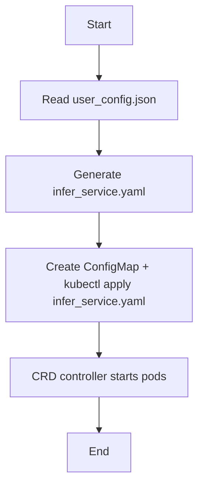
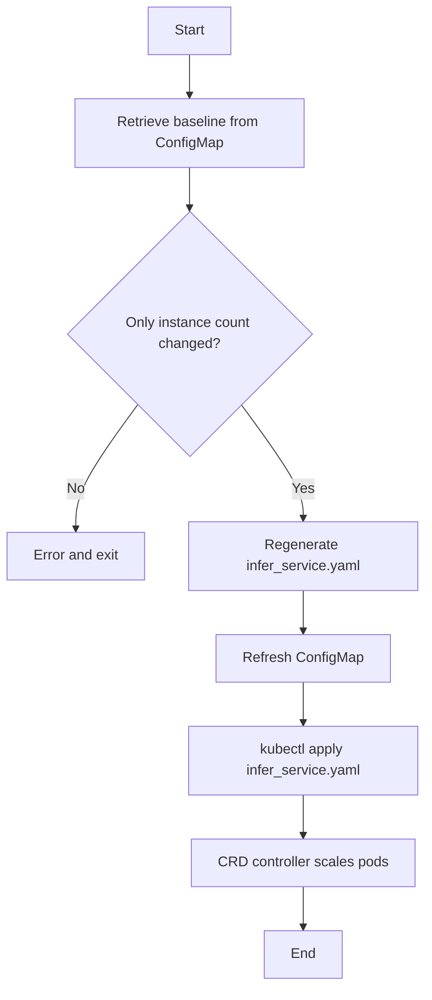

# CRD-Based Deployment Design Document (MindIE PyMotor)

<!-- md-trans-meta sourceCommit=unknown translatedAt=2026-06-27T02:07:35.408Z pushedAt=2026-06-29T09:24:14.104Z -->

## Background and Objectives

This document describes the design and implementation of the MindIE PyMotor deployment method based on the InferServiceSet CRD.

Objectives:

- Support unified pod start for roles such as controller, coordinator, prefill, and decode through the **InferServiceSet CRD** (`mindcluster.huawei.com/v1`).

- Use `infer_service_init.yaml` as the init template, which is instantiated by `deploy.py` based on `user_config.json` to output a usable `infer_service.yaml`.

- Use the InferServiceSet deployment by default. Configuring `motor_deploy_config.deploy_mode` to `multi_deployment` in `user_config.json` switches back to the traditional multi-YAML deployment mode. During scaling and ConfigMap refresh, the current deployment mode is read from the cluster ConfigMap.

- In CRD mode, implement scaling by regenerating and applying InferServiceSet, with the CRD controller responsible for pod creation and updates.

## Design Overview

### Deployment Mode

The deployment mode is determined by `motor_deploy_config.deploy_mode` in `user_config.json` (defaults to `infer_service_set` if not configured). During scaling (`--update_instance_num`) and ConfigMap refresh (`--update_config`), `deploy_mode` in the baseline of the cluster ConfigMap takes precedence. If this field is modified in `user_config` and differs from the baseline, an error is reported, and switching the deployment mode in this scenario is not allowed.

| Mode | motor_deploy_config.deploy_mode | Description |
|------|--------------------------------------|------|
| infer_service_set | `infer_service_set` (default, can be omitted) | Only generates and applies `infer_service.yaml`, which contains RBAC + InferServiceSet; pods are launched by the CRD controller. |
| multi_deployment | `multi_deployment` | Generates multiple independent YAML files such as controller, coordinator, engine_*, kv_pool, and applies them separately. |

### InferServiceSet Resource Composition

`infer_service_init.yaml` is a multi-document YAML file, containing the following in order:

1. **ServiceAccount**: `mindie-motor-controller` (required by the controller)

2. **ClusterRole**: `mindie-controller-role` (get/list/watch for configmaps/nodes)

3. **ClusterRoleBinding**: `mindie-controller-binding` (binds the above ServiceAccount and ClusterRole)

4. **InferServiceSet**: defines the workloads and services for the four roles: controller, coordinator, prefill, and decode.

### Instantiation Strategy

The `generate_yaml_infer_service_set` function in `deploy.py` instantiates the template based on `user_config`, primarily filling in:

- **namespace**: taken from `motor_deploy_config.job_id`

- **replicas**: each role has two replicas fields

  - `role.replicas`: number of instances (fixed at 1 for controller/coordinator; `p_instances_num` for prefill; `d_instances_num` for decode)

  - `role.spec.replicas`: number of pods for each Deployment under multi_yaml (2 for controller/coordinator in active/standby mode; `single_p_instance_pod_num` for prefill; `single_d_instance_pod_num` for decode)

- **image**: taken from `motor_deploy_config.image_name`

- **InferServiceSet metadata.name**: Used for prefill/decode app labels, container names, JOB_NAME base, service domain name build, etc.

- **role.services**: No metadata is added; the CRD controller creates K8s Services according to naming rules.

- **env**: ROLE, JOB_NAME, CONTROLLER_SERVICE, COORDINATOR_SERVICE, etc.

  - **JOB_NAME** for prefill/decode: `deploy.py` sets the initial value to `{namespace}-{InferServiceSet.metadata.name}`; after the pod starts, the CRD injects `INFER_SERVICE_INDEX` and `INSTANCE_INDEX`, and `boot.sh` refreshes it to `{namespace}-{InferServiceSet_name}-{INFER_SERVICE_INDEX}-p/d{INSTANCE_INDEX}` accordingly.

- **NPU resources**: configured based on `p_pod_npu_num` and `d_pod_npu_num`.

- **nodeSelector**: based on `hardware_type` (`800I_A2`/`800I_A3`)

- **RBAC**: `metadata.namespace` of ServiceAccount, `metadata.namespace` of ClusterRoleBinding, and `subjects[].namespace` are updated to the deployment namespace.

### ConfigMap Strategy

The infer_service_set and multi_deployment modes share the same ConfigMap logic: `create_motor_config_configmap` writes `user_config.json`, boot.sh, probe, and other files into the `motor-config` ConfigMap for mounting and use by each pod.

## Key Processes

### 1. Initial Deployment (infer_service_set mode)

1. Read `user_config.json`.

2. Generate `infer_service.yaml` based on `infer_service_init.yaml` and user_config.

3. Inside `exec_all_kubectl_multi`: create the ConfigMap `motor-config`, then run `kubectl apply` on `infer_service.yaml` (including RBAC + InferServiceSet).

4. The CRD controller starts pods for each role based on the InferServiceSet.

#### Flowchart

### 2. Scaling (--`update_instance_num`, `infer_service_set` mode)

1. Read the baseline from the cluster ConfigMap; if it does not exist, return an error.

2. Verify that only the instance count has changed; otherwise, report an error.

3. Regenerate `infer_service.yaml` (with updated replicas for prefill/decode).

4. Refresh the ConfigMap with the current input user_config.

5. Execute `kubectl apply` on `infer_service.yaml`, and the CRD controller scales pods based on the new spec.

#### Flowchart

### 3. Deployment Mode and CM Validation

- During initial deployment, the mode is read from `motor_deploy_config.deploy_mode` in `user_config.json` (defaults to `infer_service_set`).

- During scaling, the current `deploy_mode` is read from the baseline in the cluster ConfigMap, and scaling is performed according to that mode without requiring the user to specify it again.

- **Modifying deploy_mode in update scenarios is prohibited**:

  - `--update_config`: explicit validation; if `deploy_mode` in `user_config.json` is inconsistent with the cluster baseline, an error is reported, and switching the deployment method by only refreshing the CM is prohibited.

- `--update_instance_num`: Validated through `validate_only_instance_changed`; only modifications to `p_instances_num` and `d_instances_num` are allowed. Modifying `deploy_mode` will cause a discrepancy between the config and the baseline, resulting in an error and exit.

## Scenario Introduction

### Environment and Prerequisites

- Prepare a valid `user_config.json` (containing legal `p_instances_num`, `d_instances_num`, etc.).

- Ensure that the MindCluster infer-operator is installed in the cluster.

- The infer_service-related templates under `examples/deployer/yaml_template/` exist and are in the correct format.

### Scenarios

| Scenario | Steps | Expected Result |
|------|------|------|
| Initial deployment (infer_service_set) | Do not configure `"deploy_mode"` in `motor_deploy_config` or configure `"deploy_mode": "infer_service_set"`, then run `python3 deploy.py` | Success; generates `output/deployment/infer_service.yaml`; RBAC and InferServiceSet are applied; ConfigMap motor-config exists; CRD controller starts controller/coordinator/prefill/decode pods; service can perform inference normally |
| Initial deployment (multi_deployment) | Configure `"deploy_mode": "multi_deployment"` in `motor_deploy_config`, then run `python3 deploy.py` | Success; generates multiple YAML files including controller, coordinator, engine_*, kv_pool, etc.; they are applied separately; each Deployment starts the corresponding pod; service can perform inference normally |
| infer_service_set scale-up | Increase `p_instances_num` or `d_instances_num`, then run `python3 deploy.py --update_instance_num` | Success; regenerates infer_service.yaml; after applying, CRD controller scales up prefill/decode pods |
| infer_service_set scale-down | Decrease the number of instances, then run `python3 deploy.py --update_instance_num` | Success; replicas in InferServiceSet are reduced; after applying, CRD controller reclaims excess pods |
| No infer_service_init | Delete or move away `infer_service_init.yaml`, then run deployment in infer_service_set mode | Error: InferServiceSet init yaml not found |
| Only refreshing CM after modifying deploy_mode | After initial infer_service_set deployment, change `deploy_mode` in user_config to `multi_deployment` and run `--update_config` | Error: deploy_mode cannot be modified by refreshing ConfigMap; redeployment is required |
| Scaling after modifying deploy_mode | After initial infer_service_set deployment, change `deploy_mode` in user_config to `multi_deployment` and run `--update_instance_num` | Error: only modifications to p_instances_num/d_instances_num are allowed; changing deploy_mode is considered invalid |

## Comparison with `multi_deployment` Mode

| Dimension | `infer_service_set` Mode | `multi_deployment` Mode |
|------|----------|-----------------|
| Output files | A single `infer_service.yaml` (including RBAC + InferServiceSet) | Multiple files: controller, coordinator, engine_p0–pn, engine_d0–dn, kv_pool |
| Apply targets | RBAC + InferServiceSet | Individual Deployments, Services, RBAC, etc. |
| Pod creator | CRD controller | kubectl apply directly creates Deployments |
| Scaling | Update the replicas (number of instances) for each prefill/decode role in InferServiceSet and apply | Apply/Delete the added/removed engine YAML files |
| Prerequisites | The cluster must have MindCluster infer-operator installed | No infer-operator dependency |
