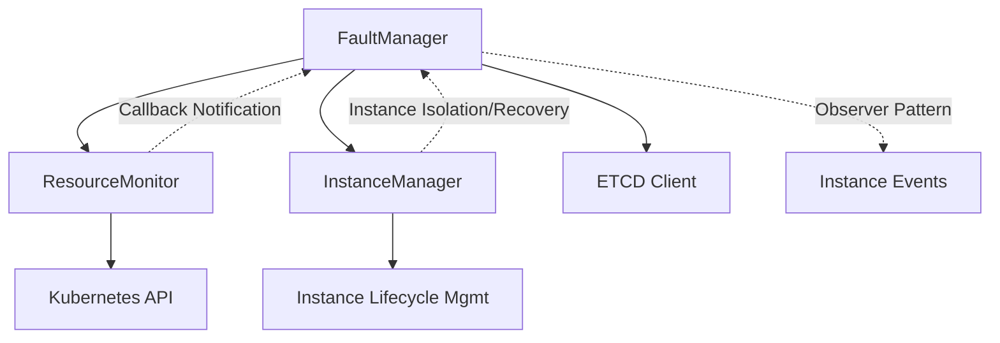
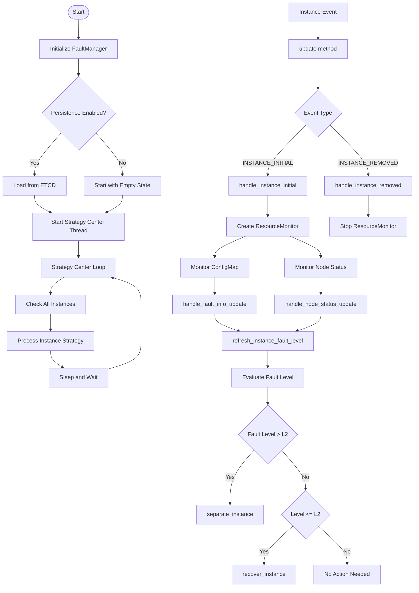
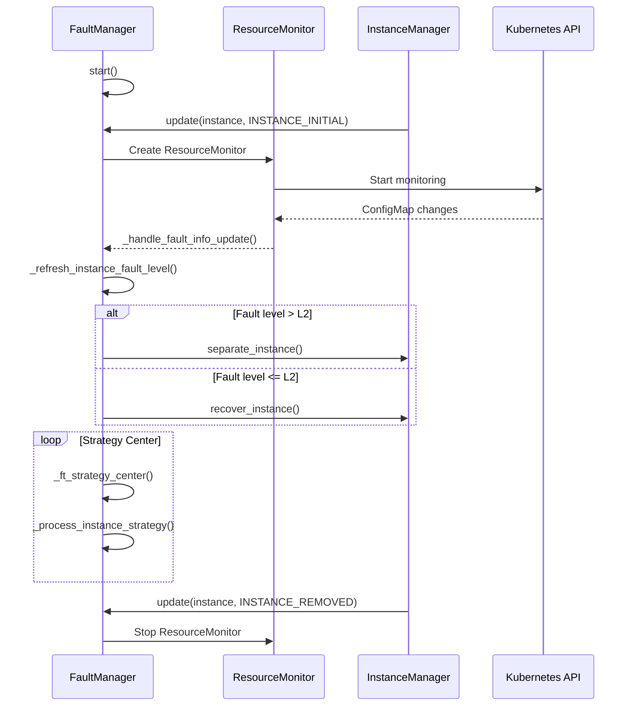

# FaultManager Workflow Analysis

<!-- md-trans-meta sourceCommit=unknown translatedAt=2026-06-27T02:07:07.601Z pushedAt=2026-06-30T02:48:21.603Z -->

## Overview

FaultManager is the core fault-tolerance component in MindIE PyMotor. It listens to instance lifetime events via the Observer pattern, coordinates with ResourceMonitor for fault detection, and works with InstanceManager to handle instance isolation and recovery.

## Core Component Interaction



**Text-based Component Relationships:**

```text
FaultManager (Core controller)  
├── ResourceMonitor (Failure detection) → Kubernetes API  
├── InstanceManager (Instance lifetime management)  
├── ETCD Client (Persistence)  
└── Observer pattern ← Instance events
```

## Workflow Diagram



**Simplified text-based process:**

```text
Start → Initialization → Strategy center loop  
                    ↓  
Instanceevent → update() → Fault detection → Fault evaluation → Instance action (isolaterecover)  
                    ↓  
ResourceMonitor → Watch ConfigMap → Callback to FaultManager → Refresh fault severity  
                    ↓  
Strategy center → Inspect instance → Execute policy → Wait for next cycle
```

## Interaction Sequence Diagram



## Detailed Workflow Description

### 1. Initialization and Startup Phase

**`start()`**

1. Reset the stop event (supports singleton reuse).

2. Create and start the `FaultToleranceStrategyCenter` daemon thread.

3. If persistence is enabled, restore the fault manager state data from ETCD.

4. The thread begins periodically executing the Policy Center logic.

### 2. Observer Pattern Response

**`update()`**

- **INSTANCE_INITIAL event:** When a new instance is created, instance and server metadata are added, and a ResourceMonitor is created for each host to start monitoring.

- **INSTANCE_REMOVED event:** When an instance is removed, all related ResourceMonitors are stopped, and server and instance data are cleaned up.

### 3. ResourceMonitor Interaction Mechanism

**Creation and management:**

- A separate ResourceMonitor instance is created for each host IP.

- Each ResourceMonitor monitors the ConfigMap and node status of that host.

- Status changes are reported to the FaultManager through the callback functions `node_change_handler` and `configmap_change_handler`.

**Fault Information Processing:**

- `_handle_fault_info_update()`: processes device fault information in the ConfigMap

- `_handle_node_status_update()`: processes node status changes (primarily handles node restart faults)

- Both callbacks trigger `_refresh_instance_fault_level()` to re-evaluate the instance fault level

### 4. InstanceManager Interaction Logic

**Instance Isolation and Recovery:**

- When the instance fault level > L2: The `separate_instance()` method is called to forcibly isolate the instance.

- When the instance fault level ≤ L2: If the instance has been isolated, the `recover_instance()` method is called to recover the instance.

- Isolating an instance prevents the heartbeat mechanism from restoring it to an active state.

### 5. Policy Center Core Logic

**Periodic execution flow:**

1. Obtain the list of all instance IDs

2. Call `_process_instance_strategy()` for each instance.

3. Select an appropriate recovery strategy based on the current fault level and code.

4. Manage the strategy lifetime: start new strategies, stop old strategies, and check strategy completion status.

**Strategy processing rules:**

- **Same level:** Check whether the current policy is completed. If completed, reset the state.

- **Escalation (different level):** Stop the current policy and start a new policy.

- **De-escalation (different level):** Do not perform any operation.

## Data Structure Description

### NodeMetadata

```python
class NodeMetadata(BaseModel):
    """
    Each node metadata represents a node in the cluster.
    And An instance may have multiple nodes.
    """
    pod_ip: str = Field(..., description="Pod IP address")
    host_ip: str = Field(..., description="Host IP address")
    instance_id: int = Field(..., description="Instance ID that this node belongs to")
    node_status: NodeStatus = Field(default=NodeStatus.READY, description="node status")
    fault_infos: dict[int, FaultInfo] = Field(default_factory=dict,
                                              description="Fault information dictionary keyed by fault_code")
```

### InstanceMetadata

```python
class InstanceMetadata(BaseModel):
    """ Instance metadata for fault tolerance management. """
    instance_id: int = Field(..., description="Instance ID")
    fault_level: FaultLevel = Field(default=FaultLevel.HEALTHY, description="Current instance fault level")
    fault_code: int = Field(default=0x0, description="Fault code that trigger the current strategy")
    
    # Non-serializable fields (excluded from serialization)
    lock: Any = Field(default=None, exclude=True)
    # StrategyBase instance, using Any to avoid requiring arbitrary_types_allowed
    strategy: Any = Field(default=None, exclude=True)
    
    @model_validator(mode='after')
    def init_lock(self):
        """Initialize lock if not provided"""
        if self.lock is None:
            self.lock = threading.Lock()
        return self
    
    def model_dump(self, **kwargs) -> dict:
        """Override model_dump to exclude non-serializable fields"""
        return super().model_dump(exclude={'lock', 'strategy'}, **kwargs)
```

## Configuration Parameter Description

- `strategy_center_check_interval`: Policy Center check interval (seconds)

- `configmap_prefix`: ConfigMap name prefix

- `configmap_namespace`: ConfigMap namespace

- `enable_etcd_persistence`: Whether to enable ETCD persistence
