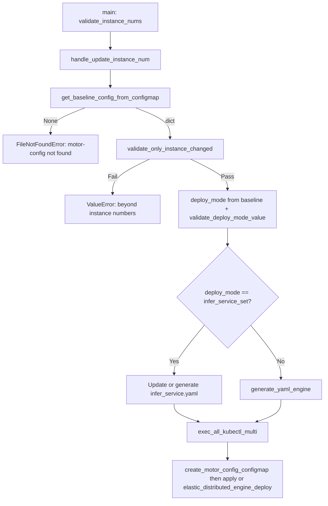

# Instance-Level Manual Scaling Design Specification (MindIE PyMotor)

<!-- md-trans-meta sourceCommit=unknown translatedAt=2026-06-27T02:07:04.163Z pushedAt=2026-06-30T03:18:46.629Z -->

This document describes the behavior of `examples/deployer/deploy.py` when invoked with `--update_instance_num`, including its mapping to cluster ConfigMaps and YAML artifacts. All statements are based on the implementation in the referenced script and its dependencies, and do not reflect guarantees beyond what the script implements.

## 1. Entry Point and Pre-Validation

- **Entry point**: When `main()` in `deploy.py` parses `--update_instance_num`, it calls `handle_update_instance_num(user_config)` and then `return`s, without executing the full `deploy_services()` flow.

- **Common pre-validation**: Before branching, `main()` executes `validate_instance_nums(user_config)` (`lib/generator/engine.py`). The validation chain for `p_instances_num` and `d_instances_num` in `motor_deploy_config` is as follows:

    - Missing field: The internally called `obtain_engine_instance_total` (`lib/utils.py`) raises `KeyError`, with the copy `p_instances_num is required in motor_deploy_config` / `d_instances_num is required ...`.

    - Non-integer: `obtain_engine_instance_total` raises `ValueError` when `int(...)` fails, with the copy `p_instances_num and d_instances_num must be integers`.

    - Out of bounds: `validate_instance_nums` itself raises `ValueError`, requiring `> INSTANCE_NUM_ZERO` (0) and `<= INSTANCE_NUM_MAX` (16). The constants are defined in `lib/constant.py`, with copy such as `p_instances_num must be greater than 0` / `must not exceed 16`.

## 2. Baseline: Cluster ConfigMap `motor-config`

- **Read**: `handle_update_instance_num` calls `get_baseline_config_from_configmap(deploy_config["job_id"])` (`lib/generator/k8s_utils.py`).

- **Command**: `kubectl get configmap motor-config -n <job_id> -o json` (`MOTOR_CONFIG_CONFIGMAP_NAME` is `motor-config`, and `job_id` comes from `motor_deploy_config.job_id` in the current input `user_config`, used as the namespace).

- **Parsing**: Retrieve the string from `data["user_config.json"]` in the returned JSON, then use `json.loads` to convert it to a dict. If the command fails, the JSON is invalid, the `data` key is missing or the `user_config.json` key is missing, and the function returns `None`.

- **When missing**: If the baseline is `None`, raise `FileNotFoundError`: `ConfigMap motor-config not found. Please deploy once before scaling.`

## 3. Only Instance Count Changes Are Allowed: `validate_only_instance_changed`

- **Implementation**: `validate_only_instance_changed(current_config, baseline_config)` in `lib/config_validator.py`.

- **Logic**: Perform a deep copy of each of the two configurations, remove `p_instances_num` and `d_instances_num` from `motor_deploy_config`, and then compare the entire dicts. If they are not equal, raise a `ValueError`: `user_config changes detected beyond instance numbers. Only p_instances_num/d_instances_num can be modified for scaling.`

## 4. Deployment Mode Is Based on the Cluster Baseline

- **Value**: `deploy_mode_arg = baseline_deploy.get("deploy_mode", DEPLOY_MODE_INFER_SERVICE_SET)` (`lib/constant.py`: `DEPLOY_MODE_INFER_SERVICE_SET` is `"infer_service_set"`).

- **Validation**: `validate_deploy_mode_value(deploy_mode_arg)` requires the value to belong to `VALID_DEPLOY_MODES`: `infer_service_set`, `multi_deployment`, `single_container`. If invalid, a `ValueError` is raised with copy containing `Baseline config has invalid deploy_mode`.

Subsequent YAML generation and `kubectl` behavior branch based on `deploy_mode_arg` (see the next section). **Note**: The scaling branch reads `deploy_mode` from the baseline, not solely determined by the current local `user_config`.

## 5. ConfigMap and `kubectl` Main Entry Point Updates

- **Unified behavior**: At the end of `handle_update_instance_num`, `exec_all_kubectl_multi(deploy_config, baseline_config, deploy_mode_arg)` (`lib/generator/k8s_utils.py`) is called.

- **ConfigMap**: `exec_all_kubectl_multi` **first** calls `create_motor_config_configmap(job_id)`: It uses `g_user_config_path` already set in the current process (set by `set_user_config_path(user_config_path)` in `main()`, corresponding to the `user_config.json` path parsed from this command line) along with files such as `startup/` and `probe/` to assemble `kubectl create configmap motor-config ... --from-file=user_config.json=<path> -n <job_id>`, and then pipes it to `kubectl apply` via `apply_configmap` using client dry-run.

- **Therefore**: Each successful scaling execution updates the `motor-config` in the cluster with the content of the **current input** `user_config.json` file (regardless of whether it goes through the engine's per-file scaling).

## 6. Scaling Behavior in Two Deployment Modes

### 6.1 `infer_service_set`

- **YAML path**: `get_deploy_paths()` sets the InferServiceSet output to `os.path.join(OUTPUT_ROOT_PATH, "infer_service.yaml")`, where `OUTPUT_ROOT_PATH` is `./output_yamls` (`lib/constant.py`), and the path is relative to the current working directory when executing the script under `examples/deployer`.

- **If `./output_yamls/infer_service.yaml` already exists**: Call `update_infer_service_replicas_only(infer_output, deploy_config)` (`lib/generator/infer_service.py`): load the YAML, locate the document with `kind: InferServiceSet`, set the top-level `replicas` of the roles named `prefill` / `decode` to the current `deploy_config`'s `p_instances_num` and `d_instances_num` respectively (read by `obtain_engine_instance_total`), write back to the same file, and append this path to `g_generate_yaml_list`.

- **If it does not exist**: First call `init_service_domain_name(paths, deploy_config)` to initialize the service domain name; then verify that the template file `infer_service_input_yaml` (i.e., `./yaml_template/infer_service_template.yaml`) exists. **If it does not exist, raise `FileNotFoundError`: `InferServiceSet template yaml not found: <path>.`** After passing the check, call `init_infer_service_domain_name(infer_input, deploy_config)` and `generate_yaml_infer_service_set(infer_input, infer_output, user_config)` to fully generate the file and add it to `g_generate_yaml_list` (consistent with the initial InferServiceSet generation flow).

- **`kubectl`**: When `baseline_config is not None` and `deploy_mode_arg == infer_service_set`, `exec_all_kubectl_multi` executes `kubectl apply -f <file> -n <job_id>` for **each** file in `g_generate_yaml_list`. In the scaling scenario, the list typically contains only the single item `infer_service.yaml`.

### 6.2 `multi_deployment` (and the else branch entered when not `infer_service_set`)

- **YAML generation**: Call `generate_yaml_engine(engine_input_yaml, engine_output_yaml, user_config)` (`lib/generator/engine.py`). `engine_output_yaml` is `os.path.join(OUTPUT_ROOT_PATH, g_engine_base_name)`. For each `p_index in range(p_total)` and `d_index in range(d_total)`, it writes `{engine_output_yaml}_p{index}.yaml` / `_d{index}.yaml` and appends all of them to `g_generate_yaml_list`. `g_engine_base_name` is set by `update_engine_base_name` based on the engine type (e.g., `vllm` for vLLM; see `SERVER_BASE_NAME_MAP`, etc.).

- **`kubectl`**: When `baseline_config` exists and the mode is not `infer_service_set`, `exec_all_kubectl_multi` calls `elastic_distributed_engine_deploy(deploy_config, baseline_deploy_config, OUTPUT_ROOT_PATH)` (the implementation is in **`lib/generator/k8s_utils.py`**; the logic is consistent with the function of the same name in `engine.py`, but the actual execution is based on `k8s_utils`).

- **Scale-in**: For P or D, if the target instance count `<` the baseline, reduce from `index = base-1` to `total`, and execute `kubectl delete -f` on the file `{OUTPUT_ROOT_PATH}/{g_engine_base_name}_{p|d}{index}.yaml`; if the file still exists, `os.remove` it.

- **Scale-out**: If the target `>` the baseline, execute `kubectl apply -f` on the above paths for `index in range(base, total)`.

- **Order**: First `scale_engine_by_type(..., NODE_TYPE_P)`, then `scale_engine_by_type(..., NODE_TYPE_D)`.

NOTE
When `deploy_mode` is not `infer_service_set`, `handle_update_instance_num` **does not** call `generate_yaml_*` for controller/coordinator, etc.; it only generates multiple engine files and performs incremental apply/delete via `elastic_distributed_engine_deploy`. This differs from the full deployment path.

## 7. Differences from `--update_config` (for Comparison)

- **`handle_update_config`** (`--update_config`): Read the `motor-config` baseline; if the current `p_instances_num`/`d_instances_num` differs from the baseline, it raises a `ValueError`, prompting the use of `--update_instance_num` for instance scaling; otherwise, it validates that `deploy_mode` is consistent and checks the whitelist fields, then calls `create_motor_config_configmap`, but does **not** execute `elastic_distributed_engine_deploy` or the `apply` list scaling of InferServiceSet.

- **Baseline missing**: Under `--update_config`, the message is `ConfigMap motor-config not found or has no user_config in cluster. Please deploy once before updating configmap.`

## 8. Key Symbols and Helper Functions (Source Code Locations)

| Name | File |
|------|------|
| `handle_update_instance_num` | `examples/deployer/deploy.py` |
| `get_baseline_config_from_configmap`, `run_cmd_get_output`, `exec_all_kubectl_multi`, `create_motor_config_configmap`, `elastic_distributed_engine_deploy`, `scale_engine_by_type` | `examples/deployer/lib/generator/k8s_utils.py` |
| `validate_only_instance_changed`, `strip_instance_nums`, `validate_deploy_mode_value` | `examples/deployer/lib/config_validator.py` |
| `generate_yaml_engine`, `validate_instance_nums`, `update_engine_base_name` | `examples/deployer/lib/generator/engine.py` |
| `generate_yaml_infer_service_set`, `update_infer_service_replicas_only` | `examples/deployer/lib/generator/infer_service.py` |
| `obtain_engine_instance_total` | `examples/deployer/lib/utils.py` |
| `MOTOR_CONFIG_CONFIGMAP_NAME`, `OUTPUT_ROOT_PATH`, `INSTANCE_NUM_MAX`, etc. | `examples/deployer/lib/constant.py` |

## 9. Flowchart (Consistent with Code Branches)

### 9.1 `--update_instance_num` Main Flow

## 10. Constraint Summary (All Verifiable Item by Item in the Above Functions)

1. Before scaling, the cluster must already contain `motor-config` with `user_config.json` (otherwise `get_baseline_config_from_configmap` returns `None` and raises an error).

2. Except for `motor_deploy_config.p_instances_num` / `d_instances_num`, the entire `user_config` must be consistent with the baseline (`validate_only_instance_changed`).

3. The valid range of instance numbers is defined by `validate_instance_nums` and the constants `INSTANCE_NUM_ZERO` / `INSTANCE_NUM_MAX`.

4. Each call to `exec_all_kubectl_multi` refreshes `motor-config` with the `user_config.json` file content used by the current command.

5. In multi-deployment mode, the engine artifacts and scaling operation files are located under **`./output_yamls/`**, with filenames such as `{engine_base_name}_p0.yaml`; in InferServiceSet mode, the primary artifact is **`./output_yamls/infer_service.yaml`**.
