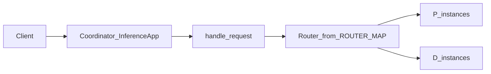

# PD Disaggregation (Feature Description)

<!-- md-trans-meta sourceCommit=unknown translatedAt=2026-06-27T02:06:50.624Z pushedAt=2026-06-30T07:14:40.697Z -->

Prefill/Decode disaggregation schedules the prefill and decode phases of inference across separate instances (P/D roles) that work together. For business implications and deployment configurations—such as `user_config.json` and KV transfer—refer to the [PD Disaggregation Deployment](../user_guide/service_deployment/pd_disaggregation_deployment.md) section in the User Guide.

This section only explains, from the perspective of the **Coordinator runtime code in this repository**, how deployment modes are enumerated and how incoming requests are routed.

## Deployment Mode Enumeration

The `DeployMode` values in `motor/config/coordinator.py` include:

| Enum | String Value |
|----------|-----------|
| `SINGLE_NODE` | `single_node` |
| `PD_SEPARATE` | `pd_separate` |
| `CDP_SEPARATE` | `cdp_separate` |
| `CPCD_SEPARATE` | `cpcd_separate` |
| `PD_DUAL_DISPATCH` | `pd_dual_dispatch` |
| `PD_DISAGGREGATION_SINGLE_CONTAINER` | `pd_disaggregation_single_container` |

The configuration is driven by the `deploy_mode` field of `CoordinatorConfig` / `SchedulerConfig` (the Scheduler configuration in the deployment documentation shall prevail where discrepancies exist).

## Main Request Routing Table

In `motor/coordinator/router/dispatch.py`, `_ROUTER_MAP` maps `DeployMode` to specific Router classes.

| `DeployMode` | Router Class |
|----------------|------------|
| `CDP_SEPARATE` | `SeparateCDPRouter` |
| `PD_SEPARATE` | `SeparateCDPRouter` |
| `CPCD_SEPARATE` | `SeparatePDRouter` |
| `SINGLE_NODE` | `PDHybridRouter` |
| `PD_DISAGGREGATION_SINGLE_CONTAINER` | `SeparateCDPRouter` |
| `PD_DUAL_DISPATCH` | `SeparatePDDualDispatchRouter` |

After the client inference request constructs a `RequestInfo` via `handle_request`, it instantiates the class from the table above and calls `handle_request()`.

## Instance Readiness and Fallback

`motor/coordinator/domain/scheduling.py` defines `InstanceReadiness` (such as `REQUIRED_MET`, `ONLY_PREFILL`, `ONLY_DECODE`, `NONE`, and `UNKNOWN`).

The logic in `handle_request` (consistent with the source code):

- Read `config_mode = config.scheduler_config.deploy_mode` and `readiness = await scheduler.has_required_instances()`.

- When `config_mode` is `PD_SEPARATE`, `CDP_SEPARATE`, `CPCD_SEPARATE`, or `PD_DISAGGREGATION_SINGLE_CONTAINER`, and `readiness == ONLY_PREFILL`, set the actual `deploy_mode` used for table lookup to `DeployMode.SINGLE_NODE` (comment note: fallback only when there is P but no D).

- Otherwise, `deploy_mode` equals `config_mode`.

- Then use `deploy_mode` to retrieve the class from `_ROUTER_MAP`; if not found, return 500 with `detail` containing `Unknown deploy mode`.

## Data Flow (Concept)

For the Metaserver path (the entry point on the D side that forwards P requests to Workers), see the description related to `POST /v1/metaserver` in [Service-Oriented Interface Description](../user_guide/service_oriented_interface/description.md); the implementation entry points are `dispatch.handle_metaserver_request` and `SeparateCDPRouter.handle_metaserver_request`.
