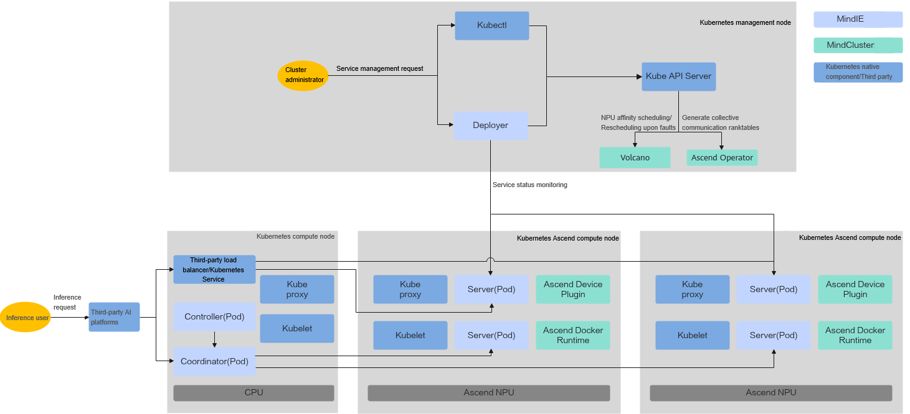
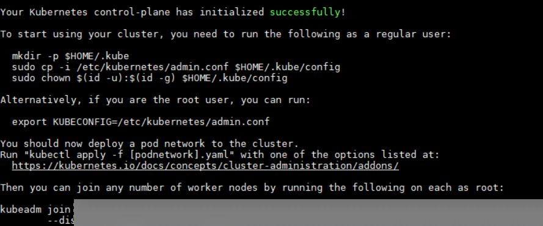
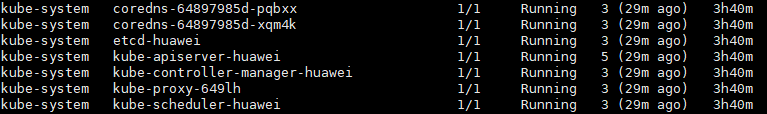
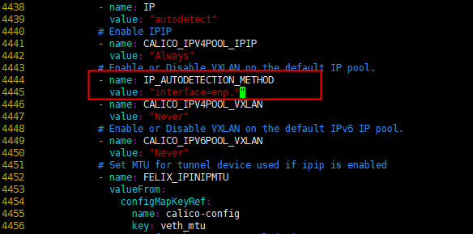
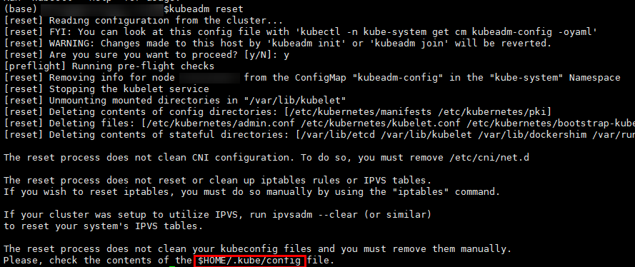
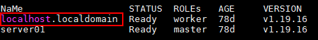
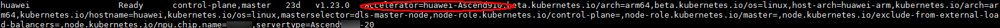
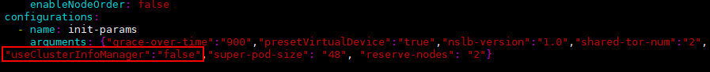

# Environment Setup

<!-- md-trans-meta sourceCommit=unknown translatedAt=2026-06-27T02:06:03.882Z pushedAt=2026-06-30T10:55:59.264Z -->

## Overview

This section applies only to cluster service deployment based on K8s and does not cover other scenarios. The deployment diagram is shown in [Figure 1 Overall deployment view of the K8s cluster](#fig698114995216).

**Figure 1** Overall deployment view of the K8s cluster<a name="fig698114995216"></a>



**Table 1** Deployment modes

|Deployment Mode|Description|
|--|--|
|PD disaggregation |Multiple servers are jointly deployed on one or more compute nodes, divided into Prefill compute instances (P instances) and Decode compute instances (D instances). P and D instances are deployed separately and perform collaborative inference, collectively serving as a Group to provide inference services externally. For details about PD disaggregation deployment, see [PD disaggregation deployment](./service_deployment/pd_disaggregation_deployment.md).|

## Component Introduction

Cluster containerized deployment depends on Kubernetes and MindCluster. For specific deployment scenarios, see [Table 1 Dependency list](#table9819144513712). For detailed introduction to Kubernetes components, see [Kubernetes Setup Tools](https://kubernetes.io/zh-cn/docs/reference/setup-tools/). For detailed introduction to MindCluster components, see "Introduction" \> "[Component Introduction](https://www.hiascend.com/document/detail/en/mindcluster/730/clustersched/dlug/mxdlug_003.html)" in the *MindCluster Cluster Scheduling User Guide*.

**Table 2** Dependency list<a name="table9819144513712"></a>

|Dependency Package|Software Description|Installed on Management Node (Y/N)|Installed on Compute Node (Y/N)|
|--|--|--|--|
|**Kubernetes**|-|-|-|
|kubectl|Command-line tool for Kubernetes.|Y|N|
|kubeadm|Tool for creating and managing Kubernetes clusters.|Y|Y|
|kubelet|Used to start containers on each node in the cluster.|Y|Y|
|**MindCluster**|-|-|-|
|Ascend Device Plugin|Based on the Kubernetes device plugin mechanism, provide device discovery, allocation, and health status reporting for Ascend AI Processors, enabling Kubernetes to manage Ascend AI Processors. Ascend Docker Runtime must be installed before use.|Y|Y|
|Ascend Operator|Create ranktable files and mount them to containers as configmaps, enabling data communication and task coordination among NPU devices across multiple nodes and optimizing collective communication link establishment performance.|Y|N|
|ClusterD|ClusterD is required for full-card scheduling, static vNPU scheduling, dynamic vNPU scheduling, checkpoint restart, elastic training, inference card fault recovery, and inference card fault rescheduling.|Y|N|
|Volcano|Based on the open-source Volcano scheduling plugin mechanism, add features such as affinity scheduling and fault rescheduling for Ascend AI Processors, maximizing the computing performance of Ascend AI Processors.|Y|Y|
|Ascend Docker Runtime|Provide Ascend containerization support for Docker or containerd, automatically mounting required files and device dependencies.|Y|N|

## Kubernetes Installation and Configuration

### Installing Kubernetes

**Installation Method 1 (Recommended):**

Refer to the [Kubernetes Official Website](https://kubernetes.io/docs/setup/) for installation.

1. Install the kubectl, kubeadm, and kubelet tools for Kubernetes.

    >[!NOTE]NOTE
    >- The supported Kubernetes versions are 1.18.x to 1.25.x, with version 1.19.x or later recommended.
    >- kubeadm and kubelet need to be installed on all nodes, while kubectl only needs to be installed on the management node.

2. Use the kubeadm tool to create a Kubernetes cluster. For installing kubeadm and creating a Kubernetes cluster, see [Creating a cluster with kubeadm](https://kubernetes.io/docs/setup/production-environment/tools/kubeadm/create-cluster-kubeadm/) on the Kubernetes official website.

    >[!NOTE]NOTE
    >If you encounter issues during the cluster initialization process, see "Reference" > "FAQs" > "Faults During Installation" > "Kubernetes Initialization Failure" in the *MindCluster Cluster Scheduling User Guide*.

**Installation Method 2:**

Install Kubernetes using the Alibaba Cloud mirror. All the following operations are performed on the management node. The Arm architecture is recommended. Select the software version with the Arm architecture.

1. Refer to the [Alibaba Cloud Kubernetes Mirror Official Website](https://developer.aliyun.com/mirror/kubernetes?spm=a2c6h.13651102.0.0.560a1b11OvDRt7) homepage to install the kubectl, kubeadm, and kubelet tools for Kubernetes.

     <br>Refer to the "Configuration Method" on the Alibaba Cloud Kubernetes Mirror official website, and directly execute the installation code on the server command line. You can modify the installation code to specify the installation version (for example: yum install -y **kubelet-1.23.0-00** **kubeadm-1.23.0-00** **kubectl-1.23.0-00**). Using the openEuler system as an example, the overall installation command example is as follows.

      ```bash
      cat <<EOF > /etc/yum.repos.d/kubernetes.repo
      [kubernetes]
      name=Kubernetes
      baseurl=https://mirrors.aliyun.com/kubernetes/yum/repos/kubernetes-el7-aarch64/
      enabled=1
      gpgcheck=1
      repo_gpgcheck=1
      gpgkey=https://mirrors.aliyun.com/kubernetes/yum/doc/yum-key.gpg https://mirrors.aliyun.com/kubernetes/yum/doc/rpm-package-key.gpg
      EOF
      yum install -y kubelet-1.23.0-00 kubeadm-1.23.0-00 kubectl-1.23.0-00
      ```

    >[!NOTE]NOTE
    >If the message "No match for argument: socat" or "nothing provides socat needed by xxx" is displayed, it indicates that the socat library is missing in the environment. The solution is as follows. (Missing other libraries, such as iptables and conntrack, will also produce similar messages.)
    >Use the following command to install the missing library yourself.
    >
    >```bash
    >#CentOS
    >yum install -y socat
    >#Ubuntu
    >apt-get install -y socat
    >```

2. Run the following command to query the dependencies and images required for deploying Kubernetes.

    ```bash
    kubeadm config images list
    ```

    Based on the query results, users need to manually install them one by one using docker pull. An example command is shown below.

    ```bash
    docker pull registry.k8s.io/kube-apiserver:v1.23.0
    ```

    >[!NOTE]NOTE
    >This image repository is the official Google image repository. The connection may be unstable. You can use the following two methods to access it:
    >
    >```bash
    >#Use the Alibaba Cloud image repository
    >docker pull registry.cn-hangzhou.aliyuncs.com/google_containers/kube-apiserver:v1.23.0
    >docker tag registry.cn-hangzhou.aliyuncs.com/google_containers/kube-apiserver:v1.23.0 registry.k8s.io/kube-apiserver:v1.23.0
    >#Access the image synchronization website and select the corresponding version of the K8s component for download
    >https://docker.aityp.com/s/registry.k8s.io
    >```

3. Run the following command to clear the system network proxy environment variables. Kubernetes core components (kubeadm/kubelet) need to directly access services such as the API Server. The network proxy may intercept or tamper with such requests, which may cause Kubernetes services to become unavailable.

    ```bash
    export -n http_proxy
    export -n https_proxy
    export -n no_proxy
    ```

4. Run the following command to initialize the Kubernetes cluster. When the output shown in [Figure 3 Kubernetes cluster initialization successful](#fig17764145015239) appears, it indicates that the initialization is successful.

    ```bash
    kubeadm init
    ```

    **Figure 3** Kubernetes cluster initialization successful<a name="fig17764145015239"></a>

    

    Then execute the content in [Figure 3 Kubernetes cluster initialization successful](#fig17764145015239), as shown below:

    ```bash
    mkdir -p $HOME/.kube
    sudo cp -i /etc/kubernetes/admin.conf $HOME/.kube/config
    sudo chown $(id -u):$(id -g) $HOME/.kube/config
    ```

5. <a id="step0001"></a>Run the following command to check whether the current default startup items are in normal status. As shown in [Figure 4 Check status](#fig669924115221), if all statuses are `Running`, the Kubernetes initialization is successful.

    ```bash
    kubectl get pods -A
    ```

    **Figure 4** Check status<a name="fig669924115221"></a>

    

6. (Optional) If the service starting with `coredns` is not in the running state, you need to add a network protocol framework service to the K8s cluster. It is recommended to use the calico framework (if the pod status is normal, you can skip this step).

    1. Run the following command to obtain the calico-related image (if a network connectivity issue occurs, reset the network proxy environment variables).

        ```bash
        docker pull calico/kube-controllers:v3.23.5
        docker pull calico/cni:v3.23.5
        docker pull calico/node:v3.23.5
        ```

        >[!NOTE]NOTE
        >There is a compatibility relationship between Kubernetes and calico versions. Query the compatible version and download it for use.

    2. Run the following command to download the calico YAML file (after this step is complete, cancel the network proxy settings).

        ```bash
        curl -k -O https://docs.projectcalico.org/v3.23/manifests/calico.yaml
        ```

    3. Run the `vim calico.yaml` command to modify the file, find the "CALICO_IPV4POOL_IPIP" field (around line 4444), and add the following content below it.

        ```bash
        - name: IP_AUTODETECTION_METHOD
        value: "interface=enp.*"
        ```

        >[!NOTE]NOTE
        >This method uses regular expression matching to find network interface cards (NICs). NIC names may vary across environments. Before deploying calico, it is recommended to use `ifconfig` to find the NIC name corresponding to the IP address on all servers. For example, in some environments where nodes are to be added to the cluster, the IP address may be configured on a virtual NIC. In the following example, the NIC name is `virbr0`, which differs from other servers. The configuration in the `calico.yaml` file must cover the NIC names of all nodes. In this case, you can set this field to `"interface=enp.*|virbr0"`.
        >
        >```txt
        ># ifconfig
        >virbr0: flags=4163<UP,BROADCAST,RUNNING,MULTICAST>  mtu 1500
        >         inet 141.61.21.1  netmask 255.255.252.0  broadcast 141.61.23.255
        >```

        **Figure 5** Display of modified content<a name="fig17764145015239"></a>  

        

    4. Start calico.

        ```bash
        kubectl apply -f calico.yaml
        ```

    5. Repeat step [5](#step0001). You can observe that the Pod status returns to normal.

### Resetting Kubernetes Settings

**This step is not required after successful initialization. You can perform the following reset steps when you need to reconfigure Kubernetes.**

Run the following command to reset Kubernetes settings. If the output is similar to [Figure 5 Reset successful](#fig3621632193415), the reset is successful.

```bash
kubeadm reset
```

**Figure 5**  Reset successful<a name="fig3621632193415"></a>



>[!NOTE]NOTE
>After the reset is successful, you need to manually delete the _\{$HOME\}_/.kube/config file to ensure that all Kubernetes configurations are removed.

### Adding Compute Nodes to the Kubernetes Cluster

If the entire cluster uses only one server, you do not need to add compute nodes and can skip the following steps.

The node to be added must meet the following requirements:

The basic Kubernetes software kubeadm and kubelet have been installed.

1. On the management node, create the token and ca-cert code required for a new node to join the cluster.

    The token and ca-cert code are valid for 24 hours. If they have expired, use the following commands to create them.

    - Create a token

        ```bash
        kubeadm token create
        ```

    - Create a ca-cert code

        ```bash
        openssl x509 -pubkey -in /etc/kubernetes/pki/ca.crt | openssl rsa -pubin -outform der 2>/dev/null | openssl dgst -sha256 -hex | sed 's/^.* //'
        ```

        >[!NOTE]NOTE
        >Because the preceding commands contain a plaintext token, it can be printed through history operation queries after execution, which may expose sensitive information. You are advised to use the following method for configuration.
        >
        >- Before executing sensitive commands, run the following command to temporarily disable the history operation query function.
        >
        >   ```bash
        >   set +o history
        >   ```
        >
        >- After completing sensitive command operations, run the following command to restore the history query function.
        >
        >   ```bash
        >   set -o history
        >   ```

2. Run the following command on the new node to join the cluster.

    ```bash
    kubeadm join <ip>:<port> --token {token} \
            --discovery-token-ca-cert-hash sha256:{ca-cert code}
    ```

    Parameter description:

    - <ip\>:<port\>: IP address and port of Kubernetes on the management node.

    - --token: Token for the node to join.

    - --discovery-token-ca-cert-hash: certificate hash value for joining the cluster.

3. On the new node, use the following command to query the current node hostname.

    ```bash
    hostname
    ```

    If the node hostname conflicts with other node names in the cluster, modify the `/etc/hostname` file to change the node hostname.

4. On the management node, use the following command `kubectl get nodes -A` to view node information. As shown in [Figure 7 New node](#fig1471911375514), `localhost.localdomain` is the newly added node.

    **Figure 6**  New node<a name="fig1471911375514"></a>  

    

5. On the management node, use the following command to label the new node with `accelerator=huawei-Ascend910` or `accelerator=huawei-Ascend310x` based on the actual NPU device type.

    ```bash
    #kubectl label nodes {node name} accelerator=huawei-Ascend910
    kubectl label nodes localhost.localdomain accelerator=huawei-Ascend910
    ```

6. On the management node, use the following command to view the `accelerator=huawei-Ascend910` label added to the new node. As shown in [Figure 8 accelerator=huawei-Ascend910 label](#fig4827123110205), the presence of "accelerator=huawei-Ascend910" indicates success.

    ```bash
    kubectl get nodes --show-labels
    ```

    **Figure 8**  accelerator=huawei-Ascend910 label<a name="fig4827123110205"></a>

    

### Installing MindCluster Components

The cluster management components depend on the Ascend Docker Runtime, Ascend Device Plugin, Volcano, and Ascend Operator components in MindCluster. The Volcano and Ascend Operator components are installed on the management node, while the other components are installed on the compute nodes.

1. Create node labels, create users, create log directories, and create namespaces by referring to [Preparing for Installation](https://gitcode.com/Ascend/mind-cluster/blob/branch_v26.0.0/docs/en/scheduling/installation_guide/03_installation/manual_installation/01_preparing_for_installation.md) in the *MindCluster Cluster Scheduling User Guide*.

2. Install Ascend Docker Runtime by referring to the "Installing Ascend Docker Runtime in Containerd Scenario" in the [Ascend Docker Runtime](https://gitcode.com/Ascend/mind-cluster/blob/branch_v26.0.0/docs/en/scheduling/installation_guide/03_installation/manual_installation/02_ascend_docker_runtime.md) of the *MindCluster Cluster Scheduling User Guide*.

3. Install Ascend Device Plugin by using the `device-plugin-_xxx_-v{version}.yaml` file. For installation details, see [Ascend Device Plugin](https://gitcode.com/Ascend/mind-cluster/blob/branch_v26.0.0/docs/en/scheduling/installation_guide/03_installation/manual_installation/04_ascend_device_plugin.md) in the *MindCluster Cluster Scheduling User Guide*.

    >[!NOTE]NOTE
    >When Ascend Device Plugin starts, if the `useAscendDocker` parameter in the `xxx.yaml` configuration file is set to `true` and the user has installed Ascend Docker Runtime and it is in effect, the driver-related directories under `/usr/local/Ascend` will be automatically mounted.

4. Install Volcano by referring to [Volcano](https://gitcode.com/Ascend/mind-cluster/blob/branch_v26.0.0/docs/en/scheduling/installation_guide/03_installation/manual_installation/05_volcano.md) in the *MindCluster Cluster Scheduling User Guide*.

    >[!NOTE]NOTE
    >In a single-machine scenario, when installing Volcano by referring to [Volcano](https://gitcode.com/Ascend/mind-cluster/blob/branch_v26.0.0/docs/en/scheduling/installation_guide/03_installation/manual_installation/05_volcano.md) in the *MindCluster Cluster Scheduling User Guide*, before executing step 9 in the "Volcano" section, modify the `volcano-v1.7.0.yaml` file in the `volcano-v1.7.0` directory generated after extracting Volcano, search for the "useClusterInfoManager" field and change its value to `false`, as shown in the following figure. After the modification is complete, execute step 9 in the "Volcano" section.
    >

5. Install Ascend Operator by referring to [Ascend Operator](https://gitcode.com/Ascend/mind-cluster/blob/branch_v26.0.0/docs/en/scheduling/installation_guide/03_installation/manual_installation/08_ascend_operator.md) in the *MindCluster Cluster Scheduling User Guide*.

6. Install ClusterD by referring to [ClusterD](https://gitcode.com/Ascend/mind-cluster/blob/branch_v26.0.0/docs/en/scheduling/installation_guide/03_installation/manual_installation/06_clusterd.md) in the *MindCluster Cluster Scheduling User Guide*.
