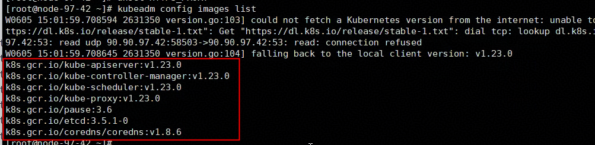
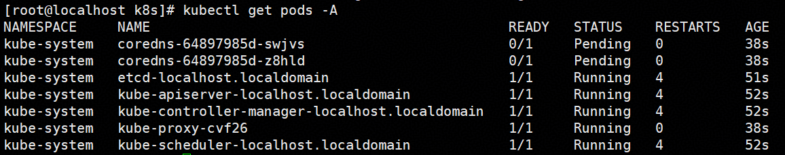
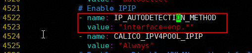
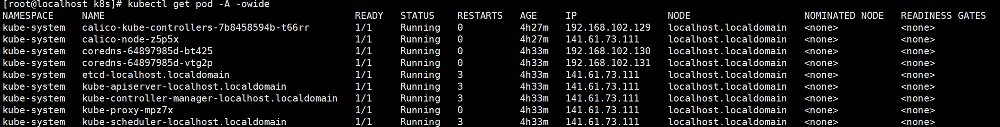
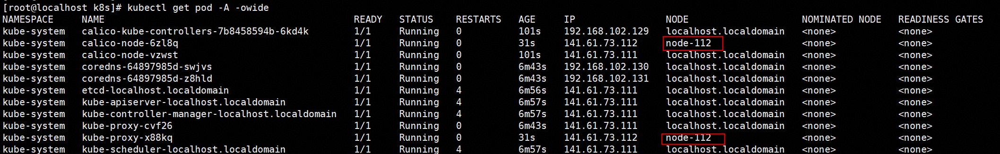

# Environment Setup

## Dependency Description

MindIE Motor depends on the container orchestration capabilities provided by Kubernetes, including Pod deployment, service exposure, health probes, and fault restart, to ensure secure service running. It also depends on MindCluster to provide Ascend cluster scheduling capabilities, implementing NPU resource scheduling and automatic fault recovery. The deployment diagram is shown in [Figure 1 Overall deployment view of the K8s cluster](#fig698114995216), and the specific component names and function descriptions are listed in [Table 1 Dependency list](#table9819144513712).

**Figure 1** Overall deployment view of the K8s cluster<a name="fig698114995216"></a>


**Table 1** Dependency list<a name="table9819144513712"></a>

|Dependency Package|Software Description|Installed on Management Node (Master Node)|Installed on Compute Node (Worker Node)|
|--|--|--|--|
|**Firmware and Driver**|-|-|-|
|Ascend HDK|NPU driver tool. The inference engine depends on this component.|Y|Y|
|**Image Management Tool**|-|-|-|
|docker|Image loading and usage.|Y|Y|
|**Kubernetes**|-|-|-|
|kubectl|Command-line tool for Kubernetes.|Y|N|
|kubeadm|Tool for creating and managing Kubernetes clusters.|Y|Y|
|kubelet|Starts containers on each node in the cluster.|Y|Y|
|**MindCluster**|-|-|-|
|Ascend Device Plugin|Based on the Kubernetes device plugin mechanism, provides device discovery, allocation, and health status reporting for Ascend AI processors, enabling Kubernetes to manage Ascend AI processor resources. It can be used only after Ascend Docker Runtime is installed.|Y|Y|
|ClusterD|Users who use full-card scheduling, static vNPU scheduling, dynamic vNPU scheduling, checkpoint resume training, elastic training, inference card fault recovery, or inference card fault rescheduling must install ClusterD.|Y|N|
|Volcano|Based on the open-source Volcano scheduling plugin mechanism, adds features such as affinity scheduling and fault rescheduling for Ascend AI processors to maximize the computing performance of Ascend AI processors.|Y|N|
|Ascend Docker Runtime|Provides Ascend containerization support for docker or containerd, automatically mounting required files and device dependencies.|Y|Y|
|Infer Operator|Creates inference instance Workloads and Services, providing manual scaling capabilities for inference instances.|Y|N|

## Ascend HDK and Docker Installation

 1. Ascend HDK has been installed on all servers. If it is not installed, refer to the [Ascend HDK Installation and Deployment Guide](https://support.huawei.com/enterprise/en/ascend-computing/ascend-hdk-pid-252764743?category=installation-upgrade&subcategory=software-deployment-guide) and select the corresponding driver version based on the product series and model.

 2. Install Docker on the host machine by yourself (version 24.x.x or later is required). For Docker installation, see the [Docker Installation Guide](https://docs.docker.com/get-started/get-docker/).

## Kubernetes Installation

Install Kubernetes from an image source. Both automated script installation and manual installation are supported. Automated script installation is recommended. You can also refer to the [Kubernetes official website](https://kubernetes.io/docs/setup/) for installation.

### Prerequisites Check

1. Docker has been installed in advance.

2. Check the Docker configuration.

    ```bash
    vim /etc/docker/daemon.json
    ```

    Check the mandatory items (save directly after configuration). The following is an example:

    - Check the `exec-opts` configuration item. It must be `native.cgroupdriver=systemd`.

    - Check the `insecure-registries` configuration item. It must contain `swr.cn-north-4.myhuaweicloud.com` and `registry.cn-hangzhou.aliyuncs.com`.

    ```bash
    {
    "default-runtime": "ascend",
    "exec-opts": [
    "native.cgroupdriver=systemd"
    ],
    "insecure-registries": [
    "registry.cn-hangzhou.aliyuncs.com",
    "swr.cn-north-4.myhuaweicloud.com"
    ],
    "registry-mirrors": [
    "https://ascendhub.huawei.cn",
    "https://quay.io",
    "https://cr.rnd.huawei.com"
    ]
    }
    ```

3. Configure the Docker proxy.

    ```bash
    # Back up the old proxy
    mkdir -p /etc/systemd/system/docker.service.d/backup
    mv /etc/systemd/system/docker.service.d/*.conf /etc/systemd/system/docker.service.d/backup/ 2>/dev/null

    # Set a new proxy. Configure a valid network proxy
    cat > /etc/systemd/system/docker.service.d/http-proxy.conf << 'EOF'
    [Service]
    Environment="HTTP_PROXY=xxxx"
    Environment="HTTPS_PROXY=xxxx"
    Environment="NO_PROXY=xxxx"
    EOF
    ```

    Verify that the configuration takes effect.

    ```bash
    # Restart docker
    systemctl daemon-reload
    systemctl restart docker
    # You must be able to see HTTP_PROXY and HTTPS_PROXY
    systemctl show docker --property=Environment
    ```

4. Check the storage space. Ensure that the used space of the root directory is less than 85%; otherwise, image loss may occur.

    ```bash
    # Check the server disk space
    df -h
    ```

### Automatic Installation (Recommended)

The script installs Kubernetes 1.23.0 and Calico 3.24.5 by default. This version combination supports the normal deployment of MindIE Motor.

1. Prepare the script.

    The [installation script](https://gitcode.com/Ascend/MindIE-Motor/tree/master/docs/en/user_guide/deployment/k8s/deployment_script) for K8s is prepared in the current directory. Copy the folder directly to the server where installation is required.

2. Configure parameters.

    Modify the script configuration file `env.conf`. The content to be configured is as follows.

      ```bash
      # HOST_IP is the IP address of the current node. Format: HOST_IP=<IP address>

      HOST_IP="141.61.73.111"

      # Regular expression for automatic detection of the Calico NIC
      # Command to query the primary NIC: ip route | grep default
      #
      # Principle description:
      # calico runs on every server in the cluster (calico is configured only on the management node, and this configuration applies to all nodes in the cluster). Therefore, the preceding expression must ensure that calico can find the NIC on every server in the cluster
      # If the primary NIC names of all nodes in the entire cluster (found by running ip route | grep default) share the same prefix, for example, the primary NIC names of the cluster nodes are enp1 (master), enp2 (worker1 node), and enp115235 (worker node 2), you can enter enp.*
      # If the primary NIC names of the nodes are inconsistent, use | to include the naming rules of all nodes in the expression. For example, if most nodes use enp as the prefix for their primary NICs while a few nodes use virbr0, you can enter enp.*|virbr0
      IP_AUTODETECTION_IFACE="xxx"

      # ---------- Network proxy (optional; the script tests the direct connection first and then the proxy, and uses whichever works) ----------
      HTTP_PROXY="http://<proxy_server>:<proxy_port>"
      HTTPS_PROXY="http://<proxy_server>:<proxy_port>"
      NO_PROXY="127.0.0.1,localhost,10.0.0.0/8,192.168.0.0/16,141.61.0.0/16"
      ```

3. Pre-check.

    Run the following command. The script checks the Docker configuration, external network connectivity, Docker network connectivity, and root directory usage. If the check fails, troubleshoot whether the corresponding functions in the environment are normal.

      ```bash
      source env.conf && sudo -E bash deploy_k8s.sh precheck
      ```

4. Formal installation.

    The script automatically performs all operations in the "manual installation" section. If an error occurs, troubleshoot the environment issue based on the log information.

      ```bash
      # Management node
      source env.conf && sudo -E bash deploy_k8s.sh master
      # Compute node
      source env.conf && sudo -E bash deploy_k8s.sh worker
      ```

After the installation is complete, you do not need to pay attention to the "Manual Installation" section and can directly proceed to the "Creating a Cluster" chapter.

### Manual Installation

1. Obtain the Kubernetes components.

    Run the installation command on the server command line. You can modify the installation command to specify the installation version (for example, `yum install -y kubelet-1.23.0-00 kubeadm-1.23.0-00 kubectl-1.23.0-00`). The following example uses the openEuler OS and Arm architecture (for other OSs and architectures, modify the repository source as needed). The complete installation command is as follows.

      ```bash
      # Back up the old repository source to avoid interference
      mkdir -p /etc/yum.repos.d/disabled
      mv /etc/yum.repos.d/*.repo /etc/yum.repos.d/disabled/ 2>/dev/null

      # Set the repository source
      cat > /etc/yum.repos.d/openEuler-huawei.repo << 'EOF'
      [openEuler-everything]
      name=openEuler Everything
      baseurl=https://repo.huaweicloud.com/openeuler/openEuler-24.03-LTS-SP2/everything/aarch64/
      enabled=1
      gpgcheck=0
      EOF

      cat > /etc/yum.repos.d/kubernetes.repo << 'EOF'
      [kubernetes]
      name=Kubernetes
      baseurl=https://mirrors.aliyun.com/kubernetes/yum/repos/kubernetes-el7-aarch64/
      enabled=1
      gpgcheck=0
      EOF

      # Start the installation
      yum install -y kubelet-1.23.0-00 kubeadm-1.23.0-00 kubectl-1.23.0-00
      ```

    >[!NOTE]NOTE
    >A proxy must be mounted before installation.
    >After installation, restore the repository sources in the `/etc/yum.repos.d/disabled` folder as needed.

2. Install the dependencies of Kubernetes.

    ```bash
    unset http_proxy
    unset https_proxy
    unset HTTP_PROXY
    unset HTTPS_PROXY
    kubeadm config images list
    ```

    >[!NOTE]NOTE
    >When running the preceding command, you must unmount the proxy. Otherwise, subsequent version mismatches may occur.

    The query result is shown in the following figure.

    **Figure 3**  Example of image results<a name="fig17764145015239"></a>

    

    You need to obtain all images shown in the preceding figure. The following two methods are provided for obtaining images:
    >
    >```bash
    >#(Recommended) Method 1: Use the Alibaba Cloud image repository
    >#Pull the images
    >docker pull registry.cn-hangzhou.aliyuncs.com/google_containers/kube-apiserver:v1.23.0
    >docker pull registry.cn-hangzhou.aliyuncs.com/google_containers/kube-controller-manager:v1.23.0
    >docker pull registry.cn-hangzhou.aliyuncs.com/google_containers/kube-scheduler:v1.23.0
    >docker pull registry.cn-hangzhou.aliyuncs.com/google_containers/kube-proxy:v1.23.0
    >docker pull registry.cn-hangzhou.aliyuncs.com/google_containers/pause:3.6
    >docker pull registry.cn-hangzhou.aliyuncs.com/google_containers/etcd:3.5.1-0
    >docker pull registry.cn-hangzhou.aliyuncs.com/google_containers/coredns:v1.8.6
    >
    >#Rename the images
    >docker tag registry.cn-hangzhou.aliyuncs.com/google_containers/kube-apiserver:v1.23.0           k8s.gcr.io/kube-apiserver:v1.23.0
    >docker tag registry.cn-hangzhou.aliyuncs.com/google_containers/kube-controller-manager:v1.23.0  k8s.gcr.io/kube-controller-manager:v1.23.0
    >docker tag registry.cn-hangzhou.aliyuncs.com/google_containers/kube-scheduler:v1.23.0           k8s.gcr.io/kube-scheduler:v1.23.0
    >docker tag registry.cn-hangzhou.aliyuncs.com/google_containers/kube-proxy:v1.23.0               k8s.gcr.io/kube-proxy:v1.23.0
    >docker tag registry.cn-hangzhou.aliyuncs.com/google_containers/pause:3.6                           k8s.gcr.io/pause:3.6
    >docker tag registry.cn-hangzhou.aliyuncs.com/google_containers/etcd:3.5.1-0                        k8s.gcr.io/etcd:3.5.1-0
    >docker tag registry.cn-hangzhou.aliyuncs.com/google_containers/coredns:v1.8.6                      k8s.gcr.io/coredns/coredns:v1.8.6
    >
    >#Remove the unused images
    >docker rmi registry.cn-hangzhou.aliyuncs.com/google_containers/kube-apiserver:v1.23.0
    >docker rmi registry.cn-hangzhou.aliyuncs.com/google_containers/kube-controller-manager:v1.23.0
    >docker rmi registry.cn-hangzhou.aliyuncs.com/google_containers/kube-scheduler:v1.23.0
    >docker rmi registry.cn-hangzhou.aliyuncs.com/google_containers/kube-proxy:v1.23.0
    >docker rmi registry.cn-hangzhou.aliyuncs.com/google_containers/pause:3.6
    >docker rmi registry.cn-hangzhou.aliyuncs.com/google_containers/etcd:3.5.1-0
    >docker rmi registry.cn-hangzhou.aliyuncs.com/google_containers/coredns:v1.8.6
    >
    >#Method 2: Visit the image synchronization website and select the corresponding K8s component version to download
    >https://docker.aityp.com/s/registry.k8s.io
    >```

3. Run the following command to clear the system network proxy environment variables. The Kubernetes core components (kubeadm/kubelet) need to directly access services such as the API Server. A network proxy may intercept or tamper with such requests, which may make Kubernetes services unavailable **(Compute nodes: complete this step and then go to the "Creating a Cluster" step. Management nodes: continue with the following steps.)**.

    ```bash
    rm -rf /var/lib/kubelet
    mkdir /var/lib/kubelet
    swapoff -a
    kubeadm reset -f
    rm -rf /etc/cni/net.d /root/.kube/
    unset http_proxy
    unset https_proxy
    unset HTTP_PROXY
    unset HTTPS_PROXY
    ```

4. Initialize kubeadm.

    Use the following commands to initialize the Kubernetes cluster. When the output shown in the figure appears, the initialization is successful.

    ```bash
    kubeadm init --kubernetes-version={parameter 1：kubelet_version} --pod-network-cidr=192.168.0.0/16 --apiserver-advertise-address={parameter 2 host_ip}
    mkdir -p $HOME/.kube;
    cp -f /etc/kubernetes/admin.conf $HOME/.kube/config;
    chown $(id -u):$(id -g) $HOME/.kube/config
    ```

    >[!NOTE]NOTE
    >
    >There are **two parameters that you need to configure by yourself**.
    >
    >`kubelet_version`: You can query it by running the `kubelet --version` command.
    >
    >`host_ip`: the IP address of the host.
    >
    >**Example of the final command**:
    >
    >`kubeadm init --kubernetes-version=v1.23.0 --pod-network-cidr=192.168.0.0/16 --apiserver-advertise-address=141.88.99.101`

    **Figure 4**  Kubernetes cluster initialized successfully

    

5. <a id="step0001"></a>Run the following command to check whether the current default startup item status is normal. As shown in the following figure, the pod starting with coredns should be in the pending status, and the other pods should be in the running status.

    ```bash
    kubectl get pods -A
    ```

    **Figure 5** Checking the status

    

6. Add a network protocol framework service to the k8s cluster to change the status of the service starting with coredns from pending. The calico component is recommended.

    - Run the following command to obtain the calico-related images.

        ```bash
        # Confirm the architecture first, and then execute the corresponding branch (aarch64=ARM, x86_64=x86)
        uname -m

        # ---- ARM  ----
        docker pull swr.cn-north-4.myhuaweicloud.com/ddn-k8s/docker.io/calico/kube-controllers:v3.24.5-linuxarm64
        docker pull swr.cn-north-4.myhuaweicloud.com/ddn-k8s/docker.io/calico/cni:v3.24.5-linuxarm64
        docker pull swr.cn-north-4.myhuaweicloud.com/ddn-k8s/docker.io/calico/node:v3.24.5-linuxarm64

        docker tag swr.cn-north-4.myhuaweicloud.com/ddn-k8s/docker.io/calico/kube-controllers:v3.24.5-linuxarm64 calico/kube-controllers:v3.24.5
        docker tag swr.cn-north-4.myhuaweicloud.com/ddn-k8s/docker.io/calico/cni:v3.24.5-linuxarm64             calico/cni:v3.24.5
        docker tag swr.cn-north-4.myhuaweicloud.com/ddn-k8s/docker.io/calico/node:v3.24.5-linuxarm64             calico/node:v3.24.5

        # ---- x86  ----
        docker pull swr.cn-north-4.myhuaweicloud.com/ddn-k8s/docker.io/calico/kube-controllers:v3.24.5
        docker pull swr.cn-north-4.myhuaweicloud.com/ddn-k8s/docker.io/calico/cni:v3.24.5
        docker pull swr.cn-north-4.myhuaweicloud.com/ddn-k8s/docker.io/calico/node:v3.24.5

        docker tag swr.cn-north-4.myhuaweicloud.com/ddn-k8s/docker.io/calico/kube-controllers:v3.24.5 calico/kube-controllers:v3.24.5
        docker tag swr.cn-north-4.myhuaweicloud.com/ddn-k8s/docker.io/calico/cni:v3.24.5             calico/cni:v3.24.5
        docker tag swr.cn-north-4.myhuaweicloud.com/ddn-k8s/docker.io/calico/node:v3.24.5             calico/node:v3.24.5
        ```

        >[!NOTE]NOTE
        >The versions of Kubernetes and calico must match. The preceding operation uses version 3.24.5 as an example. If you need to change the version, query the matching version and download it for use.

    - Run the following command to download the calico .yaml file. (A network proxy must be configured before this step.)

        ```bash
       curl -L -k -O https://docs.projectcalico.org/v3.24/manifests/calico.yaml
        ```

    - Run the `vim calico.yaml` command to modify the file. Find the `CALICO_IPV4POOL_IPIP` field and **additionally add** the following content above it (around line 4522):

        ```bash
        - name: IP_AUTODETECTION_METHOD
          value: "interface={NIC matching expression}"
        ```

        **Figure 6** Display of modifications<a name="fig17764145015239"></a>

        

        >[!NOTE]NOTE
        >calico runs on every server in the cluster (calico is configured only on the management node, and the configuration is applied to all nodes in the cluster). Therefore, the preceding expression must ensure that calico can find the NIC on every server in the cluster:
        >
        >If the **primary NIC names (found by running `ip route | grep default`) of all nodes in the cluster share the same prefix**, for example, the primary NIC names of the cluster nodes are enp1 (master), enp2 (worker1 node), and enp115235 (worker2 node), you can enter `enp.*`.
        >
        > If the **primary NIC names of the nodes are inconsistent**, use `|` to include the naming rules of all nodes in the expression. For example, if the primary NICs of most nodes start with `enp`, while the primary NIC of a few nodes is on virbr0, you can enter `enp.*|virbr0`.

    - Start calico.

        ```bash
        unset http_proxy https_proxy HTTP_PROXY HTTPS_PROXY
        kubectl apply -f calico.yaml
        kubectl taint nodes --all node-role.kubernetes.io/master-
        ```

    - Wait for a short period (about 20 seconds), and then run the following command. You can observe that the Pod status returns to normal, as shown in Figure 7.

        ```bash
        kubectl get pods -A
        ```

        **Figure 7** Normal status of the management node<a name="fig17764145015239"></a>

        

### Creating a Cluster

Connect compute nodes to the management node by following the steps below to form a cluster.

1. On the management node, create the token and ca-cert code required for a new node to join the cluster.

    The token and ca-cert code are valid for 24 hours. If they have expired, create them using the following commands.

    - Creating a token

        ```bash
        kubeadm token create --print-join-command
        ```

    - Output

        ```bash
        kubeadm join 90.90.122.33:6443 --token ssajj5.mtjx77rj06et9ssv     --discovery-token-ca-cert-hash sha256:xxx
        ```

    - Querying the host name

        ```bash
        hostname
        ```

2. On the compute node, run the following command to join the cluster.

    ```bash
    # Copy the output above and add the --node-name field. The value of this field specifies the name of the current node and can be customized, but it must differ from the hostname
    kubeadm join 90.90.122.33:6443 --token ssajj5.mtjx77rj06et9ssv     --discovery-token-ca-cert-hash sha256:xxx --node-name=worker-09
    ```

3. On the management node, run the `kubectl get pod -A -owide` command to view node information. As shown in [Figure 8 New node](#fig1471911375514), all pods running on the newly added node node-112 are in the running status.

    **Figure 8**  New node<a name="fig1471911375514"></a>

    

    >[!NOTE]NOTE
    >Repeat steps 2 and 3 until all compute nodes have joined the management node.

## MindCluster Component Installation

The cluster management components depend on the Ascend Docker Runtime, Ascend Device Plugin, ClusterD, Volcano, and Infer Operator components in MindCluster. Among them, **the management node needs all components, while the compute node only needs the image of the Ascend Device Plugin**. It is recommended to install version 26.0.0 or later.

1. Refer to the [Preparing for Installation](https://gitcode.com/Ascend/mind-cluster/blob/branch_v26.1.0/docs/zh/scheduling/05_developer_guide/00_installation_deployment/00_manual_installation/01_preparing_for_installation.md) section in the *MindCluster Cluster Scheduling User Guide* to create users, create log directories, build images, and create namespaces.

2. Refer to the [Ascend Docker Runtime](https://gitcode.com/Ascend/mind-cluster/blob/branch_v26.1.0/docs/zh/scheduling/05_developer_guide/00_installation_deployment/00_manual_installation/02_ascend_docker_runtime.md) section in the *MindCluster Cluster Scheduling User Guide* to install the Ascend Docker Runtime.

3. Refer to the [Ascend Device Plugin](https://gitcode.com/Ascend/mind-cluster/blob/branch_v26.1.0/docs/zh/scheduling/05_developer_guide/00_installation_deployment/00_manual_installation/04_ascend_device_plugin.md) section in the *MindCluster Cluster Scheduling User Guide* to install the Ascend Device Plugin, using the `device-plugin-_xxx_-v{version}.yaml` file for installation.

    >[!NOTE]NOTE
    >When the Ascend Device Plugin starts, if the `useAscendDocker` parameter in the `xxx.yaml` configuration file is set to `true` and the user has installed the Ascend Docker Runtime and it has taken effect, the driver-related directories under `/usr/local/Ascend` are automatically mounted.

4. Refer to the [Volcano](https://gitcode.com/Ascend/mind-cluster/blob/branch_v26.1.0/docs/zh/scheduling/05_developer_guide/00_installation_deployment/00_manual_installation/05_volcano.md) section in the *MindCluster Cluster Scheduling User Guide* to install Volcano.

    >[!NOTE]NOTE
    >In the single-machine scenario, when installing Volcano by referring to the [Volcano](https://gitcode.com/Ascend/mind-cluster/blob/branch_v26.1.0/docs/zh/scheduling/05_developer_guide/00_installation_deployment/00_manual_installation/05_volcano.md) section in the *MindCluster Cluster Scheduling User Guide*, before executing step 9 in the "Volcano" section, you need to modify the `volcano-v1.7.0.yaml` file in the `volcano-v1.7.0` directory generated after Volcano decompression, search for the `useClusterInfoManager` field and change its value to `false`, as shown in the following figure. After the modification is complete, execute step 9 in the "Volcano" section.
    >

5. Refer to the [infer_Operator](https://gitcode.com/Ascend/mind-cluster/blob/branch_v26.1.0/docs/zh/scheduling/05_developer_guide/00_installation_deployment/00_manual_installation/07_infer_operator.md) section in the *MindCluster Cluster Scheduling User Guide* to install the Infer Operator.

6. Refer to the [ClusterD](https://gitcode.com/Ascend/mind-cluster/blob/branch_v26.1.0/docs/zh/scheduling/05_developer_guide/00_installation_deployment/00_manual_installation/06_clusterd.md) section in the *MindCluster Cluster Scheduling User Guide* to install ClusterD.

## Setting Node Labels

Based on the server type, perform the following operations on the management node to set labels for the cluster uniformly.

   >[!NOTE]NOTE
   >The current script also labels the master node of the k8s cluster as a worker node, meaning that by default the master node can also be used to deploy inference services. If adjustment is needed, users can modify the labeling script themselves.

1. Atlas 800I A2 inference server

   ```bash
    master=$(kubectl get nodes  | grep  master| grep -v NAME| awk '{print $1}')
    workers=$(kubectl get nodes  | grep -v NAME| awk '{print $1}')

    echo "master node is $master"
    echo "worker node is $workers"

    arch=$(arch)
    echo $arch
    if [[ $arch == aarch64 ]];then
        arch=arm
    else
        arch=x86
    fi

    kubectl label nodes $master masterselector=dls-master-node          --overwrite=true

    for i in $workers;
    do
      kubectl label nodes $i  node-role.kubernetes.io/worker=worker     --overwrite=true
      kubectl label nodes $i  workerselector=dls-worker-node            --overwrite=true
      kubectl label nodes $i  host-arch=huawei-arm                      --overwrite=true
      kubectl label nodes $i  accelerator=huawei-Ascend910              --overwrite=true
      kubectl label nodes $i  accelerator-type=module-910b-8            --overwrite=true
      kubectl label nodes $i  nodeDEnable=on                            --overwrite=true
    done
   ```

2. Atlas 800I A3 SuperPoD Server

   ```bash
    master=$(kubectl get nodes  | grep  master| grep -v NAME| awk '{print $1}')
    workers=$(kubectl get nodes  | grep -v NAME| awk '{print $1}')

    echo "master node is $master"
    echo "worker node is $workers"

    arch=$(arch)
    echo $arch
    if [[ $arch == aarch64 ]];then
        arch=arm
    else
        arch=x86
    fi

    kubectl label nodes $master masterselector=dls-master-node         --overwrite=true

    for i in $workers;
    do
      kubectl label nodes $i  node-role.kubernetes.io/worker=worker    --overwrite=true
      kubectl label nodes $i  workerselector=dls-worker-node           --overwrite=true
      kubectl label nodes $i  host-arch=huawei-arm                     --overwrite=true
      kubectl label nodes $i  accelerator=huawei-Ascend910             --overwrite=true
      kubectl label nodes $i  accelerator-type=module-a3-16            --overwrite=true
      kubectl label nodes $i  nodeDEnable=on                           --overwrite=true
    done
   ```

3. Atlas 850 SuperPoD Server.

   >[!NOTE]NOTE
   >`accelerator-type` must be filled in based on the actual form. For a common cluster, use `850-Atlas-8p-8`; for an 850 SuperPoD, change it to `850-SuperPod-Atlas-8`; for a 950 SuperPoD, change it to `950-SuperPod-Atlas-8`. For details, see [mindcluster label configuration](https://gitcode.com/Ascend/mind-cluster/blob/branch_v26.0.0/docs/en/scheduling/installation_guide/03_installation/manual_installation/01_preparing_for_installation.md#%E5%88%9B%E5%BB%BA%E8%8A%82%E7%82%B9%E6%A0%87%E7%AD%BE).

   ```bash
    master=$(kubectl get nodes  | grep  master| grep -v NAME| awk '{print $1}')
    workers=$(kubectl get nodes  | grep -v NAME| grep -v master| awk '{print $1}')

    echo "master node is $master"
    echo "worker node is $workers"

    arch=$(arch)
    echo $arch
    if [[ $arch == aarch64 ]];then
        arch=arm
    else
        arch=x86
    fi

    kubectl label nodes $master masterselector=dls-master-node         --overwrite=true

    for i in $workers;
    do
      kubectl label nodes $i  node-role.kubernetes.io/worker=worker    --overwrite=true
      kubectl label nodes $i  workerselector=dls-worker-node           --overwrite=true
      kubectl label nodes $i  host-arch=huawei-$arch                   --overwrite=true
      kubectl label nodes $i  accelerator=huawei-npu                   --overwrite=true
      kubectl label nodes $i  accelerator-type=850-Atlas-8p-8          --overwrite=true
      kubectl label nodes $i  nodeDEnable=on                           --overwrite=true
    done
   ```
