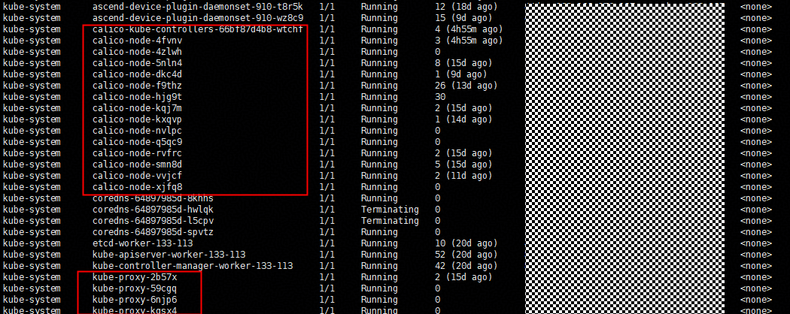
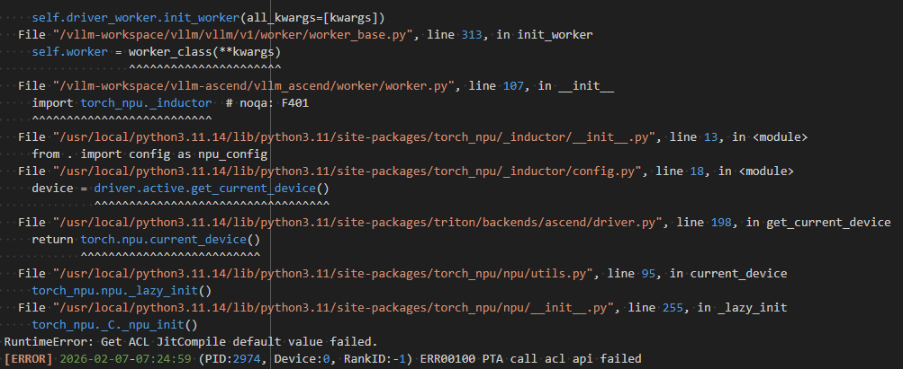
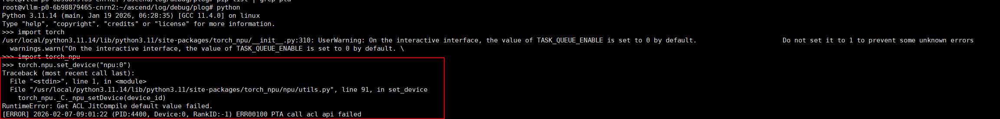
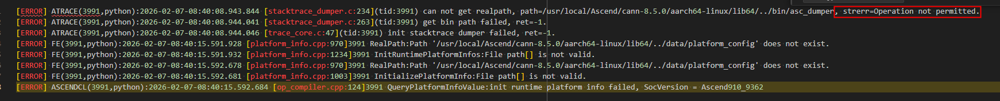
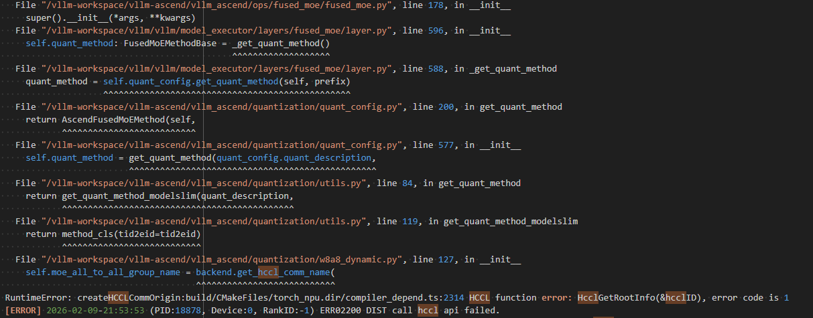
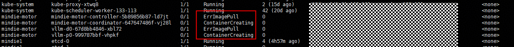

# FAQs About Deploying the Inference Service Using MindIE-PyMotor

## Pod Network Connectivity Issues Between Kubernetes Nodes

**Symptom**

The service fails to be deployed, and the PyMotor log shows that the network communication between the Controller and PD instances is abnormal.

<br>

**Cause Analysis**

The MoE EP solution includes general-purpose compute nodes and intelligent compute nodes. Generally, the master node and service node in the cluster use general-purpose compute nodes. The NIC names of general-purpose compute nodes and intelligent compute nodes may be different. As a result, the NIC names in the Calico configuration file are not applicable to all nodes. If the pods on different nodes in the onsite Kubernetes cluster cannot communicate with each other, you can rectify the fault by referring to the following methods.

  <br>

**Solution**

Run the `kubectl get pod -A -owide` command on the master node to check whether the pod status of calico and kube-proxy is normal.


- If the network-related pods are normal (`READY: 1/1` + `STATUS: Running`, as shown in the preceding figure):
  If the pod status of calico and kube-proxy is normal, restart the pod. (Run the following command on the master node to delete the network-related pod. The pod will be restarted several seconds later.)

  ```bash
  kubectl get pods -n kube-system | grep calico | awk '{print $1}' | xargs kubectl delete pod -n kube-system
  kubectl get pods -n kube-system | grep kube-proxy | awk '{print $1}' | xargs kubectl delete pod -n kube-system
  ```

- If the network-related pod is abnormal (`READY: 0/1`): 
  If the pod status is abnormal, for example, a Calico pod is always in the `ready 0/1` state, You can view the NIC names of all nodes (including master and worker nodes) in the cluster. If all nodes have NICs with the same name, for example, `enp189s0f0`, run the `kubectl edit ds -n kube-system calico-node` command on the master node to change the NIC name. If the NICs are bonded onsite, enter the bond name, for example, `bond4`.
  
  ```yaml
  - name: IP_AUTODETECTION_METHOD
    value: interface=enp189s0f0
  ```

  If the in-band management plane NIC names of all nodes in the cluster are different, for example, `enp189s0f0` and `enp125s0f0`, change the NIC names as follows:
  
  ```yaml
  - name: IP_AUTODETECTION_METHOD
    value: interface=enp189s0f0,enp125s0f0
  ```

If the fault persists, run the `kubectl describe pod -n [pod namespace] [pod name]` and `kubectl logs -n [pod namespace] [pod name]` commands on the master node to view the pod information and logs, analyze the cause, and rectify the fault.

## During service deployment, the error message "Get ACL JitCompile default value failed" is displayed in the log

**Symptom**
The service fails to call torch_npu. Check the logs of the P or D node. The following error message is displayed:



<br>

**Cause Analysis**
The NPU cannot be used in the pod, and the CANN component may fail to be invoked. When you enter the pod and perform the set_device operation, the same error is reported.



Go to the `~/ascend/log/debug/plog` directory in the pod to view the plog. Run `ll -rt` in this directory to identify the latest plog file, then `cat [latest plog filename]` to view it. The command fails due to insufficient runtime permissions.



**Solution**

For details, see [Troubleshooting Cases](https://www.hiascend.com/developer/blog/details/0297201752127535078) in the Ascend community.

## HCCL Connection Exception

**Symptom**

The HCCL connection fails. The following error information is displayed in the logs of the P or D node:



**Cause Analysis**

This problem may be caused by hardware faults or incorrect environment variable settings.

**Solution**

- Ensure the `HCCL_CONNECT_TIMEOUT` environment variable in startup script folder files such as `examples/infer_engines/vllm/env.json` (or the actual configuration file in use, e.g., `examples/infer_engines/vllm/models/deepseek/v3_1/env_v3_1_A2_EP32.json`) is set to a value between `120` and `7200`. Then, log in to the server where the error occurred and run `npu-smi set -t reset -i id -c chip_id [-m 1]` to reset the NPU.

  - `id`: The NPU ID obtained by running the `npu-smi info -l` command is the device ID.
  - `chip_id`: chip ID, which is obtained by running the `npu-smi info -m` command.

- If the fault persists, locate the fault by referring to the [Fault Diagnosis](https://www.hiascend.com/document/detail/en/canncommercial/850/commlib/hcclug/hcclug_000048.html) document in the Ascend community.

## Docker Image Exists Locally, but Pod Creation Fails with Image Pull Error

**Symptom**
    <br>The `kubectl get pod -A -owide` command shows that the pod in the `mindie-motor` namespace is in the `ErrImagePull` state.


**Cause Analysis**

- For Kubernetes versions earlier than 1.23: Kubernetes interacts with Docker via its API, and images are stored in Docker's storage.
- For Kubernetes versions 1.23 and later: Kubernetes communicates with the container runtime through CRI. By default, containerd is used, and Docker is not involved.

**Solution**
    <br>If the Kubernetes version is high, run the `ctr -n k8s.io image import [imageName]` command to load the image.

## Error "RuntimeError: can't start new thread" Is Reported After a Container Is Started

**Symptom**
On some nodes, the Pod throws `RuntimeError: can't start new thread` from the Python side after startup; setting the container's `seccompProfile` to `Unconfined` resolves the issue.

**Cause Analysis**
Linux seccomp intercepts syscalls related to thread/process creation (such as `clone3`). When `seccompProfile.type: RuntimeDefault` is set, certain container runtimes do not permit `clone3` in their default policy, causing glibc/pthread thread creation to fail.

**Solution**
By default, the repository deployment template uses `seccompProfile.type: Unconfined`, which can avoid this problem. If a higher security level or RuntimeDefault is required, see [Pod Permissions](https://gitcode.com/Ascend/MindIE-PyMotor/blob/master/examples/features/pod_permission_guide/README.md).

## `show_log.sh` Exits Without Logs or Returns Immediate Error

**Symptom**
Under `examples/deployer`, running `bash show_log.sh` prints an error to stderr and exits immediately, or the script starts but pod logs never appear as expected.

**Cause Analysis**
`show_log.sh` validates that `name_space` is not empty by reading `[LogSetting]` in `log_collect/log_config.ini` before launching `log_monitor.py`. If left unset or blank (the default repo template leaves `name_space` empty and requires manual entry), the script does not launch Python in the background. Instead, it outputs a message (e.g., prompting to set `name_space`) to the current terminal and exits with a non-zero status. If the provided namespace does not match the actual one, `show_log.sh` will still launch the collection process. However, `kubectl get pods` and `kubectl logs` will perform operations on the incorrect namespace, which may result in no Pods found, failure to retrieve target component logs, or unexpected content in `output.log` and on-disk logs.

**Solution**
If startup fails immediately: follow the on-screen prompts to edit `examples/deployer/log_collect/log_config.ini`, set `name_space` under `[LogSetting]` to match the namespace from `kubectl get pods -n <namespace>` (same as `<job_id>`/actual workload namespace in the PD disaggregation deployment doc), save the modification, and rerun `bash show_log.sh`. If a process is running but behaving abnormally, check `log_collect/output.log` and verify the namespace and Pod name with `kubectl get pods -n <Your namespace>`. For more information about deployment and log collection, see "Viewing Logs" in [PD Disaggregation Deployment](service_deployment/pd_disaggregation_deployment.md).

## Error "failed to create fsnotify watcher: too many open files" Is Displayed in the `show_log.sh` Log

**Symptom**
When using `show_log.sh` to view logs, an error similar to `failed to create fsnotify watcher: too many open files` occurs.

**Cause Analysis**
This error is typically related to the Linux inotify resource limit (distinct from "open file count" under the process `ulimit -n`). When monitoring a large number of directories or files, fsnotify may fail to create watchers if `max_user_watches` or `max_user_instances` is set too low. You can run the following commands on the faulty node to check the current value. The common default values are `8192` and `128`. If the value is too small, this problem may occur.

```bash
cat /proc/sys/fs/inotify/max_user_watches
cat /proc/sys/fs/inotify/max_user_instances
```

**Solution**
On the host or affected environment, raise the inotify limit (requires root). It is advised to edit the persistent `sysctl` configuration and run `sysctl -p` to apply changes, for example, increasing the watch count and instance limits to larger values.

```bash
# Edit the sysctl configuration file
sudo vim /etc/sysctl.conf
```

Add or modify the following content in the file (the value can be adjusted):

```text
fs.inotify.max_user_watches=1048576
fs.inotify.max_user_instances=512
```

Save and apply the configuration.    

```bash
sudo sysctl -p
```
