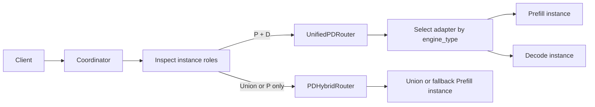
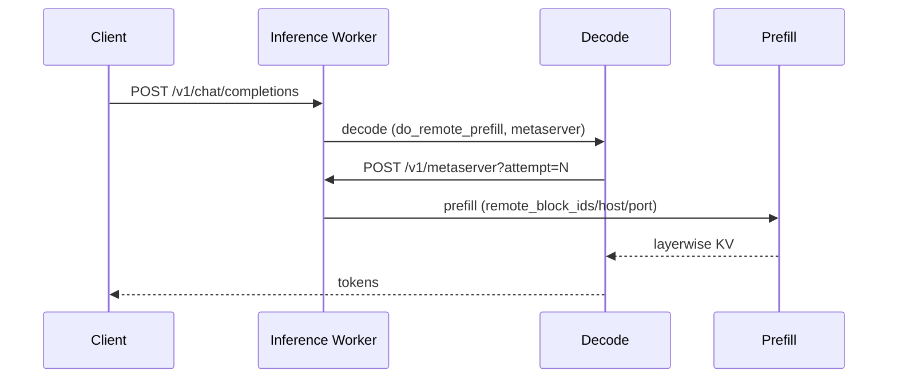

# PD 分离（特性说明）

**Prefill / Decode 分离**指将预填充与解码阶段调度到不同实例协同完成。部署配置与 KV 传输参数见 [PD 分离服务部署](../user_guide/deployment/k8s/pd_disaggregation_deployment.md)。

## 自动识别拓扑

Coordinator 不再读取 `motor_coordinator_config.scheduler_config.deploy_mode`。请求进入 `motor/coordinator/router/dispatch.py` 后，根据当前可用实例角色自动选择 Router：

| 可用角色 | Router |
|----------|--------|
| 同时存在 `prefill` 和 `decode` | `UnifiedPDRouter` |
| 存在 `union` | `PDHybridRouter` |
| 仅存在 `prefill` | `PDHybridRouter`，用于 PD 降级 |
| 其他组合 | 返回 503 |

`motor_deploy_config.deploy_mode` 仍然保留，只用于选择 `infer_service_set`、`multi_deployment` 或 `single_container` 等部署形态，不参与推理行为选择。

## Connector 驱动执行计划

P/D 实例的协同行为由引擎 Connector 推导出的 `dispatch_capabilities` 决定：

| Connector 能力 | Dispatch plan |
|----------------|---------------|
| `concurrent_engine_sync` | P/D 并发执行，由引擎同步 KV |
| `prefill_handoff_decode` | Prefill 完成后将结果交给 Decode |

NodeManager 会从 vLLM 的 `kv_transfer_config.kv_connector` 或显式 `dispatch_profile` 推导 capability；SGLang 自动上报 `concurrent_engine_sync`。Coordinator 根据实例 `engine_type` 选择原生协议 Adapter，并使用 P/D 两端的兼容元数据进行保护性校验。

### vLLM Connector 识别白名单

vLLM 引擎按 `kv_connector` 名称（大小写不敏感）推导 capability，目前内置识别下表中的连接器：

| `kv_connector` | 推导出的 capability |
|----------------|---------------------|
| `MooncakeConnectorV1` | `prefill_handoff_decode` |
| `MooncakeHybridConnector` | `prefill_handoff_decode` |
| `NixlConnector` | `prefill_handoff_decode` |
| `MooncakeLayerwiseConnector` | `concurrent_engine_sync` |
| `MultiConnector` | 取 `kv_connector_extra_config.connectors[0]`（传输连接器，要求至少 2 个）递归判定 |

- **`MultiConnector` 只看 `connectors[0]`（传输层）**。KV 池/存储类连接器（如 `AscendStoreConnector`、`MooncakeConnectorStoreV1`、`UCMConnector`、`LMCacheAscendConnector`）一般作为 `connectors[1]` 的后端使用，不参与 capability 判定，因此**无需**出现在白名单中。
- 不在上表内、且 `connectors[0]` 也无法识别的连接器会被判为 `unknown`，**不产生任何 capability**。

> ⚠️ **fail-closed**：原生 vLLM P/D 启动只接受 `handoff` 或 `trigger` 语义；未知或不兼容 Connector 会在 NodeManager 构造启动命令时失败，避免把错误推迟到 KV 传输阶段。

`dispatch_capabilities` 是 NodeManager 上报的兼容元数据，不支持在用户配置中直接填写。若需让**未被识别的连接器**作为 P/D 传输使用，请在 `motor_engine_prefill_config` / `motor_engine_decode_config` **顶层**（与 `engine_type` 同级，**不是** `engine_config` 内部）显式声明 `dispatch_profile`：

| `dispatch_profile` | 推导出的 capability | 协同行为 |
|--------------------|---------------------|----------|
| `handoff` | `prefill_handoff_decode` | Prefill 完成后交给 Decode |
| `trigger` | `concurrent_engine_sync` | Decode 先启动，经 Worker metaserver 触发 Prefill；引擎按层同步 KV |

原生 vLLM P/D 同时支持 `handoff` 与 `trigger`（`MooncakeLayerwiseConnector` 推导为 `trigger`）。同一集群内 **handoff 与 trigger 实例不可混部**，Coordinator 会返回 503。SGLang 仍使用自身 bootstrap 协议。

**Layerwise / trigger：** `motor_coordinator_config.inference_workers_config.worker_metaserver_base_port` 默认 `12000`。每个 Inference Worker 在独立端口 `base+worker_index` 上监听 `POST /v1/metaserver`（不与推理口 `SO_REUSEPORT` 共用）。设为 `0` 可关闭。Decode 引擎回调该地址时不携带 API Key，也不走推理面 TLS。metaserver 监听地址与 callback 广告地址一致：优先 `POD_IP`，否则用 `coordinator_api_host`（不绑 loopback，以便跨节点 Decode 回调）。`0.0.0.0`/`::` 可作为推理口监听地址启动，走 Trigger 时若没有可达广告地址则该请求 503。metaserver 端口冲突或启动失败只禁用该 Worker 的 Trigger（请求 503），不拖垮推理口。集群检测读 Worker 本地实例缓存（含 `dispatch_capabilities`），不在每个请求上走 `GET_AVAILABLE_INSTANCES`。若判定为 Trigger 但当前 attempt 没有 Decode 实例，返回 503。

**配置示例**（自定义 connector 不在白名单内时）：

```json
"motor_engine_prefill_config": {
  "engine_type": "vllm",
  "dispatch_profile": "handoff",
  "engine_config": {
    "kv_transfer_config": {
      "kv_connector": "YourCustomConnector",
      "kv_role": "kv_producer"
    }
  }
},
"motor_engine_decode_config": {
  "engine_type": "vllm",
  "dispatch_profile": "handoff",
  "engine_config": {
    "kv_transfer_config": {
      "kv_connector": "YourCustomConnector",
      "kv_role": "kv_consumer"
    }
  }
}
```

> Prefill 与 Decode 两端 `dispatch_profile` 必须一致，且取值须与 Connector 实际协同语义匹配。字段说明见 [user_config 全量参数说明](../user_guide/configuration/config_reference.md#dispatch_profile)。

### SGLang Bootstrap 元数据

SGLang 使用原生 bootstrap 协议，不复用 vLLM 的 `kv_transfer_params`。NodeManager 从所选
引擎配置的 `engine_config.disaggregation_bootstrap_port`（兼容
`disaggregation-bootstrap-port`）派生每个 Pod 的 `bootstrap_port`，并在注册消息的 endpoint
元数据中上报。Coordinator 的 SGLang Adapter 将 Prefill endpoint 的 `bootstrap_host`、
`bootstrap_port` 和稳定的 `bootstrap_room` 注入 Prefill/Decode 请求；`business_port` 仍是
推理 HTTP 服务端口。

## 数据流



vLLM **handoff**：Coordinator 先调度 Prefill，完成后再调度 Decode。

vLLM **trigger / layerwise**（`MooncakeLayerwiseConnector`）：


