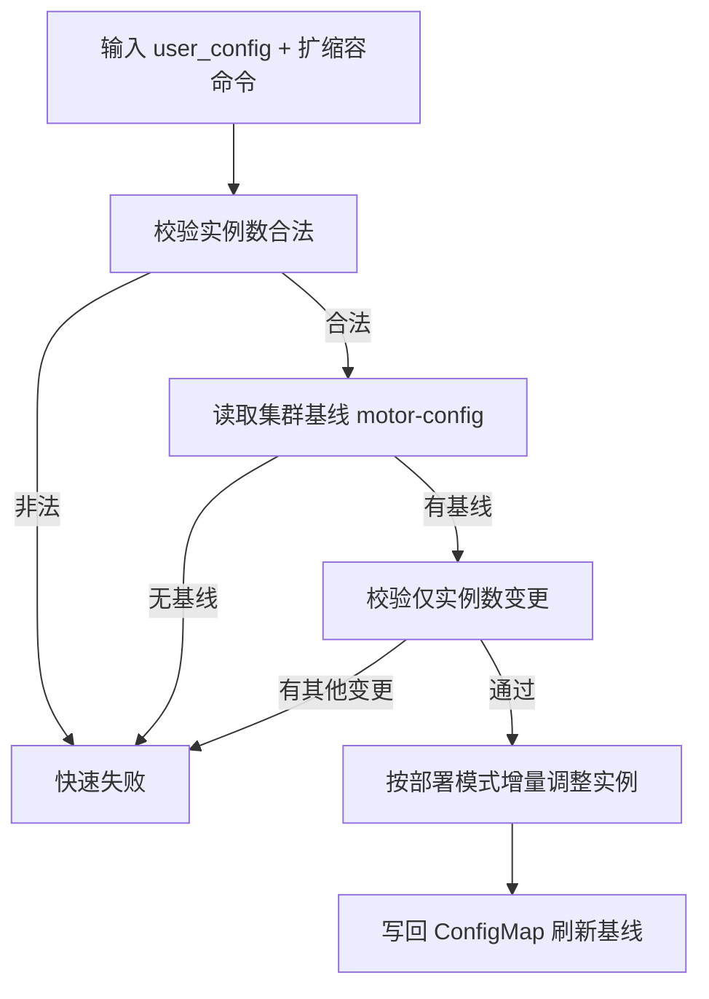

# 实例扩缩容设计文档

MindIE Motor 提供两种实例扩缩容方式，满足不同运维场景的需求：

- **自动扩缩容**：依据推理实例的实时负载自动调整 Prefill / Decode 实例数量，适用于负载波动大、追求资源利用率的场景。
- **手动扩缩容**：人工修改实例数并执行增量调整，适用于需要确定性变更行为、或集群不具备自动扩缩容条件的场景。

两种方式互补，分别对应"负载自适应"与"人工决策"两种扩缩容语义。本文档分别介绍两者的设计思路。

## 1. 自动扩缩容

### 1.1 特性概述

自动弹性扩缩容功能支持根据推理实例的实时负载自动调整 Prefill 和 Decode 实例数量。当请求量上升时自动扩容，当负载回落时自动缩容，在保障服务 SLA 的同时提升资源利用率。

核心机制：Infer Operator 为推理实例创建 HPA（Horizontal Pod Autoscaler）资源，HPA 通过 External Metrics Adaptor 或 Prometheus Adapter 获取 MindIE Motor 汇聚的引擎级负载指标（如排队请求数、TPS、KV Cache 使用率等），按用户配置的扩缩容阈值自动调整实例副本数。

支持 Atlas 800I A2 推理服务器 / Atlas 800I A3 超节点服务器，前置依赖 Infer Operator 部署，以及 External Metrics Adaptor 或 Prometheus Adapter 之一（用于将 Motor 指标转换为 Kubernetes External Metrics）。

### 1.2 工作原理

```text
┌──────────────────────────────────────────────────────────────────┐
│                         K8s Cluster                              │
│                                                                  │
│   ┌────────────┐     ┌───────────┐     ┌───────────────────┐     │
│   │    HPA     │     │  Infer    │     │    Engine Pods    │     │
│   │(autoscaler)|────>│ Operator  │────>│ (Prefill / Decode)│     │
│   └────────────┘     └───────────┘     └─────────┬─────────┘     │
│         ^                                        │               │
│         │                                        │               │
│         │        ┌──────────────────┐            │               │
│         │        │   MindIE Motor   │            │               │
│         └────────│   Coordinator    │<───────────┘               │
│   (External      │ (aggregation/TPS)│   /metrics                 │
│    Metrics API)  └──────────────────┘                            │
│                                                                  │
└──────────────────────────────────────────────────────────────────┘
```

1. MindIE Motor Coordinator 从所有引擎 Pod 采集 Prometheus 指标，按语义聚合后通过 `/metrics` 端点暴露。
2. External Metrics Adaptor 周期性从 Coordinator 拉取指标，转换为 Kubernetes External Metrics API；或走 Prometheus Adapter 路径（Coordinator -> Prometheus -> Prometheus Adapter -> External Metrics API），两条路径并行支持。
3. HPA 从 External Metrics API 获取负载数据，与用户配置的目标阈值对比。
4. 当指标持续超出阈值时，HPA 通知 Infer Operator 增加副本；低于阈值时减少副本。

设计要点：**指标聚合与扩缩容决策解耦**。Motor 只负责指标的采集、聚合与暴露，扩缩容决策完全交由 HPA 标准机制完成，Motor 不感知扩缩容过程。这使得自动扩缩容能力可以复用 K8s 生态成熟的 HPA 语义（稳定窗口、冷却、多指标最保守决策等），无需自研控制器。

### 1.3 指标设计

#### 1.3.1 指标聚合视图

Coordinator `/metrics` 端点提供多种聚合视图，通过 `type` 参数切换，满足不同扩缩容粒度：

| type 值 | 说明 | 适用场景 |
|---------|------|---------|
| `full`（默认） | 全局聚合，所有实例指标聚合为单一值 | Prometheus 抓取、HPA 全局扩缩容 |
| `instance` | 实例级指标，注入 `instance_id`、`role` 标签 | 单实例排障 |
| `role` | 按角色（Prefill / Decode）聚合 | 按角色独立扩缩容 |

```bash
# 查看全局聚合指标（默认）
curl http://{coordinator-ip}:1027/metrics

# 按角色分别查看指标
curl http://{coordinator-ip}:1027/metrics?type=role&role=prefill
curl http://{coordinator-ip}:1027/metrics?type=role&role=decode
```

#### 1.3.2 推荐的扩缩容指标

Prefill 为计算密集型、Decode 为访存密集型，建议分别配置不同的扩缩容指标以匹配各自的计算特征。

**Prefill 扩缩容推荐指标：**

| 指标名 | 类型 | 说明 | 推荐阈值建议 |
|--------|------|------|-------------|
| `vllm:num_requests_waiting` | Gauge | 等待调度的请求数 | > 5 触发扩容，< 2 触发缩容 |
| `vllm:num_requests_running` | Gauge | 当前运行中的请求数 | 视 NPU 规格和模型而定 |
| `vllm:kv_cache_usage_perc` | Gauge | KV Cache 使用率（0-1） | > 0.8 触发扩容 |
| `motor:prompt_tokens_per_second` | Gauge | Prompt token 处理速率（Motor 计算） | 按 SLA 目标设定 |
| `vllm:time_to_first_token_seconds` | Histogram | 首 token 延迟（TTFT） | 按 SLA 目标（如 p95 < 500ms） |

**Decode 扩缩容推荐指标：**

| 指标名 | 类型 | 说明 | 推荐阈值建议 |
|--------|------|------|-------------|
| `vllm:num_requests_waiting` | Gauge | 等待调度的请求数 | > 5 触发扩容 |
| `vllm:num_requests_running` | Gauge | 当前运行中的请求数 | 视 NPU 规格和模型而定 |
| `motor:generation_tokens_per_second` | Gauge | 生成 token 速率（Motor 计算） | 按 SLA 目标设定 |
| `vllm:e2e_request_latency_seconds` | Histogram | 端到端请求延迟 | 按 SLA 目标（如 p95 < 2s） |
| `vllm:time_per_output_token_seconds` | Histogram | 跨 token 延迟（TPOT） | 按 SLA 目标（如 p95 < 50ms） |

> [!NOTE]说明
>
> - `motor:prompt_tokens_per_second` 和 `motor:generation_tokens_per_second` 是 MindIE Motor Coordinator 计算的服务级指标，基于 vLLM 原始 counter 计算 delta rate 得到，更准确反映实时吞吐。
> - Histogram 类型指标（如 `vllm:e2e_request_latency_seconds`）需要在 Adaptor 侧计算分位数（p50/p95/p99）后作为独立指标暴露。
> - Gauge 指标直接反映当前负载水平，优先推荐；Counter 类型指标（如 token 总数）不会因 `/metrics` 请求而重置，直接比较数值无法反映速率变化，不建议作为扩缩容依据。

#### 1.3.3 多指标组合策略

HPA 支持在同一策略中配置多个指标，并选择**最保守的扩缩容决策**（即当前副本数最接近触发扩容或缩容的指标）——这保证了任一指标触及阈值时都不会被其他指标"掩盖"：

```yaml
scalingPolicy:
  type: HPA
  spec:
    minReplicas: 1
    maxReplicas: 4
    metrics:
    - type: External
      external:
        metric:
          name: num_requests_waiting
        target:
          type: AverageValue
          averageValue: "5"
    - type: External
      external:
        metric:
          name: kv_cache_usage_perc
        target:
          type: AverageValue
          averageValue: "0.8"
```

#### 1.3.4 HPA 契约指标与 PD 配比信号

除原始引擎指标外，Motor Coordinator 在 `/metrics` 上直接暴露一组面向 HPA 的**契约指标**：容量规划利用率（`motor:prefill_utilization` / `motor:decode_utilization`，需求速率 /（当前实例数 × 单实例容量估计），>1 表示供给不足，HPA target 即目标利用率 ρ）、容量规划推导的所需实例数（`motor:prefill_replicas_required` / `motor:decode_replicas_required`）、入口请求速率（`motor:request_rate`）、Prefill 时延分位数（`vllm:request_prefill_time_seconds` p50/p95/p99）以及 PD 配比信号（`motor:pd_ratio_current` / `motor:pd_ratio_suggested`）。契约指标在输出渲染层同时以无冒号别名（`:` → `_`，如 `motor_prefill_utilization`）暴露，适配 K8s External Metrics 命名习惯；别名的生成同样由 Motor Coordinator 完成，External Metrics Adaptor 无需做名称映射或二次计算（指标语义详见[指标接口](../user_guide/api/metrics_interfaces.md)）。

契约指标背后的容量规划模型同样归属 Motor Coordinator：需求侧由入口完成请求统计推导到达率 λ 与平均输入/输出长度，供给侧在线标定单实例容量（`C_p` 取纯 prefill 处理吞吐的 EMA，`C_d` 取单实例 generation TPS 峰值学习并带衰减下限 floor），再按 `N_p = ⌈λ·L̄_in/(C_p·ρ)⌉`、`N_d = max(吞吐约束, KV 约束)` 推导所需实例数。这一归属划分与前述解耦原则一致：需求推导、容量标定、实例数推导、配比建议等语义计算属于"指标聚合"，由 Motor 负责；而阈值判断、扩缩容执行、配比调整仍完全在 HPA / 外部控制器侧。特别地，`motor:pd_ratio_suggested` 只是基于所需实例数之比的**建议信号**（经指数平滑与区间裁剪），Motor 不依据它修改任何实例数量或 K8s 资源——参考执行方式（CronJob 定期按建议配比调整 InferServiceSet role replicas）见[自动弹性扩缩容](../user_guide/features/auto_scaling.md)。容量规划算法的正确性由仓库内合成闭环仿真测试（`tests/coordinator/core/`）回归保障。

### 1.4 扩缩容策略配置

在 `examples/deployer/yaml_template/infer_service_template.yaml` 中，为 Prefill 和 Decode 角色的配置块下添加 `scalingPolicy`。

以下示例对应 External Metrics Adaptor 路径，`external.metric` 下无需配置 `selector`：

```yaml
roles:
  # ========== Prefill 角色 ==========
  - name: prefill
    replicas: 4
    workload:
      apiVersion: apps/v1
      kind: StatefulSet
    scalingPolicy:            # 新增：弹性扩缩容策略
      type: HPA
      spec:
        minReplicas: 1
        maxReplicas: 4
        metrics:
        - type: External
          external:
            metric:
              name: vllm:num_requests_waiting
            target:
              type: AverageValue
              averageValue: "5"
    metadata:
      labels:
        infer.huawei.com/gang-schedule: 'true'
    spec:
      # ... 其余配置保持不变 ...

  # ========== Decode 角色 ==========
  - name: decode
    replicas: 4
    workload:
      apiVersion: apps/v1
      kind: StatefulSet
    scalingPolicy:            # 新增：弹性扩缩容策略
      type: HPA
      spec:
        minReplicas: 1
        maxReplicas: 4
        metrics:
        - type: External
          external:
            metric:
              name: motor:generation_tokens_per_second
            target:
              type: AverageValue
              averageValue: "10"
    metadata:
      labels:
        infer.huawei.com/gang-schedule: 'true'
    spec:
      # ... 其余配置保持不变 ...
```

使用 Prometheus Adapter 路径时，需在 `external.metric` 下新增 `selector.matchLabels`，以 Adapter 暴露的标签限定指标范围：

```yaml
metrics:
- type: External
  external:
    metric:
      name: vllm_total_requests
      selector:
        matchLabels:
          infer_huawei_com_inferservice_name: vllm-0
          kubernetes_namespace: mindie-motor
    target:
      type: AverageValue
      averageValue: "5"
```

模板中的 `kubernetes_namespace` 与 `infer_huawei_com_inferservice_name` 只是占位值：deployer 生成 `infer_service.yaml` 时，会把 `kubernetes_namespace` 更新为 `user_config.json` 中的 `motor_deploy_config.job_id`，把 `infer_huawei_com_inferservice_name` 更新为 `<InferServiceSet 名>-0`；仅更新实例数的手动扩缩容路径也会按当前 `job_id` 回填这两个标签。未配置这两个标签时不会自动注入。

**scalingPolicy 参数说明：**

| 参数 | 说明 | 取值 |
|------|------|------|
| `scalingPolicy.type` | 弹性扩缩容策略类型 | 当前仅支持 `HPA` |
| `scalingPolicy.spec.minReplicas` | 缩容下限，实例数不会低于此值 | 正整数 |
| `scalingPolicy.spec.maxReplicas` | 扩容上限，实例数不会超过此值 | 正整数，且 ≥ minReplicas |
| `scalingPolicy.spec.metrics[].type` | 指标类型 | `External`（由 External Metrics Adaptor 或 Prometheus Adapter 提供） |
| `scalingPolicy.spec.metrics[].external.metric.name` | 外部指标名称 | 需与所选指标接入组件暴露的指标名一致 |
| `scalingPolicy.spec.metrics[].external.metric.selector` | 指标选择器 | 仅 Prometheus Adapter 场景需要配置；External Metrics Adaptor 场景无需新增 |
| `scalingPolicy.spec.metrics[].external.metric.selector.matchLabels.kubernetes_namespace` | 指标所属命名空间 | 仅 Prometheus Adapter 场景配置。模板包含此标签时，deployer 生成 YAML 会将其更新为 `motor_deploy_config.job_id` |
| `scalingPolicy.spec.metrics[].external.metric.selector.matchLabels.infer_huawei_com_inferservice_name` | 指标所属 InferService | 仅 Prometheus Adapter 场景配置。模板包含此标签时，deployer 按 `<InferServiceSet 名>-0` 自动更新；缺失时不注入 |
| `scalingPolicy.spec.metrics[].external.target.type` | 目标值类型 | `AverageValue`（Pod 平均值） |
| `scalingPolicy.spec.metrics[].external.target.averageValue` | 目标平均值阈值 | 按指标量纲设定 |

> [!NOTE]
> `scalingPolicy.spec.metrics[].external.metric.name` 需填写所选指标接入组件暴露的指标名。External Metrics Adaptor 或 Prometheus Adapter 都可能对 MindIE Motor 原始 Prometheus 指标名（如 `vllm:num_requests_waiting`）做映射或重命名。部署后，可通过以下命令查看实际暴露的指标列表：
>
> ```bash
> kubectl get --raw /apis/external.metrics.k8s.io/v1beta1 | grep -E "vllm:|motor:"
> ```
>
> 若 Adaptor 暴露的指标名与本文示例不同，请以实际返回值为准。
>
> 本特性依赖 MindCluster Infer Operator 版本 ≥ 26.1.0。用户需按上文示例在 `infer_service_template.yaml` 中手动添加 `scalingPolicy` 配置。

### 1.5 关键设计考虑

- **扩缩容范围**：自动扩缩容仅作用于 Prefill 和 Decode 实例；Router 不参与扩缩容。
- **缩容稳定窗口**：缩容存在稳定窗口（HPA 默认 5 分钟），避免负载短暂波动导致频繁扩缩。
- **新实例性能预热**：扩容的新实例没有 KV Cache 缓存，Prefix Cache 特性会逐步重建缓存，因此新实例的推理性能可能出现小幅度劣化并在一段时间后恢复。
- **依赖链路**：External Metrics Adaptor 需持续运行并正确配置 Coordinator 地址。若 Adaptor 异常，HPA 将无法获取指标，可能导致扩缩容失效。
- **缩容下限**：建议 `minReplicas` 至少设为 1，避免缩容到 0 导致服务完全不可用。
- **角色独立扩缩**：若使用不带 `type` 参数的 `/metrics` 端点（默认 `full`），HPA 获取到的是全局聚合值。如需按 Prefill/Decode 角色独立扩缩容，Adaptor 需分别请求 `/metrics?type=role&role=prefill` 和 `/metrics?type=role&role=decode`。

## 2. 手动扩缩容设计

### 2.1 设计目标与适用场景

手动扩缩容提供**确定性、人工可控**的实例数调整手段：用户修改实例数后执行一次扩缩容操作，集群实例数精确收敛到目标值，变更行为可预期。

适用场景：

- 集群未部署 HPA / External Metrics Adaptor，不具备自动扩缩容条件；
- 需要精确预期变更行为（如按计划扩容、临时缩容、演练）；
- 作为自动扩缩容不可用时的兜底手段。

与自动扩缩容的边界：手动扩缩容只调整 **Prefill / Decode 实例数**，Controller、Coordinator 等控制面组件不在扩缩容路径中。

### 2.2 核心设计思路

手动扩缩容的设计围绕"**以集群内基线为锚、增量调整、成功即收敛**"展开，核心要点如下：

**1. 集群 ConfigMap 作为唯一基线（motor-config）**

每次部署会把 user_config 持久化到集群中的 ConfigMap `motor-config`。扩缩容以集群内基线与当前输入做对比，而非以本地文件为基准——集群状态即真相，避免多客户端/多机器本地配置漂移导致误扩缩。集群中不存在基线（未部署过）时拒绝扩缩容。

**2. 单一变更维度约束**

扩缩容仅允许修改实例数字段（`p_instances_num`、`d_instances_num` 或 `hybrid_instances_num`），其余配置必须与基线完全一致。该约束保证了"扩缩容 = 只改实例数"这一语义清晰、可校验，防止配置变更与实例变更混入同一次操作。其他配置的修改走全量重新部署路径，职责分离。

**3. 增量式调整，不动存量实例**

- **扩容**：仅对新增的实例（更高 index）执行创建，已运行实例不重拉、不滚动重启，存量流量不受影响；
- **缩容**：从最大 index 开始逆序删除，并同步清理对应部署产物。实例对等（无状态），逆序删除不会产生 index 空洞。

增量语义保证操作耗时与变更量成正比，大规模集群下避免全量重建。

**4. 部署模式自适应**

扩缩容路径的部署模式取自集群基线（而非本地输入），保证与集群实际拓扑一致：

- **InferServiceSet 模式**：直接更新角色 replicas，与自动扩缩容共享同一份 YAML 形态；
- **multi_deployment 模式**：按引擎类型逐个增量 apply / delete 对应实例的 YAML。

**5. 成功即刷新基线**

每次成功的扩缩容都会把本次 user_config 写回 ConfigMap，成为下一次操作的基线。集群状态始终收敛于最后一次成功操作，不会出现"执行了但集群配置未记录"的漂移。

**6. 前置校验先行**

实例数的整数性、范围（大于 0 且不超过 16）在触碰集群之前完成校验，快速失败，避免无效操作。



### 2.3 与自动扩缩容的关系

两种方式互补而非互斥：

| 维度 | 自动扩缩容 | 手动扩缩容 |
|------|-----------|-----------|
| 决策主体 | HPA（负载自适应） | 人工 |
| 变更粒度 | min/max 范围内连续调整 | 一次性精确设定实例数 |
| 适用场景 | 负载波动大、追求资源利用率 | 无自动扩缩容环境、需确定性变更 |
| 依赖 | Infer Operator + HPA + External Metrics Adaptor | 仅需集群 ConfigMap 基线 |

两者可组合使用：手动扩缩容设定部署层实例数基数，自动扩缩容在 HPA 的 min/max 范围内进一步动态调整副本数。

## 3. 参考文档

- [配置基于负载的弹性扩缩容](https://gitcode.com/Ascend/mind-cluster/blob/master/docs/zh/scheduling/04_usage/09_infer_operator_best_practice/05_configuring_elastic_scaling.md) — Infer Operator 弹性扩缩容策略配置指南
- [Metrics 可观测性指标设计文档](./metrics.md) — MindIE Motor Metrics 子系统架构与指标说明
- [指标接口](../user_guide/api/metrics_interfaces.md) — MindIE Motor `/metrics` 端点使用说明
- [手动扩缩容用户手册](../user_guide/features/manual_scaling.md) — 手动扩缩容操作步骤与常见问题
