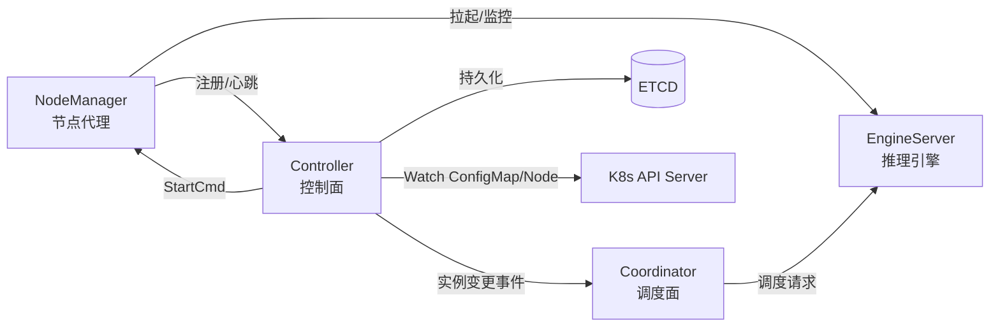
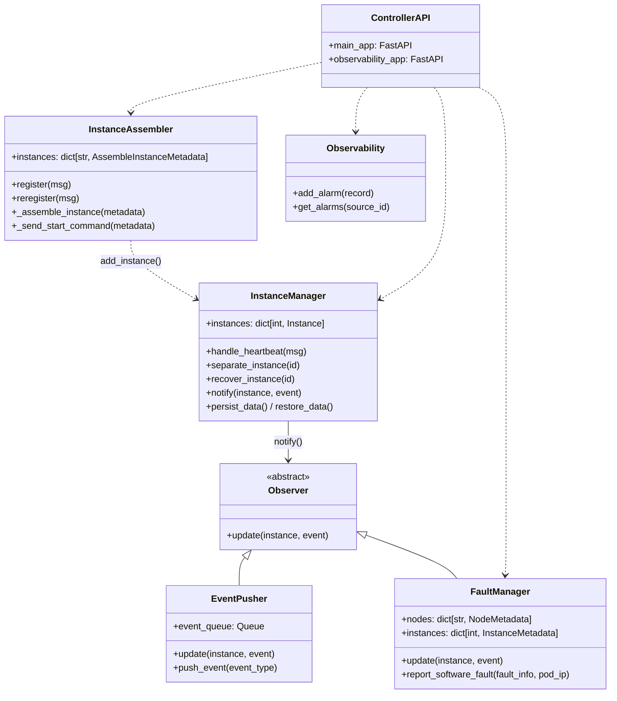
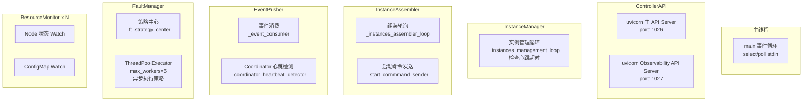
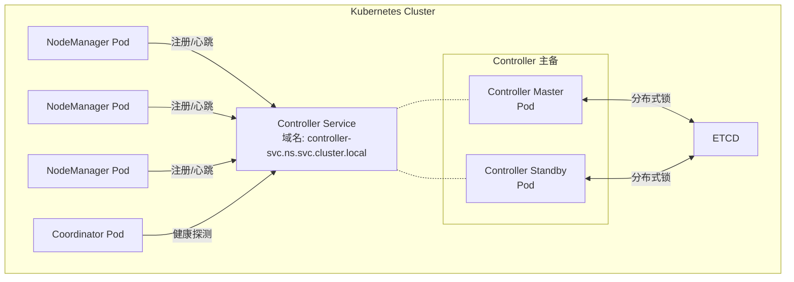
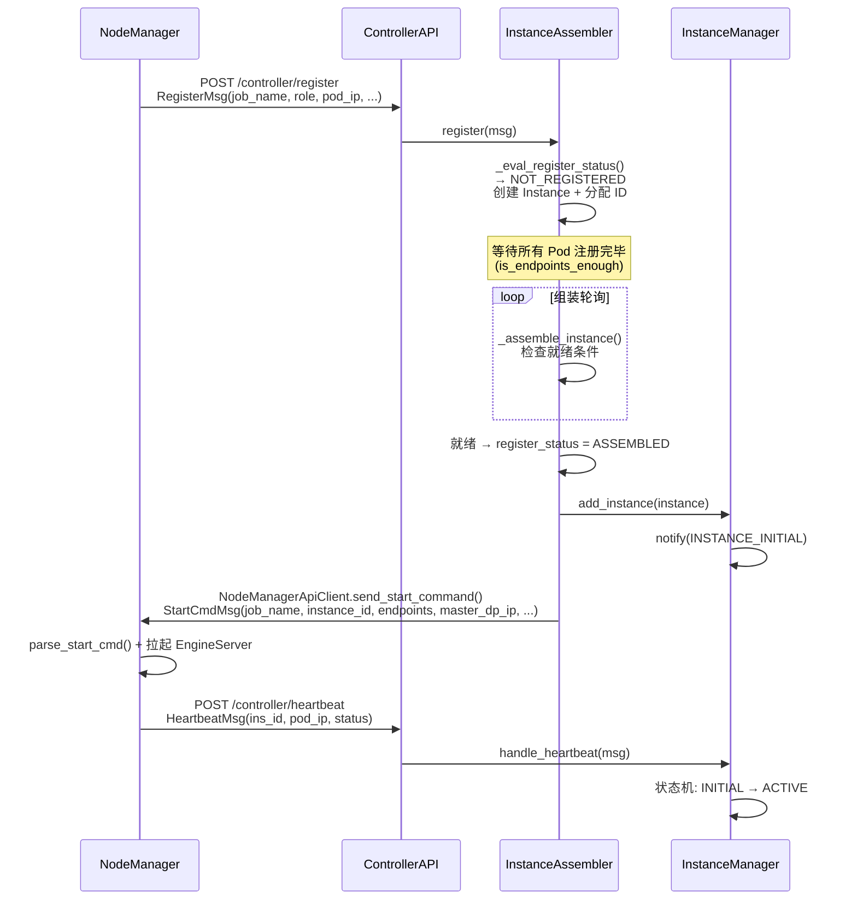
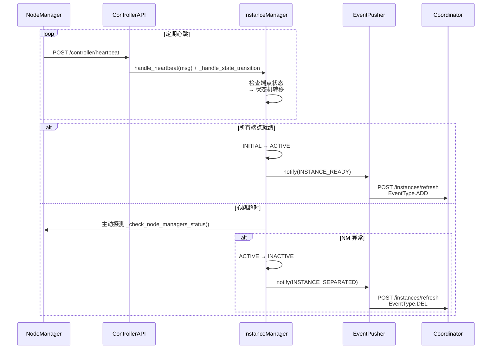
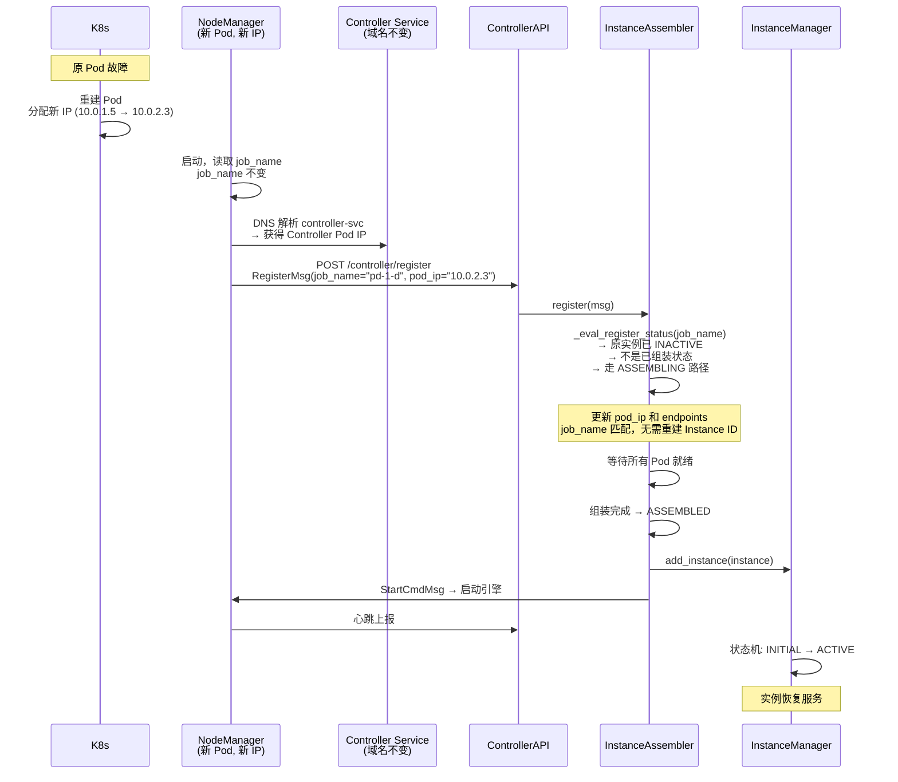
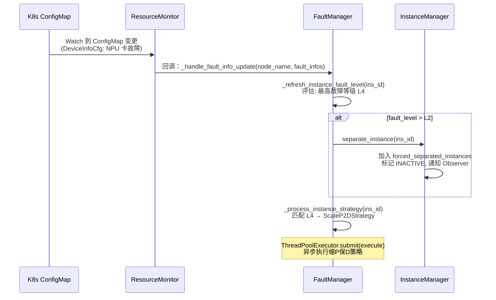
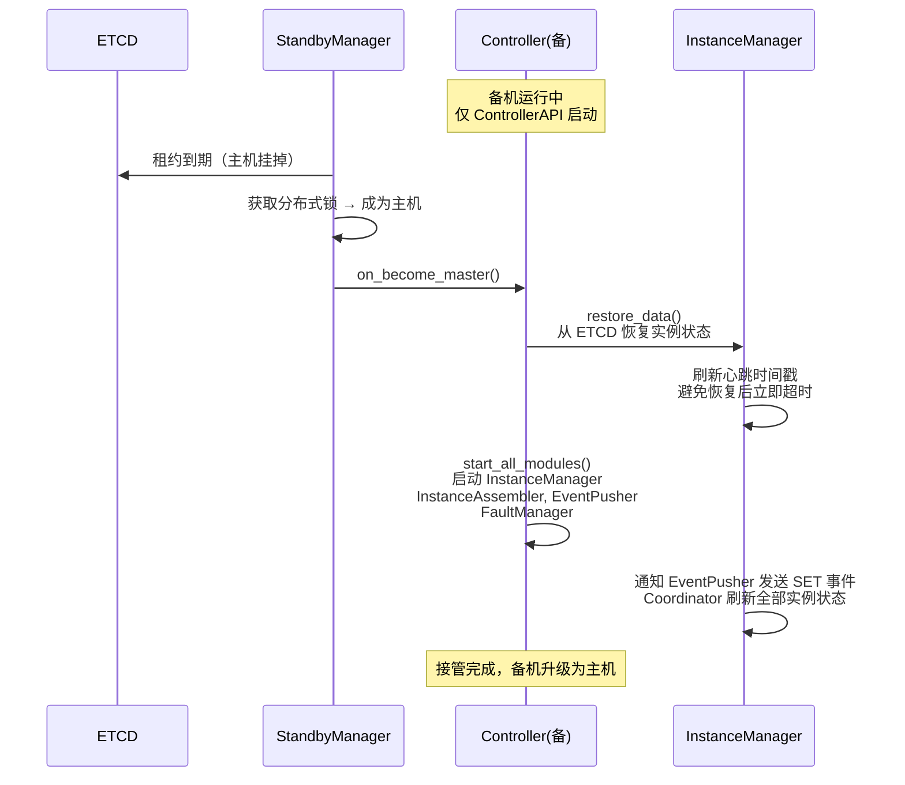

# Controller（控制器）

## 概述

Controller 是 Motor 推理集群的**控制面核心**，负责管理所有推理实例的全生命周期——从 NodeManager 注册、实例组装、引擎启动，到运行心跳监控、故障隔离与自动恢复。

在 Motor 架构中，Controller 处于中枢位置：



各组件关系简述：

- **NodeManager**：每个推理 Pod 的节点代理，注册自身到 Controller，接收启动指令，上报心跳与故障。
- **Coordinator**：推理请求的调度入口，Consumer 接收 Controller 推送的实例状态变更，据此决定路由策略。
- **EngineServer**：实际执行推理的引擎进程（vLLM / SGLang），由 NodeManager 根据 Controller 下发的 StartCmd 拉起。
- **ETCD**：Controller 的持久化存储，支撑主备切换时状态恢复。
- **K8s API Server**：Controller 通过 Watch 机制感知硬件故障（ConfigMap）和节点状态变化。

---

## 架构视图

### 2.1 逻辑视图：模块职责与协作

Controller 内部采用**模块化 + Observer 模式**组织，核心模块及职责如下：



| 模块 | 源码 | 核心职责 |
|------|------|----------|
| `InstanceManager` | `motor/controller/core/instance_manager.py` | 实例字典维护、心跳处理、**状态机驱动**、实例隔离/恢复、ETCD 持久化 |
| `InstanceAssembler` | `motor/controller/core/instance_assembler.py` | 新实例**注册与组装**（等待所有 Pod 就绪）、下发启动命令、重注册恢复 |
| `EventPusher` | `motor/controller/core/event_pusher.py` | **Observer**，将实例生命周期事件（READY/SEPARATED/PAUSED/REMOVED）推送给 Coordinator |
| `FaultManager` | `motor/controller/fault_tolerance/fault_manager.py` | **Observer**，感知硬件故障（ConfigMap Watch）+ 软件故障上报，评估实例故障等级，**调度恢复策略** |
| `Observability` | `motor/controller/observability/observability.py` | 告警管理、库存盘点（供北向管理平台消费） |
| `ControllerAPI` | `motor/controller/api_server/controller_api.py` | 对外 HTTP API（FastAPI/uvicorn），含主 API 端口（默认 1026）和可观测 API 端口（默认 1027） |

**Observer 模式**是 Controller 的核心设计模式。`InstanceManager` 作为被观察者，在实例状态发生关键变化时调用 `notify()`，遍历所有观察者。当前系统有两个 Observer：

- `EventPusher`：将状态变更实时推送给 Coordinator，用于调度面路由更新。
- `FaultManager`：在实例首次注册时同步节点映射，实例隔离/删除时更新故障数据结构。

新增 Observer 只需继承 `Observer` 抽象类并注册到 `InstanceManager` 即可（见 [开发扩展指南](#开发扩展指南)）。

### 2.2 进程视图：并发模型

Controller 使用 **Python 多线程** 并发模型，每个模块都有独立的后台线程执行轮询或守护任务：



**线程间通信方式**：

| 机制 | 使用场景 |
|------|----------|
| `queue.Queue` | EventPusher 的事件队列（生产者-消费者） |
| `threading.Condition` | InstanceAssembler / EventPusher / FaultManager 的按需唤醒，替代 busy-wait |
| `threading.Lock` | 保护 `instances` 字典等共享数据 |
| `threading.RLock` | 保护配置字段（`config_lock`），支持嵌套访问 |

所有核心模块（`InstanceManager`、`InstanceAssembler`、`FaultManager`、`Observability`）均继承 `ThreadSafeSingleton`，保证全局唯一实例且线程安全。

### 2.3 开发视图：代码组织

```text
motor/controller/
├── main.py                          # 入口：解析配置、初始化模块、主循环
├── core/                            # 核心逻辑
│   ├── instance_manager.py          # 实例生命周期 + 状态机
│   ├── instance_assembler.py        # 注册/组装/下发启动命令
│   ├── event_pusher.py              # Observer：事件→Coordinator 推送
│   ├── observer.py                  # Observer 抽象基类 + 事件枚举
│   └── recovery_service.py          # 统一终止恢复辅助函数
├── fault_tolerance/                 # 故障容错子系统
│   ├── fault_manager.py             # RAS 核心：故障评估 + 策略调度
│   ├── fault_types.py               # 故障类型定义（等级/分类/元数据模型）
│   ├── strategy/                    # 恢复策略
│   │   ├── strategy.py              # StrategyBase + 等级→策略工厂
│   │   ├── scale_p2d.py             # 缩P保D
│   │   └── token_reinference.py     # token级重推
│   ├── k8s/                         # K8s 交互
│   │   ├── resource_monitor.py      # ConfigMap + Node 双重 Watch
│   │   ├── configmap_parser.py      # 解析故障 ConfigMap
│   │   └── k8s_client.py            # K8s API 客户端
│   └── mixin/                       # Mixin 分离关注点
│       ├── persistence.py           # ETCD 持久化
│       └── resource_manager.py      # 节点同步与所有权交换
├── observability/                   # 可观测性子系统
│   ├── observability.py             # 告警/库存门面
│   ├── alarm/alarm_store.py         # 内存告警存储
│   └── inventory/inventory_collector.py  # 库存采集
├── api_server/controller_api.py     # HTTP API (FastAPI)
└── api_client/                      # 出站 HTTP 客户端
    ├── coordinator_api_client.py    # 调用 Coordinator API
    └── node_manager_api_client.py   # 调用 NodeManager API
```

### 2.4 物理视图：部署拓扑

Controller 部署在 K8s 集群内，支持两种部署模式：



**关键设计**：

- **K8s Service 域名屏蔽 IP 漂移**：NodeManager 通过 K8s Service 域名（如 `controller-svc.namespace.svc.cluster.local`）访问 Controller，不写死 Pod IP。当 Controller Pod 重启或主备切换时，Service 自动将流量指向新 Pod，NodeManager 无需感知 IP 变化。
- **单实例模式**（`standby_config.enable_master_standby = false`）：仅一个 Controller Pod，适用于开发/测试环境。
- **主备模式**（`standby_config.enable_master_standby = true`）：两个 Controller Pod 通过 ETCD 分布式锁选举，备机仅运行 `ControllerAPI`（响应健康检查和注册请求），主机负责全部业务逻辑。
- **外部依赖**：ETCD（持久化 + 选主）、K8s API Server（Watch ConfigMap/Node）、Coordinator（事件推送目标）。

### 2.5 场景视图：核心用例

#### 场景 1：实例首次注册与组装



#### 场景 2：心跳与状态转移



#### 场景 3：Pod 故障自动恢复（域名屏蔽 IP 漂移）

这是 Controller 最关键的动态恢复能力。整个过程**不感知 IP 变化，只关心 job_name 一致**。



> [!NOTE]
> **域名抽象的关键价值**：pod_ip 会随 Pod 重建而变化，但 Controller 通过 job_name 识别实例身份。NodeManager 通过 K8s Service 域名（而非写死的 Pod IP）访问 Controller，确保无论 Pod 如何重建、IP 如何变化，注册请求始终能到达 Controller。Controller 侧只关心 job_name 一致即代表同一逻辑实例，无需感知底层 IP 漂移。

#### 场景 4：硬件故障感知→隔离→策略恢复



#### 场景 5：主备切换



---

## 关键特性详解

### 3.1 实例管理：注册、组装、生命周期

#### 3.1.1 注册机制

NodeManager 启动后通过 `POST /controller/register` 向 Controller 注册，携带信息包括：

- `job_name`：实例的**逻辑唯一标识**，由部署器生成，Pod 重建后保持不变
- `role`：推理角色（`prefill` / `decode` / `union`）
- `pod_ip`：当前 Pod IP（可能变化）
- `parallel_config`：并行配置（local_world_size, dp_size 等）
- `nnodes`：跨节点 PCP 场景的期望节点数
- `enable_multi_endpoints`：是否启用多端点模式

Controller 有两种注册形态：

| 注册类型 | 触发场景 | 消息类型 | 行为差异 |
|----------|----------|----------|----------|
| **首次注册** | NodeManager 首次启动 | `RegisterMsg` | 创建新 Instance、分配新 ID、组装后下发 StartCmd |
| **重注册** | Controller 重启后 | `ReregisterMsg`（携带已有 instance_id + endpoints） | 还原实例身份、**跳过 StartCmd**（引擎已在运行）、直接交还 InstanceManager |

#### 3.1.2 组装流程

`InstanceAssembler` 的组装流程通过两个后台线程协作完成：

1. **组装轮询线程** (`_instances_assembler_loop`)：
   - 检查实例的节点管理器是否全部已注册（`is_endpoints_enough()` 或跨节点 PCP 时按 `nnodes` 判断）
   - 过滤异常节点管理器（`_filter_abnormal_endpoints()`）
   - 全部就绪后标记为 `ASSEMBLED` 状态

2. **启动命令发送线程** (`_start_commmand_sender`)：
   - 对 `ASSEMBLED` 状态的实例发送 `StartCmdMsg`
   - `StartCmdMsg` 包含：`job_name`、`role`、`instance_id`、`endpoints`、`master_dp_ip`、`ranktable`、`d2d_peer_ips`（如需）
   - 支持重试机制（`send_cmd_retry_times`），超时后放弃

组装超时保护：`instance_assemble_timeout`（默认 600 秒），超时后自动清理未完成的组装。

#### 3.1.3 实例隔离与恢复

Controller 通过 `forced_separated_instances` 集合区分两类 INACTIVE 场景：

| 场景 | 触发方式 | 自动恢复 | 机制 |
|------|----------|----------|------|
| **心跳超时**（网络抖动） | `_instances_management_loop` 检测心跳超时 | ✅ 下次心跳正常自动回到 ACTIVE | 不在 `forced_separated_instances` 中 |
| **主动隔离**（故障/API） | `separate_instance()` 显式调用 | ❌ 心跳无法恢复，必须 `recover_instance()` | 加入 `forced_separated_instances` |

`separate_instance()` 调用路径：

- **故障容错**：FaultManager 评估实例故障等级 > L2（`_refresh_instance_fault_level()`）
- **API 触发**：`POST /controller/terminate_instance`
- **恢复服务**：`terminate_instance_for_recovery()` 函数

#### 3.1.4 状态机设计

`InstanceManager` 维护每个实例的状态机，状态转移由心跳和实例管理循环驱动：

```text
INITIAL → ACTIVE ⇄ PAUSED
  ▲         ▲        ▲
  │         │        │
  │         │        ▼
  │         │  (RESUMED/NORMAL)
  └────┬────┘
       ▼
    INACTIVE  →  DELETED
              (所有状态超时可达)
```

触发状态转移的事件（`InsConditionEvent`）：

| 转移 | 触发事件 |
|------|----------|
| INITIAL → ACTIVE | `INSTANCE_NORMAL` |
| INITIAL → INACTIVE | `INSTANCE_ABNORMAL` |
| INITIAL → DELETED | `INSTANCE_HEARTBEAT_TIMEOUT` |
| ACTIVE → INACTIVE | `INSTANCE_HEARTBEAT_TIMEOUT` / `INSTANCE_ABNORMAL` |
| ACTIVE → PAUSED | `INSTANCE_PAUSED` |
| INACTIVE → ACTIVE | `INSTANCE_NORMAL` |
| INACTIVE → INITIAL | `INSTANCE_INIT` |
| INACTIVE → DELETED | `INSTANCE_HEARTBEAT_TIMEOUT` |
| PAUSED → ACTIVE | `INSTANCE_RESUMED` / `INSTANCE_NORMAL` |
| PAUSED → INACTIVE | `INSTANCE_ABNORMAL` |
| PAUSED → DELETED | `INSTANCE_HEARTBEAT_TIMEOUT` |

**状态转移的副作用**：

- 状态变更触发 ETCD 持久化（`persist_data()`）——确保主备切换后状态一致
- 状态变更触发 Observer 通知（`notify()`）——EventPusher 同步 Coordinator，FaultManager 同步节点映射

### 3.2 主备模式：持久化支撑无缝切换

#### 3.2.1 为什么需要持久化

Controller 维护大量运行时状态，状态丢失意味着：

- 所有已注册实例需要重新注册（从零开始组装，大规模集群可达数分钟）
- 故障历史丢失（无法判断节点是持续故障还是瞬时抖动）
- 组装进度丢失（部分已就绪的实例需要重新走组装流程）

> [!IMPORTANT]
> 持久化使得备机可以在秒级内接管主机状态，将服务中断控制在最短时间。

#### 3.2.2 ETCD 持久化设计

三个核心模块独立持久化到 ETCD 的不同路径：

| 模块 | ETCD 路径 | 持久化内容 | 版本控制 |
|------|----------|------------|----------|
| `InstanceManager` | `/controller/instance_manager` | 所有实例的完整状态、心跳时间戳 | 单调递增 `_data_version` |
| `InstanceAssembler` | `/controller/instance_assembler` | 组装进度、`ins_id_cnt`（ID 分配计数器） | 单调递增 `_data_version` |
| `FaultManager` | `/controller/fault_manager` | 节点故障历史、实例故障等级 | 单调递增 `_data_version` |

**持久化特性**：

- **版本号 + 校验和**：每次持久化递增版本号并计算 `PersistentState` 的校验和，恢复时验证数据完整性。
- **非同步写**：仅在状态变化时触发持久化（而非每个心跳），减少 ETCD 压力。
- **恢复后刷新心跳**：从 ETCD 恢复 ACTIVE 实例后，将所有端点的心跳时间戳刷新为当前时间，避免恢复后立即因"心跳超时"误判 INACTIVE。
- **重注册恢复**：恢复后，EventPusher 主动推送 `SET` 事件给 Coordinator，刷新全部实例状态。

#### 3.2.3 主备切换流程

```text
备机运行态 (仅 ControllerAPI)
      │
      ▼  StandbyManager 感知主机 ETCD 租约过期
      │
      ▼  on_become_master() 回调
      │
      ├─► InstanceAssembler.restore_data()   恢复组装进度、ins_id_cnt
      ├─► InstanceManager.restore_data()      恢复实例状态、刷新心跳
      ├─► FaultManager.restore_data()         恢复故障历史
      │
      ▼  start_all_modules() 启动：InstanceManager、InstanceAssembler、
      │   EventPusher、FaultManager
      │
      ▼  InstanceManager 恢复后 → EventPusher.push_event(SET)
      │  Coordinator 收到 SET → 刷新全部实例状态
      │
      ▼  接管完成
```

**备机为何只跑 API**：

备机不运行业务模块（InstanceManager、FaultManager 等），只运行 ControllerAPI，原因：

1. 避免"双主"同时管理同一批实例，导致状态冲突。
2. 备机的 API 负责响应 NodeManager 的注册请求——当主机挂掉后，NodeManager 通过 K8s Service 域名访问 Controller，流量自动切到备机，注册请求不会丢失。
3. 备机的健康检查接口响应正常，保证 K8s 就绪探针通过。

> [!WARNING]
> 持久化不是实时同步的（仅在状态变更时触发），主备切换可能丢失最后少量未持久化的状态变更。这对于实例管理是可接受的——未持久化的状态通常可被 NodeManager 的重注册机制修复。

### 3.3 故障感知与恢复：多来源融合 + 策略分级

#### 3.3.1 三条故障感知通路

Controller 从三个独立来源感知故障，融合后统一评估：

```mermaid
flowchart LR
    subgraph HW[硬件故障感知]
        CM["K8s ConfigMap<br/>mindx-dl-deviceinfo-&#123;node&#125;"] -->|Watch| RM_HW[ResourceMonitor]
    end
    subgraph Node[Node 状态感知]
        K8sNode[K8s Node 状态] -->|Watch| RM_Node[ResourceMonitor]
    end
    subgraph SW[软件故障感知]
        Engine[vLLM Engine] -->|ZMQ PUB/SUB| FR[FaultReporter<br/>NodeManager]
        FR -->|HTTP| API[ControllerAPI<br/>/report_software_fault]
    end
    RM_HW --> FM[FaultManager]
    RM_Node --> FM
    API --> FM
    FM --> Eval[故障等级评估<br/>_refresh_instance_fault_level]
```



| 通路 | 故障类型 | 感知方式 | 数据结构 |
|------|----------|----------|----------|
| ConfigMap Watch | NPU 卡故障 (`CardUnhealthy`)<br/>卡间网络故障 (`CardNetworkUnhealthy`)<br/>交换机故障 | K8s Watch API，每个 Node 一个 ResourceMonitor | `FaultInfo` → `NodeMetadata.hardware_fault_infos` |
| Node Watch | 节点重启 / NotReady | K8s Watch API | `NODE_REBOOT` (fault_code: `0x0000001`) → L6 |
| 软件故障上报 | Engine DEAD/UNHEALTHY | NodeManager FaultReporter → HTTP | `FaultInfo` → `NodeMetadata.software_fault_infos` |

#### 3.3.2 故障等级体系

故障按严重程度分为 7 个等级（L0 至 L6），由 `OriginFaultLevel` 映射而来：

| 等级 | 原始故障类型 | 含义 | 恢复策略 | 策略触发条件 |
|------|-------------|------|----------|-------------|
| **L0 HEALTHY** | — | 无故障 | — | — |
| **L1** | `NotHandleFault` / `SubHealthFault` | 通知/亚健康 | 无动作 | — |
| **L2** | `RestartRequest` | 可自愈（网络抖动、引擎异常） | Token 重推 | `enable_token_reinference` + 白名单故障码 |
| **L3** | `RestartBusiness` | 无法自动恢复 | 人工介入 | — |
| **L4** | `FreeRestartNPU` | 需 NPU 隔离 | 缩P保D | `enable_scale_p2d` + Decode 角色 |
| **L5** | `RestartNPU` | 需 NPU 重启 | 委托 L4 策略 | 同 L4 |
| **L6** | `SeparateNPU` / `PreSeparateNPU` / `ManuallySeparateNPU` | 需 NPU 分离/节点重启 | 委托 L4 策略 | 同 L4 |

**实例故障等级计算逻辑**（`_refresh_instance_fault_level()`）：

1. 找到该实例所在所有物理节点的硬件故障和软件故障
2. 取所有故障中 `fault_level` 的最高值
3. `PreSeparateNPU` 特殊处理：如果节点上仍有活跃实例→降级为 L2（业务仍在运行，暂不隔离）；如果节点上无实例→保持 L6（安全隔离）
4. 根据结果决定隔离/恢复：
   - `fault_level > L2` → `separate_instance()`（强制隔离）
   - `fault_level ≤ L2` 且已隔离 → `recover_instance()`
   - `HEALTHY` → 重置并恢复

#### 3.3.3 策略调度

`_ft_strategy_center` 后台线程定期扫描所有实例的故障等级，调度恢复策略：

```text
遍历每个实例:
  │
  ├─► 获取当前故障等级 + 故障码
  │
  ├─► 查 strategy 映射表 (level → 策略工厂函数)
  │
  ├─► 策略切换决策:
  │   ├─ 新等级 > 当前等级 → UPGRADE: 停止旧策略，启动新策略
  │   ├─ 新等级 == 当前等级 → 保持（避免同等级反复切换）
  │   └─ 新等级 < 当前等级 → 忽略（保护高等级恢复不被打断）
  │
  └─► 策略完成 (is_finished):
      ├─ 清除该实例所有软件故障
      └─ 重新评估故障等级
```

策略异步执行（`ThreadPoolExecutor(max_workers=5)`），不阻塞策略中心主循环。

#### 3.3.4 两种恢复策略

**TokenReinferenceStrategy（token 级重推）**：

- 触发条件：L2 故障 + 故障码在 `{0x00F1FEF5, 0x08520003}` 白名单中 + `enable_token_reinference = true`
- 行为：等待网络自愈或故障升级，**不可中断**（`stop()` 为空实现）
- 适用场景：灵衢（Lingqu）高速网络瞬时抖动

**ScaleP2DStrategy（缩P保D）**：

- 触发条件：L4/L5/L6 故障 + `enable_scale_p2d = true` + Decode 角色
- 行为：释放一个 Prefill 节点 → 用释放的节点拉起新 Decode 实例 → Coordinator 自动降级为 SINGLE_NODE 模式 → 新 Decode 就绪后恢复 PD 分离
- 适用场景：Decode 实例硬件故障且集群无冗余节点

> [!NOTE]
> 两种策略的详细设计见 [故障容错设计文档](../../design/fault_tolerance/overview.md)。

### 3.4 可观测性：库存与告警

#### 3.4.1 库存盘点

`InventoryCollector` 从 `InstanceManager` 采集所有实例信息，生成结构化库存数据，供北向管理平台（CCAE）消费：

- **实例列表**：按角色（P/D/U）和状态（RUNNING/ERROR/INIT）分类
- **DP 分组**：展示 P-D 配对关系，包含 NPU 信息、Server 信息
- **模型状态**：HEALTHY（所有必需角色实例均运行） / SUB_HEALTHY（部分实例异常） / UNHEALTHY（某角色实例全部缺失）

库存数据通过 `GET /observability/inventory` 获取（需启用 `observability_enable`）。

#### 3.4.2 告警管理

告警流经 `AlarmStore` 内存存储，按 `source_id`（北向平台标识）分组：

| 告警类型 | 触发时机 | 可恢复 |
|----------|----------|--------|
| `InstanceExceptionAlarm` | 实例异常/恢复时 | ✅ 有清除告警（`is_cleared`） |
| `CoordinatorExceptionAlarm` | 某角色实例全部缺失 | ✅ 有清除告警 |
| `PrecisionIssueAlarm` | 精度异常 | 触发 auto-recovery（需开启 `precision_auto_recovery_enabled`） |

告警可通过 `POST /observability/add_alarm` 外部上报，通过 `GET /observability/alarms?source_id=xxx` 查询。

> [!WARNING] 已弃用
> `GET /observability/metrics` 已弃用，将在后续版本移除。请改为直接访问 Coordinator 的 `GET /metrics?type={type}&role={role}` 接口。Coordinator 的地址和端口见 [指标接口](../../user_guide/api/metrics_interfaces.md#接口格式)。

---

## 开发扩展指南

### 4.1 新增 Observer

继承 `Observer` 抽象类，监听实例生命周期事件：

```python
from motor.controller.core import Observer, ObserverEvent
from motor.common.resources import ReadOnlyInstance

class MyObserver(Observer):
    def update(self, instance: ReadOnlyInstance, event: ObserverEvent) -> None:
        if event == ObserverEvent.INSTANCE_READY:
            # 实例就绪，可以在此执行自定义逻辑
            self._on_instance_ready(instance)
        elif event == ObserverEvent.INSTANCE_SEPARATED:
            # 实例被隔离
            self._on_instance_separated(instance)
        elif event == ObserverEvent.INSTANCE_REMOVED:
            # 实例被删除
            self._on_instance_removed(instance)

    def _on_instance_ready(self, instance: ReadOnlyInstance) -> None:
        # 实现自定义逻辑
        pass
```

**注册步骤**：

1. 在 `motor/controller/main.py` 的 `observers_list` 集合中添加模块名
2. 在 `init_all_modules()` 中创建模块实例并 `attach` 到 `InstanceManager`
3. 如果需要独立线程和生命周期管理，实现 `start()`、`stop()`、`is_alive()`、`update_config()` 方法

**可用事件**（`ObserverEvent` 枚举）：

| 事件 | 含义 | 触发时机 |
|------|------|----------|
| `INSTANCE_INITIAL` | 实例首次加入 InstanceManager | 组装完成，`add_instance()` |
| `INSTANCE_READY` | 实例就绪 | INITIAL/INACTIVE → ACTIVE |
| `INSTANCE_SEPARATED` | 实例被隔离 | ACTIVE → INACTIVE（异常/隔离） |
| `INSTANCE_REMOVED` | 实例被删除 | 心跳持续超时，进入 DELETED |
| `INSTANCE_PAUSED` | 实例暂停 | PreStop / 混合 PAUSED 检测 |
| `INSTANCE_RESUMED` | 实例恢复 | PAUSED → ACTIVE |

### 4.2 新增故障恢复策略

继承 `StrategyBase`，实现策略的核心逻辑：

```python
from motor.controller.fault_tolerance.strategy import StrategyBase
from motor.config.controller import ControllerConfig

class MyRecoveryStrategy(StrategyBase):
    def __init__(self) -> None:
        super().__init__()

    def execute(self, instance_id: int) -> None:
        """执行策略。FaultManager 通过 ThreadPoolExecutor 异步调用。"""
        # 1. 执行恢复逻辑
        # 2. 等待恢复完成或超时
        # 3. 设置 _is_finished = True 通知策略完成
        with self._lock:
            self._is_finished = True

    def stop(self) -> None:
        """策略被切换时调用。设置 event 通知 execute 退出。"""
        self.event.set()
```

**注册步骤**：

1. 在 `motor/controller/fault_tolerance/strategy/strategy.py` 中实现策略工厂函数
2. 在对应故障等级的工厂函数中返回你的策略类

```python
# 示例：在 level2_strategy 中注册新策略
def level2_strategy(fault_code: int, instance_id: int, config: ControllerConfig) -> type[StrategyBase] | None:
    # 白名单检查
    if fault_code in YOUR_FAULT_CODES:
        from motor.controller.fault_tolerance.strategy import MyRecoveryStrategy
        return MyRecoveryStrategy

    # 检查已有策略...
    if fault_code in [0x00F1FEF5, 0x08520003]:
        from motor.controller.fault_tolerance.strategy import TokenReinferenceStrategy
        return TokenReinferenceStrategy
    return None
```

**策略生命周期**：

- **创建**：FaultManager 在 `_process_instance_strategy()` 中根据故障等级+故障码实例化
- **执行**：通过 `ThreadPoolExecutor.submit()` 异步执行
- **切换**：当故障等级升级且新等级 > 当前策略等级时，调用 `stop()` 中断旧策略
- **完成**：`is_finished()` 返回 True → 清除软件故障 → 重新评估故障等级

### 4.3 实现模块热更新

如果新增的模块需要响应配置变更，实现 `update_config()` 方法：

```python
def update_config(self, config: ControllerConfig) -> None:
    """配置热更新回调"""
    with self.config_lock:
        # 更新模块关心的配置字段
        self.my_interval = config.my_config.my_interval
        logger.info("MyModule configuration updated")
```

**热更新链路**：

```text
ConfigWatcher 检测到配置文件变更
      │
      ▼
main.on_config_updated()
      │
      ├─► 检查 FaultManager 启停状态是否变化
      │   （enable_fault_tolerance 切换）
      │
      └─► 遍历 modules.items():
            └─ module.update_config(config)
```

> [!NOTE]
> `ControllerAPI` 的运行时配置（端口、TLS）不支持热更新，需要重启 Pod 生效。其余模块均支持热更新。

### 4.4 新增 API 路由

**主 API 路由**（在 `ControllerAPI._create_app()` 中添加）：

```python
app.add_api_route("/controller/my_endpoint", self._my_handler, methods=["POST"])

async def _my_handler(self, request: Request) -> dict:
    body = await request.json()
    # 实现 handler 逻辑
    return {"result": "success"}
```

**可观测 API 路由**（在 `ControllerAPI._create_observability_app()` 中添加）：

```python
app.add_api_route("/observability/my_metrics", self._my_metrics, methods=["GET"])

@observability_enabled_required  # 自动检查 observability_enable 开关
async def _my_metrics(self, request: Request):
    ...
```

**探针接口约定**：

- `GET /startup`：启动探针，返回 `{"message": "Controller startup"}`
- `GET /readiness`：就绪探针，检查所有模块 `is_alive()` + 主备角色
- `GET /liveness`：存活探针，检查整体健康状态

---

## 代码导航

### 关键文件

| 文件 | 说明 |
|------|------|
| `motor/controller/main.py` | 入口：模块初始化、主循环、主备回调 |
| `motor/controller/core/instance_manager.py` | 实例管理器：状态机、心跳、隔离/恢复、持久化 |
| `motor/controller/core/instance_assembler.py` | 实例组装器：注册、组装、下发 StartCmd |
| `motor/controller/core/event_pusher.py` | 事件推送器：实例变更 → Coordinator |
| `motor/controller/core/observer.py` | Observer 抽象基类 + ObserverEvent 枚举 |
| `motor/controller/core/recovery_service.py` | 统一终止恢复辅助函数 |
| `motor/controller/fault_tolerance/fault_manager.py` | 故障管理器：故障评估、策略调度 |
| `motor/controller/fault_tolerance/fault_types.py` | 故障类型定义：等级、分类、元数据模型 |
| `motor/controller/fault_tolerance/strategy/strategy.py` | StrategyBase + 等级→策略映射 |
| `motor/controller/fault_tolerance/strategy/scale_p2d.py` | 缩P保D 策略 |
| `motor/controller/fault_tolerance/strategy/token_reinference.py` | Token 级重推策略 |
| `motor/controller/fault_tolerance/k8s/resource_monitor.py` | K8s ConfigMap + Node 双重 Watch |
| `motor/controller/observability/observability.py` | 可观测性门面 |
| `motor/controller/observability/inventory/inventory_collector.py` | 库存采集 |
| `motor/controller/observability/alarm/alarm_store.py` | 告警存储 |
| `motor/controller/api_server/controller_api.py` | HTTP API 服务 |
| `motor/common/standby/standby_manager.py` | 主备管理（通用模块） |
| `motor/config/controller.py` | ControllerConfig 定义 |

### 相关文档

- [Motor 系统架构](../../architecture.md)
- [故障容错设计文档](../../design/fault_tolerance/overview.md)
- [FaultManager 详细设计](../../design/fault_tolerance/fault_manager.md)
- [缩P保D 设计文档](../../design/fault_tolerance/scale_p2d.md)
- [PD 分离特性说明](../../design/pd_disaggregation.md)
- [配置参考：motor_controller_config](../../user_guide/configuration/config_reference.md)
