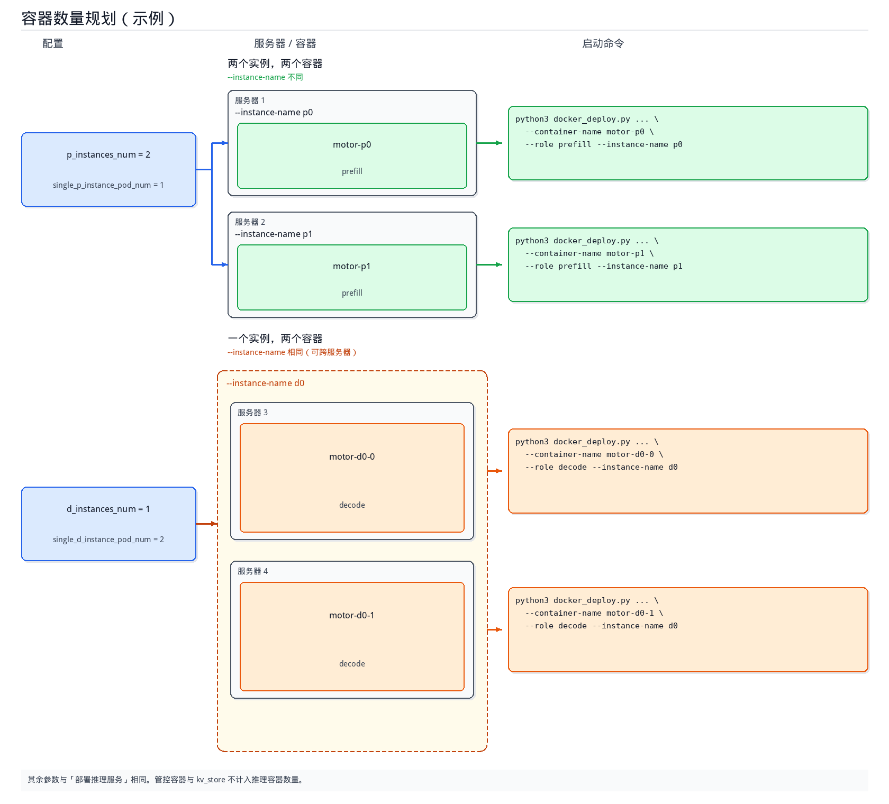

# 基于Docker的多容器服务部署指导

本文档指导用户**基于Docker完成多机推理服务的部署**，不依赖 K8s。如果使用小模型部署单机推理服务，可参考 [单容器部署指导](single_container.md)。

## 部署流程示意图


## 镜像准备

通过以下方式获取镜像，并**将镜像加载至集群的所有节点**：

 - **方式一**：下载官方完整的 MindIE Motor 镜像
     进入 [昇腾官方镜像仓库](https://www.hiascend.com/developer/ascendhub)，搜索 `motor`，按设备型号选择对应 MindIE Motor 镜像。
 - **方式二**：在已有镜像中安装 MindIE Motor
     基础镜像已安装 CANN、vLLM、vLLM Ascend 等组件，可参考 [从 vLLM Ascend 构建 MindIE Motor 镜像](../../maintenance/build_motor_image_from_vllm_ascend.md#基于vllm-ascendsglang镜像安装mindie-motor) 额外安装 MindIE Motor。

获取镜像后，请使用以下命令将镜像加载至服务器：

   ```bash
   docker load -i xxxx.tar
   ```

待镜像导入后，请使用以下命令查看Docker镜像是否存在：

   ```bash
   docker images
   ```

## 准备服务启动脚本

   获取服务部署脚本`examples` 目录：

   - 方式一（使用**官方完整 MindIE Motor 镜像**）：镜像内路径为 `/tmp/motor/examples`，可执行以下命令：

     ```bash
     IMAGE="<镜像名或镜像ID>"
     cid=$(docker create "$IMAGE")
     docker cp "$cid:/tmp/motor/examples" ./examples
     docker rm "$cid"
     ```

   - 方式二：（使用**手动安装 MindIE-Motor 的镜像**）：`git clone` 代码仓后，启动脚本位于 `MindIE-Motor/examples` 目录。

## 配置服务化参数

1. **准备配置文件**

   - PD分离场景

     MindIE Motor已提供常用模型（deepseek_v4_flash、deepseek_v4_pro、GLM 5.1等）的[**PD分离配置示例**](https://gitcode.com/Ascend/MindIE-Motor/blob/master/examples/infer_engines/vllm/models/README.md)，**用户修改少量配置后可直接使用**。

     对于未提供典型配置的模型，可参考 [MindIE Motor 配置自动生成指导](https://gitcode.com/Ascend/MindIE-Motor/blob/master/examples/infer_engines/vllm/models/README.md)，自动生成配置文件 `user_config.json` 与 `env.json`。

   - PD混部场景

     可参考 [**MindIE Motor 配置自动生成指导**](https://gitcode.com/Ascend/MindIE-Motor/blob/master/examples/infer_engines/vllm/models/README.md)，**自动生成**PD混部场景下的配置文件 `user_config.json` 与 `env.json`。

2. **配置端口**

   修改以下配置，避免端口冲突：

   ```json
   {
     ...
     "motor_controller_config": {
       "api_config": {
         "controller_api_port": 2026,
         "observability_api_port": 2027
       }
     },
     ...
     "motor_engine_prefill_config": {
       "motor_nodemanger_config": {
         "api_config": { "node_manager_port": 3026 }
       },
       ...
     },
     "motor_engine_decode_config": {
       "motor_nodemanger_config": {
         "api_config": { "node_manager_port": 4026 }
       },
       ...
     }
   }
   ```

3. **同步启动脚本配置**

    将准备好的配置文件（user_config.json、env.json）存放于启动脚本的examples/infer_engines/vllm目录下，之后将整个配置脚本目录拷贝至集群中的每一台服务器，一台服务器对应一份相同的脚本。

## 开启 KV 池化（可选）

不开启池化可跳过本节。开启后，P/D 通过 `MultiConnector` 同时做 Prefill→Decode 直传和 KV 入池；还需要单独部署一个 **kv_store** 容器（见下文「部署 KV Cache Store」）。请参考 [KV池化能力部署](../../features/kv_cache_store/README.md)文档来修改user_config.json配置文件。

## PR / DT 异构部署（可选）

Ascend950 机器分为 PR、DT 两类：PR 使用白鹭内存，DT 使用 HBM。HBM 带宽更大、性能更好，更适合 Decode；Prefill 可部署在 PR 上。**PR + DT 混合组网**时，需要把 Prefill 容器放到 PR 机器、Decode 容器放到 DT 机器。全 PR 或全 DT 组网按上文普通流程部署即可，无需本节。

>[!NOTE]说明
> Docker 部署没有调度器，异构完全由「在哪台机器上执行哪条命令」决定，即与上文「容器数量规划」中按服务器分批部署是同一件事。K8s 专用的 `npu_chip_name` 字段（`motor_engine_prefill_config` / `motor_engine_decode_config` 各一份）**在 Docker 部署下不生效**（不会被读取，也不会告警），无需填写。

1. **配置硬件类型**

   `hardware_type` 统一填写 `Ascend950`，PR、DT 机器**共用一份**相同的 `user_config.json`，因此上文「同步启动脚本配置」中「一台服务器对应一份相同脚本」的做法在异构组网下依然成立。

   ```json
   {
     "motor_deploy_config": {
       "hardware_type": "Ascend950",
       ...
     }
   }
   ```

2. **按机器形态分配角色**

   按「容器数量规划」确定实例名称后，再把容器分配到对应形态的机器上：

   | 机器形态 | `--role` | `--instance-name` | `--container-name`（示例） |
   | :--- | :--- | :--- | :--- |
   | PR | `prefill` | `p0`、`p1`、… | `motor-p0` |
   | DT | `decode` | `d0`、`d1`、… | `motor-d0-0` |

   在 **PR 机器**上执行 Prefill 的启动命令：

   ```bash
   python3 docker_deploy.py --config_dir ../infer_engines/vllm \
     --container-name motor-p0 --devices 0 \
     --role prefill --instance-name p0 \
     --pod-ip <本机 IP地址> --nic-name <本机主网卡名称> \
     --coordinator-ip <coordinator管理服务所在服务器的 IP地址> \
     --controller-ip <controller管理服务所在服务器的 IP地址>
   ```

   在 **DT 机器**上执行 Decode 的启动命令：

   ```bash
   python3 docker_deploy.py --config_dir ../infer_engines/vllm \
     --container-name motor-d0-0 --devices 0 \
     --role decode --instance-name d0 \
     --pod-ip <本机 IP地址> --nic-name <本机主网卡名称> \
     --coordinator-ip <coordinator管理服务所在服务器的 IP地址> \
     --controller-ip <controller管理服务所在服务器的 IP地址>
   ```

   管理面（`coordinator,controller`）与 kv_store 不与卡类型绑定，按下文「启动服务」正常部署即可。

3. **确认机器形态**

   部署前须逐台确认服务器的形态（PR / DT），再按形态分配容器：

   - 以机房 / 资产管理信息为准；K8s 场景下对应节点标签 `huawei.com/npu.chip.name`，取值为 `Ascend950PR`（PR）或 `Ascend950DT`（DT）。
   - 容器内已挂载 `npu-smi`，可用 `npu-smi info` 查看本机 NPU 情况。

>[!NOTE]注意
>
> - **不做机型校验**：Docker 部署不会校验角色与机器形态是否匹配——把 Prefill 容器放到 DT 机器上不会报错（启动前只校验挂载的卡数），需人工保证。
> - **单容器部署不支持异构**：单容器模式下 Prefill 与 Decode 在同一个容器、同一台机器上，无法分别落到 PR / DT。异构组网请使用本文的多容器部署。
> - **组件级 `image_name` 不生效**：`motor_engine_prefill_config`、`motor_engine_decode_config` 等组件配置中的 `image_name` 仅在 K8s 部署生效，Docker 部署的容器镜像统一取 `motor_deploy_config.image_name`。PR / DT 确需使用不同镜像时，须在各机器上分别准备并指向不同的 `--config_dir`（配置其余部分保持一致）。
> - **A5 硬件类型取值已收敛**：`850-Atlas-8p-8`、`950-SuperPod-Atlas-8`、`350-Atlas-16` 等旧取值不再支持，`hardware_type` 请填 `Ascend950`，否则启动时报 `Unknown hardware_type`。
> - 容器重建、换机或手工增减实例时，请保持角色与机器形态的对应关系（Prefill → PR，Decode → DT）。

## 启用 Render 特性（可选）

修改以下配置可以开启render特性。特性开启后，部署 Coordinator 管理面服务时，`docker_deploy.py` 会在宿主机额外创建名为 `{NAME}-vllm-render` 的新容器（`{NAME}` 即 `--container-name`），并在其中运行 vLLM Render 服务。当用户终止服务时，请注意回收该容器。Render 创建失败则不再创建主容器；主容器创建失败会删掉本次拉起的 Render。Docker 场景下 Coordinator 与 Render 同生共死：容器内 `--start` 会 `docker restart` Render 兄弟容器；Coordinator 退出（Ctrl+C / 进程退出）时 `docker stop` Render。Render 首次就绪后，Coordinator 持续对其 `/health` 心跳探测；连续失败则 Coordinator 随 Render 一起退出。为此会把宿主机 `/var/run/docker.sock` 挂进 Coordinator / 单容器；已创建的旧容器需重建后才具备该挂载。

若该容器已经存在（例如先前 `--create` 过），部署脚本不会覆盖它。进入容器后按其它角色同样的方式启动：

```bash
python3 /path/to/examples/deployer/docker_deploy.py --config_dir /path/to/examples/infer_engines/vllm --start --role render
```

也可单独创建 Render 容器（无 NPU，host 网络，与 Controller 相同模板）：

```bash
python3 /path/to/examples/deployer/docker_deploy.py --config_dir /path/to/examples/infer_engines/vllm --create --container-name <NAME>-vllm-render --role render
```

```json
{
  "motor_coordinator_config": {
    "render_config": {
      "enable": true
    }
  }
}
```

## 容器数量规划

完成 `user_config.json` 配置后，需根据 `motor_deploy_config` 确定推理实例名称及各实例对应的容器数量。同一 `--instance-name` 下的多个容器可部署在不同服务器，每个容器单独执行一次启动命令。管控容器与 kv_store 不计入推理容器数量。



1. **确定实例名称**

   `user_config.json` 中 `motor_deploy_config` 的实例数量字段决定推理实例个数，并据此确定 `--instance-name`。实例名称按角色从 0 起依次编号。

   | 配置项 | 含义 | `--role` | `--instance-name` |
   | :--- | :--- | :--- | :--- |
   | `p_instances_num` | Prefill 实例个数 | `prefill` | `p0`、`p1`、…、`p{N-1}` |
   | `d_instances_num` | Decode 实例个数 | `decode` | `d0`、`d1`、…、`d{N-1}` |
   | `hybrid_instances_num` | 混部实例个数 | `union` | `u0`、`u1`、…、`u{N-1}` |

   其中 `N` 为对应配置项的取值。例如 `p_instances_num` 为 `2` 时，Prefill 实例名称为 `p0`、`p1`。

   部署管理服务（`--role coordinator,controller`）及 kv_store 时，无需指定 `--instance-name`。

2. **确定单个实例对应的容器数量**

   `single_p_instance_pod_num`、`single_d_instance_pod_num`（混部场景为 `single_hybrid_instance_pod_num`）表示单个实例对应的容器数量。Docker 多容器部署中，一个 Pod 对应一个容器，每个容器需单独执行一次 `docker_deploy.py`。

   | 配置项 | 说明 |
   | :--- | :--- |
   | `single_p_instance_pod_num` | 单个 Prefill 实例对应的容器数量 |
   | `single_d_instance_pod_num` | 单个 Decode 实例对应的容器数量 |
   | `single_hybrid_instance_pod_num` | 单个混部实例对应的容器数量 |

   同一实例下的多个容器使用相同的 `--instance-name`，`--container-name` 不可重复，且可部署在不同服务器。

   Prefill 推理容器总数 = `p_instances_num` × `single_p_instance_pod_num`。Decode、混部同理。

3. **综合示例**

   以上图配置为例：

   ```json
   {
     "motor_deploy_config": {
       "p_instances_num": 2,
       "d_instances_num": 1,
       "single_p_instance_pod_num": 1,
       "single_d_instance_pod_num": 2
     }
   }
   ```

   - Prefill 为两个实例、两个容器，`--instance-name` 分别为 `p0`、`p1`。
   - Decode 为一个实例、两个容器，`--instance-name` 均为 `d0`，可分别部署在不同服务器。

   | `--container-name` | `--role` | `--instance-name` |
   | :--- | :--- | :--- |
   | `motor-p0` | `prefill` | `p0` |
   | `motor-p1` | `prefill` | `p1` |
   | `motor-d0-0` | `decode` | `d0` |
   | `motor-d0-1` | `decode` | `d0` |

   每个容器在对应服务器上执行一次下文「部署推理服务」中的命令。以 Prefill 实例 `p0` 为例：

   ```bash
   python3 docker_deploy.py --config_dir ../infer_engines/vllm \
     --container-name motor-p0 --devices 0 \
     --role prefill --instance-name p0 \
     --pod-ip <本机 IP地址> --nic-name <本机主网卡名称> \
     --coordinator-ip <coordinator管理服务所在服务器的 IP地址> \
     --controller-ip <controller管理服务所在服务器的 IP地址>
   ```

## 启动服务

一个完整的推理服务需要至少一个管理面容器以及多个推理容器。开启 KV 池化时，还需要一个 **kv_store** 容器。推理容器的数量、名称及所在服务器见上文「容器数量规划」，请按规划在对应服务器上分别执行。服务部署流程如下：

1. **部署管理服务**

   在 `examples/deployer` 目录下，执行如下命令将管理面服务（coordinator、controller）部署在同一容器：

   ```bash
   python3 docker_deploy.py --config_dir ../infer_engines/vllm \
     --container-name motor-ctrl --role coordinator,controller \
     --pod-ip <本机 IP地址> --nic-name <本机主网卡名称>
   ```

   若需将 Coordinator 与 Controller 分容器部署，可执行以下命令。

   ```bash
   python3 docker_deploy.py --config_dir ../infer_engines/vllm \
     --container-name motor-ctrl --role controller \
     --pod-ip <本机 IP地址> --nic-name <本机主网卡名称> \
     --coordinator-ip <coordinator管理服务所在服务器的 IP地址>
   ```

   ```bash
   python3 docker_deploy.py --config_dir ../infer_engines/vllm \
     --container-name motor-coord --role coordinator \
     --pod-ip <本机 IP地址> --nic-name <本机主网卡名称> \
     --controller-ip <controller管理服务所在服务器的 IP地址>
   ```

   上述命令执行后，窗口将自动**创建容器**、**进入容器**以及**启动管理服务**，用户在**屏幕上可观察到日志打印**。

   **开启池化时**，以上管理面命令需要额外增加 `--kv-store-ip` 参数：

   ```text
   --kv-store-ip <kv_store 所在服务器的 IP地址>
   ```

2. **部署 KV Cache Store（仅开启池化时）**

   未开启池化请跳过本步。选择任意一台服务器，在 `examples/deployer` 目录下执行：

   ```bash
   python3 docker_deploy.py --config_dir ../infer_engines/vllm \
     --container-name motor-kvs --role kv_store \
     --pod-ip <本机 IP地址> --nic-name <本机主网卡名称> \
     --coordinator-ip <coordinator管理服务所在服务器的 IP地址> \
     --controller-ip <controller管理服务所在服务器的 IP地址>
   ```

   上述命令执行后，窗口将自动创建容器、进入容器以及启动 kv_store（Mooncake 后端会拉起 `mooncake_master`，默认监听 **50088**）。由于该容器不需要挂载 NPU，所以不需要传 `--devices`。

3. **部署推理服务**

   执行以下命令可完成 1 个 Prefill 容器的部署：

   ```bash
   python3 docker_deploy.py --config_dir ../infer_engines/vllm \
     --container-name motor-p0 --devices 0 \
     --role prefill --instance-name p0 \
     --pod-ip <本机 IP地址> --nic-name <本机主网卡名称> \
     --coordinator-ip <coordinator管理服务所在服务器的 IP地址> \
     --controller-ip <controller管理服务所在服务器的 IP地址>
   ```

   执行以下命令可完成 1 个 Decode 容器的部署：

   ```bash
   python3 docker_deploy.py --config_dir ../infer_engines/vllm \
     --container-name motor-d0-0 --devices 0 \
     --role decode --instance-name d0 \
     --pod-ip <本机 IP地址> --nic-name <本机主网卡名称> \
     --coordinator-ip <coordinator管理服务所在服务器的 IP地址> \
     --controller-ip <controller管理服务所在服务器的 IP地址>
   ```

   `--devices` 为创建服务的容器挂载的 NPU 卡号（例如：0，1，2，3）。不填写时，将按硬件类型挂载模板中的全部卡（A2/A5 为 0–7，A3 为 0–15）。

   **开启池化时**，以上 Prefill / Decode 两条命令同样需要加上 `--kv-store-ip` 参数：

   ```text
   --kv-store-ip <kv_store 所在服务器的 IP地址>
   ```

   上述命令执行后，窗口将自动创建容器、进入容器以及启动推理服务，用户在屏幕上可观察到日志打印。

4. **启动参数说明**

   | 参数 | 说明 |
   | :--- | :--- |
   | `--config_dir` | `user_config.json` 和 `env.json` 所在目录。 |
   | `--container-name` | 容器名，可自定义。 |
   | `--role` | 容器中运行服务的角色。管理服务填 `coordinator,controller`，推理服务填 `prefill` 或 `decode`，池化填 `kv_store`。 |
   | `--instance-name` | 推理实例名，如 `p0`、`d0`。用于标识当前容器启动的服务归属于哪一个实例。同一实例的多个容器使用相同名称，详见上文「容器数量规划」。 |
   | `--devices` | 创建服务的容器挂载的 NPU 卡号（例如：0，1，2，3）。不填写时，按硬件类型挂载模板中的全部卡（A2/A5 为 0–7，A3 为 0–15）。管理面和 kv_store 不要传。 |
   | `--pod-ip` | **当前服务器**的 IP。 |
   | `--nic-name` | **当前服务器**对应 `--pod-ip` 的网卡名。 |
   | `--coordinator-ip` / `--controller-ip` | Coordinator / Controller 所在服务器的 IP。部署推理服务、kv_store 时填写。分容器部署管理服务时，Controller 填写 `--coordinator-ip`，Coordinator 填写 `--controller-ip`。 |
   | `--kv-store-ip` | kv_store 所在服务器的 IP。开启池化后，部署管理面（coordinator / controller）和 Prefill / Decode 时必填。`--role kv_store` 可省略，默认使用 `--pod-ip`。 |

   执行以下命令可以查看网卡名和本机 IP。`dev` 后面是 `--nic-name`，`src` 后面是 `--pod-ip`。

   ```bash
   ip -4 route get 1.1.1.1
   ```

## 推理验证

在**部署管理服务的机器上**发送如下推理请求，即可进行推理验证：

```bash
curl -X POST http://<coordinator管理服务所在服务器的 IP地址>:1025/v1/chat/completions \
  -H "Content-Type: application/json" \
  -d '{
    "model": "<模型名称，必须和user_config.json文件中的配置一致>",
    "messages": [{"role": "user", "content": "who are you?"}],
    "max_tokens": 36,
    "stream": true
  }'
```

若返回以下内容，表示服务尚未就绪，可稍后重试。

```json
{"detail":"Service is not available"}
```

开启池化后，请再用**长 prompt**（不少于 **128 token**，建议 500+）发一次请求。`AscendStoreConnector` 按 128 token 一块入池，短句不会 put，不能用来判断池化是否生效。

请求成功后，在 kv_store 容器对应的 workspace 日志中查看 `Keys`：由 `0` 变为大于 0 即表示 block 已入池。日志路径示例：

```text
examples/motor_workspace/motor-kvs/kvs/log/docker-kv_store-<时间戳>.log
```

## 终止服务与重复部署

在终端执行 **Ctrl+C** 可终止服务，但不会退出容器。服务终止后会出现如下提示，便于用户重新部署。

```text
容器内服务已终止，可执行以下命令重新部署服务。
python3 /path/to/examples/deployer/docker_deploy.py --config_dir /path/to/examples/infer_engines/vllm --start --container-name motor-ctrl --role coordinator,controller --pod-ip <本机 IP地址> --nic-name <本机主网卡名称>
运行日志：examples/motor_workspace/motor-ctrl/ctrl/log/docker-coordinator-controller-<时间戳>.log
```

用户可直接复制上述指令重新部署服务。开启池化时，kv_store 容器同样用 Ctrl+C 停止，重启命令中的 `--role` 为 `kv_store`。

## 调优指导

### 如何调整容器挂载

部署脚本会为用户自动创建容器，容器将自动挂载用户的服务启动脚本以及权重文件的路径。如需自定义容器的创建指令，可以手动调整 `examples/deployer/lib/constant.py` 文件中的 docker-run 模板。

### 同一服务器部署多个推理容器时错开端口

同一服务器上部署多个推理容器时，须先通过 `--devices` 为本容器分配 NPU，再规划并错开本容器端口。

`--devices` 填写本容器使用的卡号。同一服务器上的多个推理容器须使用不同卡号，卡数须与该容器所需 NPU 数量一致。

错开端口时，在启动命令中增加下列参数：

| 参数 | 说明 |
| :--- | :--- |
| `--node-manager-port` | 实际运行时的 NodeManager 端口，用于引擎节点管理 |
| `--data-parallel-rpc-port` | 实际运行时的数据并行 RPC 端口 |
| `--kv-port` | 实际运行时的 KV 传输端口 |
| `--base-port` | 实际运行时的引擎端点起始端口 |

以上文综合示例中 Decode 实例 `d0` 的两个容器部署在同一服务器为例。两个容器分别使用卡 `0` 与卡 `1`，端口规划如下：

| `--container-name` | `--devices` | `--node-manager-port` | `--data-parallel-rpc-port` | `--base-port` |
| :--- | :--- | :--- | :--- | :--- |
| `motor-d0-0` | `0` | `4026` | `9000` | `10000` |
| `motor-d0-1` | `1` | `4126` | `9100` | `11000` |

执行以下命令部署容器 `motor-d0-0`：

```bash
python3 docker_deploy.py --config_dir ../infer_engines/vllm \
  ... \
  --devices 0 \
  ... \
  --node-manager-port 4026 \
  --data-parallel-rpc-port 9000 \
  --base-port 10000
```

执行以下命令部署容器 `motor-d0-1`：

```bash
python3 docker_deploy.py --config_dir ../infer_engines/vllm \
  ... \
  --devices 1 \
  ... \
  --node-manager-port 4126 \
  --data-parallel-rpc-port 9100 \
  --base-port 11000
```

开启池化时，两条命令分别增加不同的 `--kv-port`，例如 `21000` 与 `22000`。未开启池化不要传 `--kv-port`。
