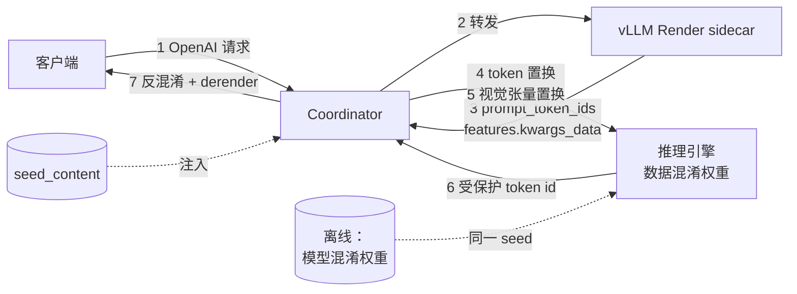

# 数据混淆推理（PMCC）

## 特性介绍

PMCC 数据混淆推理特性让 MindIE Motor 能够直接承载**数据混淆权重**：Coordinator 在请求侧把 prompt
token ID 与多模态（图像）张量映射到混淆权重所在的「受保护词表 / 受保护视觉空间」，在响应侧把引擎输出的
受保护 token ID 还原为原始词表，使明文 token 与明文图像张量不进入引擎。

该特性通过「离线权重混淆 + 线上同 seed 双向置换」机制，在**不修改推理引擎代码**的前提下让混淆权重可用：
实测 Qwen3-VL-30B-A3B 混淆权重（58 GiB）在 4 卡（P 2 + D 2，TP=2）PD 分离部署下，纯文本与图像请求
经 Render → 混淆 → 引擎 → 反混淆全链路返回正确结果（红图 → `"red"`，`2+2` → `"4"`）。

### 工作原理

离线与线上使用**同一个数据混淆因子（seed）**：离线用 `ai-asset-obfuscate` 生成混淆权重，线上 Coordinator 用
同一个 seed 把请求数据映射到混淆权重所在的物理空间，并在响应侧反变换。



1. **离线准备混淆权重**：使用 `ai-asset-obfuscate` 的 `ModelAssetObfuscation`，按模型类型与
   `token_white_list`、以指定 seed 生成混淆权重目录。权重中的词表
   （embedding / lm_head）与视觉 patch 顺序被置换，只有同 seed 可还原。
2. **请求进入 Render sidecar**：Coordinator 把请求交给 vLLM Render sidecar 完成
   chat template、tokenizer 与多模态处理，得到 `prompt_token_ids`、`features.kwargs_data`
   （`pixel_values` / `image_grid_thw` 等）以及多模态占位信息。
3. **Token 混淆（请求侧）**：`TokenObfuscationService.data_1d_obf` 把语义 token ID 映射为受保护词表 ID，
   写入 `engine_prompt_token_ids`；`token_white_list` 中的 token 不参与置换。送入引擎的是受保护 ID。
4. **视觉张量混淆（请求侧，可选）**：`ImageObfuscationService` 对 `features.kwargs_data` 下每个模态的张量载荷
   调用 SDK 的 `image_render_obf` 做 patch 置换，并回写同一字段。图像插入位置由 Render 返回的占位信息承载，
   与 token ID 置换互不影响。
5. **引擎推理**：引擎在受保护空间完成 prefill / decode。KV Conductor 的前缀索引使用同一批物理 token ID
   （`engine_token_ids`），因此缓存命中与引擎实际计算的内容一致。
6. **输出反混淆**：引擎输出的受保护 token ID 经 `data_1d_deobf` 还原为原词表 ID，再交给 Render sidecar 的
   derender 接口用原始 tokenizer 转成客户端可见文本（OpenAI 响应形态）。

### 核心功能

| 功能 | 说明 |
|------|------|
| 双向 token 置换 | 请求侧 `data_1d_obf`、响应侧 `data_1d_deobf`，同一进程内一套 seed，客户端无感知 |
| 多模态张量混淆 | `image_config.enabled` 后对 Render 返回的 `features.kwargs_data` 按模态做 patch 置换；Motor 不需要 msgpack 编解码与模型 flatten 顺序知识 |
| 文本 / 视觉共用 seed | `image_config` 嵌套在 `token_obfuscation_config` 下，与 token 混淆共用同一个 `seed_content`，避免多 seed 管理 |
| fail closed | SDK 缺失、接口调用异常时直接拒绝请求（HTTP 503），不回退明文链路；置换结果与载荷格式由 SDK 负责，Coordinator 不解析也不校验其返回内容 |
| 与 KV 亲和性调度对齐 | 前缀哈希使用受保护（物理）token ID，混淆场景下仍可命中 KV Cache |
| thinking 采样正交 | 开启混淆且 thinking 生效、客户端未显式指定 `temperature` 时强制贪心解码，避免思考段漂移 |

### 约束与限制

- **硬件**：Atlas 800I A2 推理服务器已实测（`hardware_type=800I_A2`）；Atlas 800 A3 等基于 vLLM Render 链路的机型理论上兼容，需按本文档验证。
- **部署场景**：需要 **vLLM Render sidecar**（token-only 链路）与 PD 分离部署；`render_config.enabled=true` 是本特性的硬前提。
- **引擎**：仅支持 **vLLM**（依赖其 Render token-only 接口）。SGLang 当前为 POC 支持，未覆盖本特性的 Render 链路，暂不支持。
- **特性互斥**：
  - **不支持流式请求**：任一混淆开关开启（`enabled` 或 `image_config.enabled`）后 `stream=true` 直接返回 HTTP 501。
  - **仅支持 `/v1/chat/completions` 与 `/v1/completions`**：Render 没有为其他 API 登记契约，
    任一混淆开关开启时 `/v1/responses`、`/v1/messages` 等路径直接返回 HTTP 501，不会退回本地 tokenizer
    把明文 prompt 发给混淆权重引擎。
  - **不回退**：Render 不可用时不会退回 Coordinator 本地 tokenizer（否则明文 token 会进入引擎），请求直接失败
    （任一混淆开关开启即生效）。
  - 可与 KV Cache 亲和性调度、PD 分离、扩缩容、故障重调度等特性同时使用。
- **软件依赖**：
  - `ai-asset-obfuscate`：需安装该依赖（见[环境准备](#环境准备)），版本必须与离线生成混淆权重的版本一致，且其原生库需能被加载。
  - 混淆权重必须由**同一版本 SDK、同一 seed、同一 `token_white_list`/`vocab_size`**、以及同一视觉几何
    （`patch_size`/`merge_size`/`temporal_patch_size`/`longest_edge`/`shortest_edge`）生成，否则结果错乱。
- **其他限制**：
  - 混淆相关参数均与模型/权重相关，代码不含内置默认值：`token_white_list`、`seed_content` 必须显式配置；
    `vocab_size` 与图像几何（`patch_size` 等 5 项）**可省略**，未配置时从被服务权重目录自动读取，
    显式配置始终优先（取值来源见[参数取值从哪里来](#config-sources)）。
  - 其中 `token_white_list` **无法从模型目录推导**（模型元数据里没有记录），只能由离线权重混淆方提供；漏配/多配不会报错，但会造成 token 错位。
  - 自动读取的参数会在解析后再次校验：白名单 id 超过解析出的 `vocab_size`、或解析后的
    `longest_edge < shortest_edge`，都会直接拒绝启动，而不是带着不一致的参数运行。
  - `seed_content` 可还原词表置换，须与混淆权重同权限保管，通过受控配置注入，禁止进入代码仓库、日志与截图。
  - 引擎对多模态张量按 `mm_hash` 缓存：**更换 SDK 版本或混淆实现后必须重启引擎（或更换图片）**，否则同 hash 图片会命中旧缓存。
  - 混淆后的 token ID 属于「物理词表」，任何跨实例 Token 统计/对账都需要按物理 ID 解释。
  - 开启混淆且 thinking 生效、客户端未显式传 `temperature` 时，Coordinator 会强制贪心解码（`temperature=0`）；
    需保留采样行为时请显式传参。

## 特性使用

### 环境准备

1. 已使用 MindIE Motor 完成基础推理服务部署（PD 分离），服务运行正常。参考 [PD 分离部署](pd_disaggregation.md)。
2. 镜像/环境内的 vLLM 提供 Render token-only 接口（Coordinator 通过 `render_config.endpoint` 访问），
   且 `render_config.enabled=true`。
3. 已安装 `ai-asset-obfuscate` 并保证其原生库可加载：

   ```bash
   pip install ./ai_asset_obfuscate-26.1.0.2-py3-none-any.whl   # 版本需与离线生成混淆权重的版本一致
   # Coordinator 启动时会把 <site-packages>/ai_asset_obfuscate/libs 追加到 LD_LIBRARY_PATH
   ```

   若在容器内由启动脚本安装 wheel，需保证 `libcrypto.so` / `libssl.so` 等符号链接存在且
   `LD_LIBRARY_PATH` 在 **python 进程启动前**导出（进程内 `os.environ` 修改对已加载库无效）。

4. 已准备与待部署权重**同 seed** 的混淆权重目录。离线生成示例（在 CPU 环境即可执行）：

   ```python
   from ai_asset_obfuscate import ErrorCode, ModelAssetObfuscation, ModelType

   WHITE_LIST = [151643, 151644, 151645, 151646, 151647, 151648, 151649, 151650, 151651,
                 151652, 151653, 151654, 151655, 151656, 151657, 151658, 151659, 151660,
                 151661, 151662, 151663, 151664, 151665, 151666, 151667, 151668, 198, 2610,
                 525, 264, 10950, 17847, 13, 872, 77091, 8948, 271]
   SEED = "<your-seed-content>"

   obf = ModelAssetObfuscation.create_model_obfuscation(
       model_path="/mnt/weight/Qwen3-VL-30B-A3B-Instruct",
       model_type=ModelType.QWEN3_VL,
       token_white_list=WHITE_LIST,
   )
   assert obf.set_seed_content(seed_type=2, seed_content=SEED) == ErrorCode.SUCCESS.value
   assert obf.model_weight_obf(obf_type=2, model_save_path="/data/weights/Qwen3-VL-30B-A3B-Instruct-obf-data") \
       == ErrorCode.SUCCESS.value
   ```

   生成结果目录中会额外生成一个 `obf_config.json`，**其内容仅为混淆标记**（如 `{"flag": "OBF_DATA"}`），
   不包含 seed、白名单与视觉几何，因此上述参数不能从该文件读取（取值来源见[参数取值从哪里来](#config-sources)）。

   > `ModelType`、`seed_type` / `obf_type` 的取值随模型和 SDK 版本而异，上例为 Qwen3-VL 验证通过的取值，
   > 其它模型请按 SDK 文档选择对应枚举；关键是**权重生成与线上 Coordinator 必须使用同一 `seed_content` 与白名单**。

5. 后续操作均在 K8s 集群管理节点执行，且已 `source` 集群 kubeconfig。

<a id="config-sources"></a>

### 参数取值从哪里来

数据混淆相关参数均为模型相关参数，代码不提供内置默认值。**图像几何可不配置**，未配置时 Coordinator 自动从
被服务权重目录读取，显式配置的值始终优先；其余参数按下表来源配置：

（以 `/data/weights/<模型目录>` 为被服务的权重目录，原始权重与混淆权重中的相关文件内容一致）

| 参数 | 来源 | 说明 |
|------|------|------|
| `image_config` 的 `patch_size` / `temporal_patch_size` / `merge_size` / `longest_edge` / `shortest_edge` | `<模型目录>/preprocessor_config.json`（**未配置时自动读取**） | 对应字段 `patch_size` / `temporal_patch_size` / `merge_size` / `size.longest_edge` / `size.shortest_edge`（旧版处理器为 `max_pixels` / `min_pixels`）。**不同模型取值不同**：Qwen3-VL 为 16 / 2 / 2 / 16777216 / 65536，公开的 Qwen2-VL / Qwen2.5-VL 为 14 / 2 / 2 / 12845056 / 3136 |
| `token_obfuscation_config.vocab_size` | `<模型目录>/config.json`（**未配置时自动读取**） | 多模态模型位于 `text_config.vocab_size`（纯文本模型为顶层 `vocab_size`），Qwen3-VL 为 151936 |
| `token_obfuscation_config.token_white_list` | **离线权重混淆方提供** | 模型元数据中没有记录，无法从模型目录推导。其语义为「`data_1d_obf` 的固定点」：配置正确时满足 `data_1d_obf(id) == id` |
| `token_obfuscation_config.seed_content` | 受控配置注入 | 与离线权重同一 seed，禁止入库与写入日志 |

读取示例：

```bash
python3 - <<'EOF'
import json

model = "/data/weights/Qwen3-VL-30B-A3B-Instruct-obf-data"
pp = json.load(open(f"{model}/preprocessor_config.json"))
cfg = json.load(open(f"{model}/config.json"))
print("patch/temporal/merge:", pp["patch_size"], pp["temporal_patch_size"], pp["merge_size"])
print("size:", pp["size"])
print("vocab_size:", cfg.get("text_config", {}).get("vocab_size") or cfg.get("vocab_size"))
EOF
```

> **注意**：`patch_size` 与 `temporal_patch_size` 共同决定 `pixel_values` 的展平维度
> `D = 3 × patch_size² × temporal_patch_size`（Qwen3-VL 为 1536）。与权重不一致时，
> SDK 只打 warning 并把载荷**原样返回**（请求静默未混淆），参见[问题七](#faq-geometry-mismatch)。

### 使用场景

- **场景一：纯文本数据混淆**。仅开启 `token_obfuscation_config.enabled`，适用于对话/补全等纯文本请求。
- **场景二：多模态（图像）数据混淆**。在场景一基础上开启 `token_obfuscation_config.image_config.enabled`，
  适用于带图请求（Qwen3-VL 等视觉语言模型）。文本 token 混淆照旧全量生效，图像张量混淆为**追加**的一层。

### 使用样例

以下步骤以 Qwen3-VL-30B-A3B、4 卡（P 2 + D 2，TP=2）为例。

1. 进入部署目录：

   ```bash
   cd examples/deployer
   ```

2. 在 `user_config.json` 中确认引擎权重为混淆权重，并开启 Render 与数据混淆配置：

   ```json
   {
     "motor_deploy_config": {
       "weight_mount_path": "/data/weights/"
     },
     "motor_coordinator_config": {
       "inference_workers_config": {
         "num_workers": 1
       },
       "render_config": {
         "enabled": true,
         "endpoint": { "host": "127.0.0.1", "port": 8100 },
         "timeout_ms": 30000,
         "image_name": ""
       },
       "token_obfuscation_config": {
         "enabled": true,
         "token_white_list": [151643, 151644, 151645, 151646, 151647, 151648, 151649, 151650, 151651,
                           151652, 151653, 151654, 151655, 151656, 151657, 151658, 151659, 151660,
                           151661, 151662, 151663, 151664, 151665, 151666, 151667, 151668, 198, 2610,
                           525, 264, 10950, 17847, 13, 872, 77091, 8948, 271],
         "seed_content": "<与离线权重一致的 seed>",
         "image_config": {
           "enabled": true
         }
       }
     }
   }
   ```

   关键参数说明：

   | 参数 | 说明 |
   |------|------|
   | `render_config.enabled` | 必须为 `true`；本特性的 token 与图像置换都发生在 Render 返回的载荷上 |
   | `render_config.timeout_ms` | Render 处理超时。多模态首图需要加载图像处理器，实测冷启动约 22 s，建议不小于 30000 |
   | `token_obfuscation_config.enabled` | 开启 token 置换；必须显式配置非空 `seed_content` |
   | `token_obfuscation_config.model_path` | 可选，显式指定权重目录（用于读取 `vocab_size`）。留空时使用引擎配置里的 `engine_config.model`；多模型共存时必须显式指定 |
   | `token_obfuscation_config.vocab_size` | 混淆词表大小。**可不配置**：未设置时从被服务权重目录的 `config.json` 自动读取（多模态取 `text_config.vocab_size`），显式配置优先。需与离线权重混淆参数一致（Qwen3-32B / Qwen3-VL 为 `151936`） |
   | `token_obfuscation_config.token_white_list` | **无内置默认值，开启时必须显式配置**。不参与置换的 token ID（特殊 token 及部分常用 token），必须与离线权重混淆时使用的清单完全一致；Qwen3-32B / Qwen3-VL 验证权重使用下方 37 个 token。该参数**无法从模型目录推导**，只能由权重混淆方提供 |
   | `token_obfuscation_config.seed_content` | 与离线权重同一 seed；可通过环境变量或受控配置注入，禁止入库 |
   | `token_obfuscation_config.image_config.enabled` | 开启图像张量置换；要求 `render_config.enabled=true`，与 `enabled` 相互独立 |
   | `image_config.patch_size` / `merge_size` / `temporal_patch_size` | **可不配置**：未设置时从被服务权重目录的 `preprocessor_config.json` 自动读取，显式配置优先。必须与权重混淆及图像处理器一致（Qwen3-VL 为 16 / 2 / 2，Qwen2-VL 为 14 / 2 / 2） |
   | `image_config.longest_edge` / `shortest_edge` | **可不配置**：同上，对应 `size.longest_edge` / `size.shortest_edge`（旧版处理器为 `max_pixels` / `min_pixels`）。Qwen3-VL 为 16777216 / 65536 |
   | `image_config.model_path` | 可选，显式指定权重目录（用于读取几何）。留空时使用引擎配置里的 `engine_config.model`；多模型共存时必须显式指定 |
   | `render_config.image_name` | 可选，指定 Render sidecar 的容器镜像；留空时使用部署器默认镜像 |
   | `inference_workers_config.num_workers` | Render sidecar 的处理 worker 数（部署器以 `--renderer-num-workers` 传入），多模态实测取 `1` |

   模型路径指向混淆权重目录（`motor_engine_prefill_config` / `motor_engine_decode_config`，混部场景为
   `motor_engine_union_config`）：

   ```json
   {
     "motor_engine_prefill_config": {
       "engine_type": "vllm",
       "engine_config": {
         "served_model_name": "qwen3-vl-30b",
         "model": "/data/weights/Qwen3-VL-30B-A3B-Instruct-obf-data",
         "tensor_parallel_size": 2
       }
     }
   }
   ```

   权重目录由 `motor_deploy_config.weight_mount_path` 挂载进容器，`engine_config.model` 取其下子目录。

3. 部署服务：

   ```bash
   python deploy.py --config_dir <配置目录>
   ```

4. 确认部署结果：

   ```bash
   kubectl get pod -A -owide
   ```

   预期输出：Controller / Coordinator / Prefill / Decode 均 Running，Coordinator 侧 2/2 Ready。
   日志中可看到混淆启用标志：

   ```bash
   kubectl logs -n <namespace> <coordinator-pod> -c mindie-motor-coordinator | grep -E "Vision data obfuscation|Successfully installed"
   ```

   ```text
   Successfully installed motor-3.1.0
   Successfully installed ai-asset-obfuscate-26.1.0.2
   Vision data obfuscation is enabled for Render image items
   ```

### 验证特性

1. 发送带图请求（图像为纯红色 PNG，问题为“回答颜色，一个词”）：

   ```bash
   curl -X POST http://<node0_ip>:<nodeport>/v1/chat/completions \
       -H "Content-Type: application/json" \
       -d '{
         "model": "qwen3-vl-30b",
         "max_tokens": 32,
         "messages": [{
           "role": "user",
           "content": [
             {"type": "image_url", "image_url": {"url": "data:image/png;base64,<red_png_base64>"}},
             {"type": "text", "text": "What color is this image? Answer in one word."}
           ]
         }]
       }'
   ```

   预期结果：HTTP 200，`choices[0].message.content` 为 `"red"`（蓝色图片应为 `"blue"`）。
   若返回乱码或颜色错误，说明 seed / 白名单 / 视觉几何与权重不一致，或命中了引擎侧陈旧 mm 缓存（见常见问题）。

2. 检查 Coordinator 日志中每个请求的混淆计数：

   ```bash
   kubectl logs -n <namespace> <coordinator-pod> -c mindie-motor-coordinator | grep "render tokenize success"
   ```

   预期输出（图像请求 `obfuscated_images=1`，纯文本请求 `obfuscated_images=0`）：

   ```text
   render tokenize success request_id=... prompt_length=85 latency_ms=26.10 tokenizer_source=render obfuscated_images=1
   render tokenize success request_id=... prompt_length=20 latency_ms=3.77 tokenizer_source=render obfuscated_images=0
   ```

   `obfuscated_images` 只统计图像张量置换的模态数；token 置换在 `_obfuscate` 中静默完成，没有单独计数
   （即 `obfuscated_images=1` 不代表只有图像被混淆）。

3. 发送纯文本请求，确认文本链路同样生效（混淆权重下若 token 未置换，输出必然错乱）：

   ```bash
   curl -X POST http://<node0_ip>:<nodeport>/v1/chat/completions \
       -H "Content-Type: application/json" \
       -d '{"model": "qwen3-vl-30b", "max_tokens": 32, "temperature": 0,
            "messages": [{"role": "user", "content": "What is 2+2? Answer with the number only."}]}'
   ```

   预期结果：`"4"`。

## 常见问题

**通用安装、环境、部署类问题请参考公共 FAQ。以下仅收录本特性特有的疑难问题。**

### 问题一：请求返回 503，detail 为 `failed to obfuscate Render image items: AttributeError: ... has no attribute 'image_render_obf'`

**问题描述**：开启 `image_config.enabled` 后，所有带图请求返回 503，Coordinator 日志出现上述信息。

**原因分析**：环境中的 `ai-asset-obfuscate` 版本不支持 Render 载荷置换接口（旧版本只有 `image_tensor_obf`）。

**解决步骤**：

1. 确认版本：`python -c "import ai_asset_obfuscate, importlib.metadata as m; print(m.version('ai-asset-obfuscate'))"`，
   需要与离线生成混淆权重的版本一致（本特性验证版本：`26.1.0.2`）。
2. 用新版 wheel 覆盖安装后重启 Coordinator 容器（镜像内的 wheel 需要随部署重新投放）。

### 问题二：日志显示混淆已开启，但同一张图的答案一直不变（例如始终返回 `"gray"`）

**问题描述**：更换 SDK/混淆实现后，第一次请求返回错误颜色，之后同图始终返回同一个错误结果。

**原因分析**：引擎按 `mm_hash` 缓存多模态张量。图片 hash 由 Render 对原图计算，混淆后的张量载荷变化但不改变 hash，
因此同 hash 图片会命中此前写入的旧缓存。

**解决步骤**：

1. 重启 Prefill / Decode 实例（`kubectl delete pod <prefill/decode-pod> -n <namespace>`），或
2. 换一张内容不同（hash 不同）的图片验证；
3. 验证新链路时优先整体重建命名空间，确保引擎全新加载。

### 问题三：请求返回 501 `Token-obfuscated inference currently supports non-streaming requests only`

**问题描述**：开启混淆后带 `stream=true` 的请求失败。

**原因分析**：当前版本的混淆链路只覆盖非流式请求（输出反混淆在整包响应上完成）。

**解决步骤**：客户端去掉 `stream` 参数或改为 `stream=false`。

### 问题四：请求返回 503 `ai-asset-obfuscate is unavailable` 或 `ai-asset-obfuscate vision API is unavailable: ObfException: Failed To Load Library.`

**问题描述**：Coordinator 启动成功或请求时才报 SDK 不可用/原生库加载失败。

**原因分析**：环境未安装 `ai-asset-obfuscate`，或其原生库（`ai_asset_obfuscate/libs/*.so`）依赖的动态库路径未准备好。

**解决步骤**：

1. 确认已安装：`python -c "import ai_asset_obfuscate"`；
2. 确认 `LD_LIBRARY_PATH` 含 `<site-packages>/ai_asset_obfuscate/libs`，且该设置在 python 进程启动前生效
   （容器内由启动脚本导出，例如 OpenSSL 的 `libcrypto.so` / `libssl.so` 符号链接需存在）；
3. 确认 `token_obfuscation_config.image_config.enabled=true` 时 `render_config.enabled=true`，否则配置校验会直接失败：
   `token_obfuscation_config.image_config requires render_config.enabled=true`。

### 问题五：模型输出乱码 / 答非所问

**问题描述**：服务可用但输出明显异常。

**原因分析**：线上 `seed_content`、`token_white_list`、`vocab_size` 或 `image_config` 视觉几何与离线混淆权重不一致；
或权重本身不是用同一 SDK 版本生成。其中：

- **几何不一致** 是**静默失效**：SDK 只打 warning 并把载荷原样返回，即请求实际未做混淆（见[问题七](#faq-geometry-mismatch)）；
- **白名单不一致**（漏配/多配）同样不报错：白名单内的 token 是置换固定点，漏掉一个就会把它错误地置换掉，造成 token 错位。

**解决步骤**：

1. 比对参数与权重混淆时使用的清单：白名单由混淆方提供；视觉几何与 `vocab_size` 参见
   [参数取值从哪里来](#config-sources)；
2. 如需自查白名单是否生效，可验证固定点语义（正确时结果应与输入相同）：

   ```bash
   python3 - <<'EOF'
   from motor.config.coordinator import TokenObfuscationConfig
   from motor.coordinator.render.token_obfuscation_service import TokenObfuscationService

   cfg = TokenObfuscationConfig(enabled=True, seed_content="<seed>", token_white_list=[...])
   service = TokenObfuscationService(cfg)
   print(service.obfuscate(cfg.token_white_list) == cfg.token_white_list)  # 应为 True
   EOF
   ```

3. 确认未对混淆权重再次做常规量化/转换（会破坏置换后的张量布局）；
4. 修正配置后重新部署，并重启引擎避免命中旧缓存。

### 问题六：开启混淆后请求时延升高

**问题描述**：开启图像置换后首图请求耗时明显增加。

**原因分析**：Render 首次加载图像处理器（冷启动，实测约 22 s）与每请求的张量载荷置换（实测单请求毫秒级）。

**解决步骤**：

1. 调大 `render_config.timeout_ms`（避免冷启动超时）；
2. 预热一次带图请求（或引入固定的预热流程）后再接入压测；
3. 纯文本场景关闭 `image_config.enabled`。

<a id="faq-geometry-mismatch"></a>

### 问题七：日志出现 `pixel_values D=... != expected ...`，但请求成功

**问题描述**：带图请求正常返回 HTTP 200，但答案明显不对；Coordinator/引擎日志中出现
`pixel_values D=1536 != expected 768. Returning as-is.` 之类的告警。

**原因分析**：`patch_size` / `temporal_patch_size` 与权重混淆时使用的不一致，导致
`D != 3 × patch_size² × temporal_patch_size`。此时 SDK **不会报错**，只是把载荷原样返回，
即图像张量未做混淆就发给了引擎（混淆权重要求的是混淆后的张量），因此输出异常。

**解决步骤**：

1. 按 [参数取值从哪里来](#config-sources) 从被服务权重目录的 `preprocessor_config.json` 重新获取
   `patch_size` 与 `temporal_patch_size`（注意不同模型取值不同）；
2. 确认这两个值与离线权重混淆时使用的一致（同一模型、同一份权重）；
3. 修正后重启 Coordinator；
4. 注意：该告警意味着本次请求未经混淆，属于安全影响而不只是结果问题，建议在验收中加入日志检查项。
