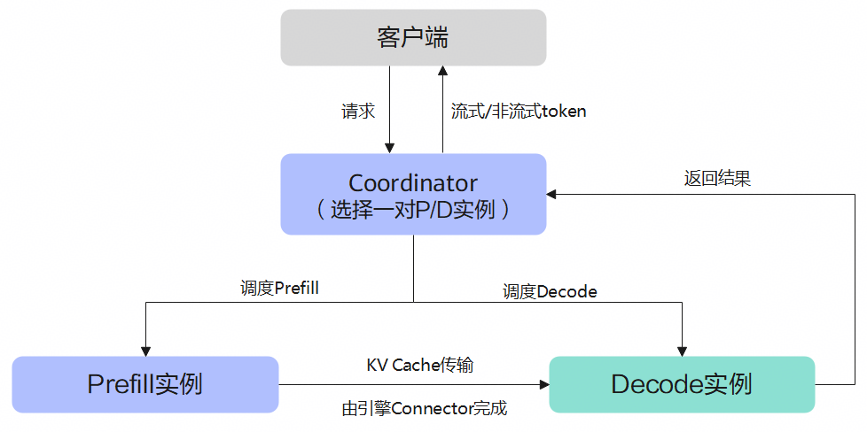

# PD 分离

## 特性介绍

PD分离（Prefill & Decode 分离）将大语言模型推理的两个阶段部署到不同实例上，使各阶段按自身资源特征独立运行。

- **Prefill（P）**：对输入prompt执行一次完整前向计算，生成该序列的KV Cache。该阶段计算密集，每个新请求均需执行一次。
- **Decode（D）**：接收P传来的KV Cache，逐步生成后续token。单步计算量小，但需反复执行直至生成结束，主要消耗访存带宽。

PD混部时，P与D共用一张卡，新请求的Prefill会中断正在进行的Decode。分离之后，P可持续处理新请求，D可持续输出token，算力与带宽按阶段分别配置，在同等时延目标下通常获得更高吞吐。

### 工作原理

MindIE Motor中的PD分离调度与实例角色能力，由Coordinator统一编排，并非某一引擎的特有开关。集群中同时存在健康的Prefill、Decode实例时，Coordinator按PD分离路径选择一对P/D，再按引擎协议完成一次请求。

一次请求的角色分工具体如下所示：

1. **入口**：客户端请求仅发送至Coordinator。Controller负责实例注册、健康检测与生命周期管理，不参与单请求转发。
2. **选路**：Coordinator依据当前可用实例的角色，选择一对Prefill与Decode实例。
3. **Prefill**：Prefill实例对prompt执行完整前向计算，生成该序列的KV Cache。
4. **KV 传输**：Prefill至Decode的KV Cache由引擎侧Connector完成传输。Coordinator仅负责选定实例并注入握手元数据，不承担KV数据搬运。
5. **Decode**：Decode实例按token逐步解码，生成结果经Coordinator返回客户端。

### 特性收益

- **资源按阶段配置**：Prefill偏重算力，Decode偏重带宽，可依据角色选择卡型与并行度，例如Prefill部署于PR、Decode部署于DT。
- **吞吐提升**：Prefill持续接收新请求的同时，Decode持续解码已有请求，两者不再争用同一条流水线。
- **时延更可控**：高并发场景下，避免Prefill中断Decode所造成的排队等待。

### 约束与限制

| 约束维度 | 要求 |
|----------|------|
| 硬件 | Atlas 800I A2推理服务器 Atlas 800I A3超节点服务器 Ascend950PR&950DT系列产品 |
| 部署场景 | 支持K8s、Docker两种部署形态。 |
| 引擎 | 支持vLLM与SGLang。 |
| 特性互斥 | K8s部署支持当前代码仓所有特性。 Docker only仅支持整服务级RAS监控、虚推健康探测、引擎重拉、PD分离降级混部、D2D权重直传、故障请求重调度、故障实例熔断、精度异常检测等RAS特性。 |
| 软件依赖 | K8s部署依赖Ascend HDK、Docker、Kubernetes与MindCluster。 Docker部署依赖Ascend HDK与Docker。 |

## 特性使用

PD分离服务的部署以及更多详细内容请参见：

- **K8s**：依赖较重，可使用Motor全部能力。RAS（高可靠、高可用）能力在出现软硬件故障时极大降低业务损失；优秀的请求调度能力（KV亲和性调度+KV Cache池化管理），明显提升推理性能。参见[PD分离服务部署](../deployment/k8s/)。
- **Docker**：依赖较轻，可使用Motor的负载均衡能力（KV亲和性调度与池化），明显提升推理性能。参见[基于Docker的服务部署](../deployment/docker/)。
